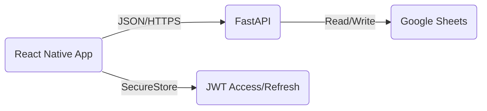

# Mobile Application Implementation Roadmap

This document outlines the strategy and steps to extend the Varavu Selavu Seyali application to mobile platforms (Android & iOS).

## 1. Executive Summary

**Goal:** Create a native mobile application for tracking expenses that works on both Android and iOS.
**Tech Stack Recommendation:** **React Native** with **Expo**.
**Rationale:**
- **Code Reuse:** Allows reusing 90% of the business logic (API clients, types, utilities) from the existing React web app.
- **Skill Reuse:** Uses TypeScript/JavaScript and React patterns, identical to the current frontend.
- **Delivery:** Expo handles the build process for both the Apple App Store and Google Play Store efficiently.

## 2. Architecture

The mobile app will communicate directly with the existing FastAPI backend.



### Key Differences from Web
| Feature | Web (React) | Mobile (React Native) |
| :--- | :--- | :--- |
| **UI Components** | HTML (`div`, `span`, `input`) | Native Components (`View`, `Text`, `TextInput`) |
| **Navigation** | Browser URL / React Router | React Navigation (Stack/Tab) |
| **Storage** | `localStorage` | `expo-secure-store` (Encrypted) |
| **Network** | `localhost` works | `localhost` needs mapping (e.g., `10.0.2.2` on Android) |
| **Camera** | HTML5 File Input | `expo-image-picker` / `expo-camera` |

## 3. Implementation Steps

### Phase 1: Project Initialization

1.  **Initialize Expo Project:**
    ```bash
    npx create-expo-app@latest varavu_selavu_mobile --template blank-typescript
    cd varavu_selavu_mobile
    ```

2.  **Install Core Dependencies:**
    ```bash
    # Navigation
    npm install @react-navigation/native @react-navigation/native-stack @react-navigation/bottom-tabs
    npx expo install react-native-screens react-native-safe-area-context

    # UI & Utilities
    npx expo install expo-status-bar expo-secure-store expo-image-picker axios
    ```

### Phase 2: Logic Migration (The "Shared" Layer)

Instead of rewriting logic, port the existing `src/api` folder from the web project.

1.  **Copy Files:** Copy `varavu_selavu_ui/src/api/*.ts` to `varavu_selavu_mobile/src/api/`.
2.  **Adapt `apiconfig.ts`:**
    Modify the base URL detection. `localhost` does not work on Android emulators.
    ```typescript
    // varavu_selavu_mobile/src/api/apiconfig.ts
    import Constants from "expo-constants";

    // Use the machine's LAN IP or a tunnel for dev, production URL for release
    const ENV_API_URL = "http://192.168.1.X:8000"; // Replace with your computer's local IP

    const API_BASE_URL = __DEV__ ? ENV_API_URL : "https://your-production-api.com";
    export default API_BASE_URL;
    ```
3.  **Adapt `auth.ts`:**
    - Remove `atob` usage (or polyfill it) for JWT decoding.
    - **Crucial:** React Native doesn't have `window` or `localStorage`. You must pass tokens into the functions or use a global state manager (Context API / Zustand) that persists to `SecureStore`.

### Phase 3: Authentication Flow

1.  **Create Auth Context:**
    Build a `AuthProvider` that checks for a stored token in `SecureStore` on app launch.
    ```typescript
    import * as SecureStore from 'expo-secure-store';

    // On Login
    await SecureStore.setItemAsync('access_token', token);

    // On App Start
    const token = await SecureStore.getItemAsync('access_token');
    ```

2.  **Screens:**
    - `LoginScreen.tsx`: Username/Password inputs.
    - `RegisterScreen.tsx`: Name, Email, Phone, Password.

### Phase 4: Core Features (UI Implementation)

Rebuild the screens using React Native primitives.

1.  **Dashboard (Home):**
    - Use `ScrollView` for the main layout.
    - Create Cards (`View` with styling) for "Total Income" and "Total Expenses".
    - Use `FlatList` for the "Recent Transactions" list.

2.  **Add Expense:**
    - Use `TextInput` for cost and description.
    - Use a Picker or a custom Modal for "Category" selection.
    - **Receipt Upload:**
      Use `expo-image-picker` to launch the camera or gallery.
      ```typescript
      import * as ImagePicker from 'expo-image-picker';

      const pickImage = async () => {
        let result = await ImagePicker.launchCameraAsync({
          mediaTypes: ImagePicker.MediaTypeOptions.Images,
          quality: 1,
        });
        // Upload result.assets[0].uri to backend
      };
      ```

### Phase 5: Polishing & Deployment

1.  **Icons & Splash Screen:** Configure `app.json` with your assets.
2.  **Build:**
    - **Android:** `npx expo run:android` (Emulator or Device).
    - **iOS:** `npx expo run:ios` (Simulator - requires Mac) or use **Expo Go** app on a real iPhone.
3.  **Publish:**
    - Create accounts on Apple Developer Program ($99/yr) and Google Play Console ($25 one-time).
    - Use **EAS Build** (Expo Application Services) to generate `.apk`/`.aab` and `.ipa` files.
    ```bash
    npm install -g eas-cli
    eas build --profile production --platform all
    ```

## 4. Immediate Next Steps

To start development immediately:

1.  [ ] Create the `varavu_selavu_mobile` directory.
2.  [ ] Set up the Expo skeleton.
3.  [ ] Port the API client and test a simple "Login" console log.

## 5. FAQ

**Q: Can I use the same backend locally?**
A: Yes, but ensure your computer and mobile phone are on the same Wi-Fi. Run the backend on `0.0.0.0` instead of `localhost` so it accepts external connections.
`uvicorn main:app --host 0.0.0.0 --port 8000`

**Q: What about the Google Login?**
A: `react-native-google-signin` is required for native Google Auth. The web flow won't work exactly the same way inside a native app due to redirect restrictions.
