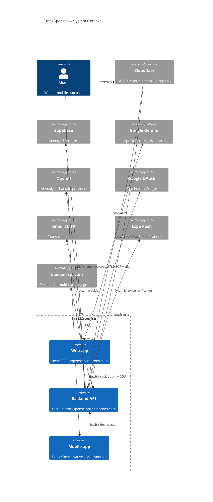
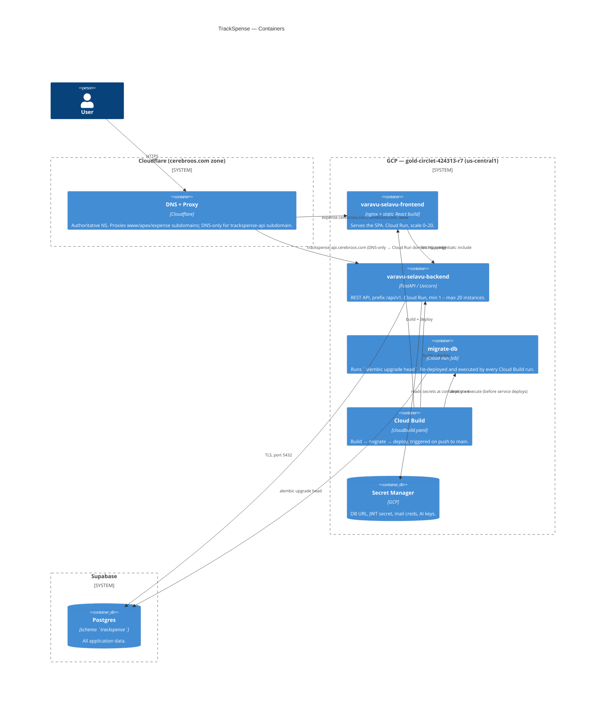

# TrackSpense (VaravuSelavuSeyali) — Infrastructure

> **Purpose:** every external service, GCP resource, and account this app actually depends on to run in production, and how they connect. Verified directly against live infrastructure (`gcloud`, `dig`) on 2026-08-14, not written from memory or assumption — re-verify anything load-bearing before relying on it, since infra drifts.
>
> **Scope:** the web app + backend ("the website," `expense.cerebroos.com`) and what it takes to host it. The mobile app is covered briefly (§9) since it shares the same backend, but its own build/release infra (EAS) isn't detailed here.

---

## 1. At a glance

| Layer | Provider | What lives there |
|:---|:---|:---|
| Domain registrar | **Porkbun** | Owns `cerebroos.com`. Registrar only — not where DNS is actually served from. |
| DNS + edge proxy | **Cloudflare** | Authoritative nameservers for `cerebroos.com`. Also proxies (CDN/WAF/TLS-terminates) most subdomains. |
| Compute | **GCP Cloud Run** (`us-central1`) | Frontend (static React SPA behind nginx) and backend (FastAPI) as two independent services. |
| CI/CD | **GCP Cloud Build** | Builds both images, runs DB migrations, deploys both services — triggered on push to `main`. |
| Database | **Supabase** (managed Postgres) | All app data, schema `trackspense`. |
| Secrets | **GCP Secret Manager** | DB URL, JWT signing secret, mail credentials, AI API keys. |
| AI / OCR | **Google Gemini**, **OpenAI** | Receipt OCR + categorization (Gemini), AI Analyst chat (configurable provider, defaults vary by env). |
| Email | **Gmail SMTP** | Transactional email (feedback, contact-us) via an app-password-authenticated Gmail account. |
| Push notifications | **Expo Push Service** | Mobile push, via `EXPO_PUSH_URL`/`EXPO_ACCESS_TOKEN`. |
| FX rates | **open.er-api.com** | Multi-currency group-expense conversion. |
| Mobile builds | **Expo / EAS** | React Native app build & OTA updates (not detailed here). |

Same GCP project (`gold-circlet-424313-r7`) also hosts two unrelated apps (`cerebroos` — the parent marketing site at the bare `cerebroos.com`/`www` domains, and `stock-analyzer-agent`) with their own Cloud Run services and Cloud Build triggers. They share the project's IAM/Secret Manager but are otherwise independent — mentioned here only so they're not mistaken for part of this app if you're browsing the project in the GCP console.

---

## 2. System context (C4 Level 1)

---

## 3. Containers (C4 Level 2)

---

## 4. Domains & DNS

**Registrar:** Porkbun — owns `cerebroos.com`, delegates DNS to Cloudflare's nameservers (`delilah.ns.cloudflare.com`, `martin.ns.cloudflare.com`). Porkbun's own DNS panel is **not** authoritative and any records added there are inert — all real DNS changes happen in the Cloudflare dashboard.

**Cloudflare zone `cerebroos.com`** — two different mechanisms are in play depending on the subdomain, which matters if you're debugging a cert or routing issue:

| Subdomain | Mechanism | Cloudflare proxy | Origin |
|:---|:---|:---|:---|
| `cerebroos.com`, `www.cerebroos.com` | GCP Cloud Run **domain mapping** | Proxied (orange cloud) | `cerebroos` Cloud Run service |
| `expense.cerebroos.com` | Plain CNAME to the frontend's default Cloud Run URL | Proxied (orange cloud) | `varavu-selavu-frontend-*.run.app` directly — **not** a GCP domain mapping |
| `trackspense-api.cerebroos.com` | GCP Cloud Run **domain mapping** | **DNS-only** (grey cloud) | `varavu-selavu-backend` Cloud Run service |

The `trackspense-api` subdomain has to stay DNS-only: Google's own managed-cert provisioning for a Cloud Run domain mapping needs to see the real `CNAME → ghs.googlehosted.com` record, and Cloudflare's proxy would otherwise mask it behind Cloudflare's own anycast IPs and terminate TLS itself instead of Google. Every other subdomain here is fine proxied because nothing downstream of them needs to see the raw DNS chain.

MX (`smtp.google.com`) and SPF (`v=spf1 include:_spf.google.com`) records also live in this same zone for Google Workspace email — unrelated to the app, but a reason to be careful with anything that touches nameservers for this domain (e.g. never accept Porkbun's "switch to our nameservers" prompt without replicating every record first).

---

## 5. Compute — GCP Cloud Run

Both services run in `us-central1`, project `gold-circlet-424313-r7` (project number `952416556244`).

| | `varavu-selavu-frontend` | `varavu-selavu-backend` |
|:---|:---|:---|
| Image | `gcr.io/gold-circlet-424313-r7/varavu-selavu-frontend` | `gcr.io/gold-circlet-424313-r7/varavu-selavu-backend` |
| Runtime | nginx serving a static CRA build | Uvicorn / FastAPI |
| Scaling | 0–20 instances (scale-to-zero) | **1**–20 instances (always-warm — avoids cold-start on the API) |
| CPU / memory | 1 vCPU / 512Mi | 1 vCPU / 512Mi |
| Service account | `952416556244-compute@developer.gserviceaccount.com` (default) | `varavu-selavu-seyali@gold-circlet-424313-r7.iam.gserviceaccount.com` (custom) |
| Public URL | `https://varavu-selavu-frontend-*.run.app` | `https://varavu-selavu-backend-*.run.app` |
| Custom domain | `expense.cerebroos.com` (via Cloudflare CNAME, §4) | `trackspense-api.cerebroos.com` (via GCP domain mapping, §4) |

Images are pushed to `gcr.io` (Container Registry, the older GCP image-hosting product) rather than Artifact Registry — not wrong, just worth knowing if you go looking for the images and only check Artifact Registry.

The backend's `varavu-selavu-seyali` service account is also what Cloud Build runs as (§6) — it holds `roles/run.admin`, `roles/secretmanager.secretAccessor`, `roles/iam.serviceAccountUser`, `roles/artifactregistry.writer`, `roles/storage.admin`, and `roles/editor` at the project level. That's broader than a least-privilege setup would ideally grant a single service account (`roles/editor` in particular is very wide) — noted here as a known gap, not something fixed as part of any work so far.

---

## 6. CI/CD — GCP Cloud Build

**Trigger:** `varavuselavuseyali`, GitHub-connected to `Rajeskumar/VaravuSelavuSeyali`, fires on push to `^main$`, runs `cloudbuild.yaml` (repo root) as the `varavu-selavu-seyali` service account.

Pipeline steps, in order:
1. Build backend image (`varavu_selavu_app/Dockerfile`)
2. Build frontend image (`varavu_selavu_ui/Dockerfile`)
3. Push backend image
4. Push frontend image
5. **Run migrations** — re-deploys the `migrate-db` Cloud Run Job with the just-built backend image, then executes it and waits. This step exists because migrations were historically a manual, undocumented step run by hand against prod — see `docs/product_review&testing_report/remediation-outcome.md` for the incident that prompted it. It deliberately does **not** run `alembic` directly inside the Cloud Build step: Cloud Build's default worker pool cannot reach Supabase's host over IPv6 (confirmed directly — `OperationalError: Cannot assign requested address`), while Cloud Run's own networking can, so the migration is delegated to a Cloud Run Job instead of running in-line.
6. Deploy backend to Cloud Run
7. Deploy frontend to Cloud Run

Migrations always run *before* either service deploys, so new code never ships ahead of the schema it depends on.

---

## 7. Data — Supabase Postgres

- Connection string lives in Secret Manager as `SUPABASE_PG_DB_URL`, injected into the backend as `DATABASE_URL`.
- All application tables live under the **`trackspense`** schema (not `public`) — `alembic/env.py` sets `version_table_schema="trackspense"` and filters migrations to `[None, "trackspense"]`.
- Migrations: Alembic, `varavu_selavu_app/alembic/`. Applied automatically by the Cloud Build pipeline (§6) — see that section for why it's routed through a Cloud Run Job rather than run directly.
- Local dev points at a separate local Postgres (`postgresql://localhost/trackspense_dev`, same `trackspense` schema convention) — entirely disconnected from the Supabase instance; there's no risk of local work touching prod data.

---

## 8. Secrets & Identity

**GCP Secret Manager** (`gold-circlet-424313-r7`) — secrets actually consumed by this app (the project also holds `FRED_API_KEY` and `openai_api_key_trader_app` for the unrelated `stock-analyzer-agent` app):

| Secret | Injected as | Used for |
|:---|:---|:---|
| `SUPABASE_PG_DB_URL` | `DATABASE_URL` | Postgres connection |
| `jwt_secret` | `JWT_SECRET` | Signs/verifies access + refresh JWTs |
| `MAIL_USERNAME` / `MAIL_PASSWORD` | same | Gmail SMTP auth for transactional email |
| `gemini_api_key` | `GEMINI_API_KEY` | Receipt OCR, categorization, chat (when Gemini is the active provider) |
| `openai_api_key` | `OPENAI_API_KEY` | AI Analyst chat (when OpenAI is the active provider) |

All bound via `secretKeyRef: latest` — the backend picks up whatever the current secret version is **at container start**. Rotating a secret's value doesn't affect already-running instances until they're recycled (this bit us once already — see the `TS-SEC-101`-adjacent incident notes in `remediation-outcome.md` for the mechanism, even though that specific incident turned out to be a different bug).

**Service accounts:**
- `varavu-selavu-seyali@gold-circlet-424313-r7.iam.gserviceaccount.com` — runs Cloud Build for this app's trigger *and* is the backend Cloud Run service's runtime identity *and* the `migrate-db` Job's identity. See §5 for its (broad) role list.
- `952416556244-compute@developer.gserviceaccount.com` — default compute SA, runtime identity for the frontend service only (which needs no special permissions — it just serves static files).

**Auth model (application-level, not infra, documented in full in `remediation-outcome.md`):** JWT access + refresh tokens as `HttpOnly` cookies (`vs_token`, `vs_refresh`), a separately-readable `vs_csrf` cookie for double-submit CSRF protection, native mobile clients using `Authorization: Bearer` instead (no cookies, not subject to CSRF). `AUTH_COOKIE_SAMESITE` is currently `none` as an interim fix for the frontend/backend being on different sites pre-`trackspense-api.cerebroos.com`; see `TS-SEC-101` (§10) for the in-progress fix and why it needs to revert to `strict`.

---

## 9. Third-party APIs

| Service | Purpose | Config |
|:---|:---|:---|
| Google Gemini | Receipt OCR (`OCR_ENGINE=gemini`, `OCR_MODEL=gemini-2.5-flash`), AI Analyst chat | `GEMINI_API_KEY` |
| OpenAI | AI Analyst chat, alternate provider | `OPENAI_API_KEY`, `OPENAI_MODEL` (defaults `gpt-5-mini`) |
| Google OAuth | "Sign in with Google" — backend verifies the `id_token` server-side | no separate secret; uses `google-auth` library against Google's public keys |
| Gmail SMTP | Feedback / contact-us transactional email | `MAIL_USERNAME`/`MAIL_PASSWORD` (app password), `smtp.gmail.com:587` |
| Expo Push Service | Mobile push notifications | `EXPO_PUSH_URL`, `EXPO_ACCESS_TOKEN` |
| open.er-api.com | FX rates for multi-currency group expenses | `FX_RATE_API_URL`, no key |

---

## 10. Known architecture decisions & open items

- **Cross-site cookie auth (in progress):** the frontend (`expense.cerebroos.com`) and backend were on different *sites* until the `trackspense-api.cerebroos.com` domain mapping (§4) — `AUTH_COOKIE_SAMESITE=none` is a live interim fix, needed because Safari/WebKit's Intelligent Tracking Prevention blocks cross-site cookies outright regardless of `SameSite`, breaking login on every WebKit-based browser (Safari and, on iOS specifically, Chrome too — Apple mandates WebKit for all iOS browsers). Full writeup and the chosen fix: `docs/product_review&testing_report/TS-SEC-101-same-origin-auth-cookies.md`. Once `trackspense-api.cerebroos.com` is confirmed live, `AUTH_COOKIE_SAMESITE` reverts to `strict` and `expense.cerebroos.com`'s frontend build points at `https://trackspense-api.cerebroos.com` instead of the raw `*.run.app` URL.
- **Two different Cloudflare mechanisms for sibling subdomains** (§4) — `expense.cerebroos.com` (plain proxied CNAME) vs. `cerebroos.com`/`www`/`trackspense-api` (GCP domain mappings) grew organically rather than by design. Not broken, but worth consolidating onto one mechanism if this domain's DNS gets touched again for unrelated reasons.
- **Broad IAM on a single service account** (§5) — `varavu-selavu-seyali` holds `roles/editor` plus several specific roles it doesn't strictly need individually scoped. Works, but a least-privilege pass would separate "what Cloud Build needs to deploy" from "what the running backend needs at runtime" into two identities.
- **DB-backed refresh-token revocation** — still the pre-existing in-memory set (doesn't survive a restart or span multiple Cloud Run instances). Documented as a known gap in `remediation-outcome.md`, not yet addressed.
- **No Cloud Scheduler / cron jobs** — the Cloud Scheduler API isn't even enabled on this project. There is no background/periodic job of any kind server-side today; everything is request-triggered.

---

## 11. Quick reference

- **Deploy:** push to `main` — Cloud Build handles build, migrate, deploy automatically (§6). No manual deploy step exists or is needed.
- **Run a migration by hand** (e.g. outside a deploy): `gcloud run jobs execute migrate-db --region=us-central1 --wait` (uses whatever image the job is currently pointed at — i.e. the last deployed backend image).
- **Check what's actually live:** `gcloud run services describe varavu-selavu-backend --region=us-central1` / `...-frontend` for the serving revision and env config; `gcloud builds list --limit=5` for recent pipeline runs.
- **Pipeline definition:** `cloudbuild.yaml` (repo root).
- **Migrations:** `varavu_selavu_app/alembic/`.
- **Auth/cookie/CSRF deep-dive:** `docs/product_review&testing_report/remediation-outcome.md` and `TS-SEC-101-same-origin-auth-cookies.md`.
