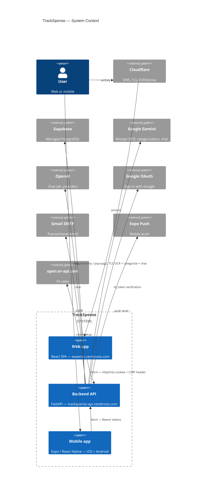
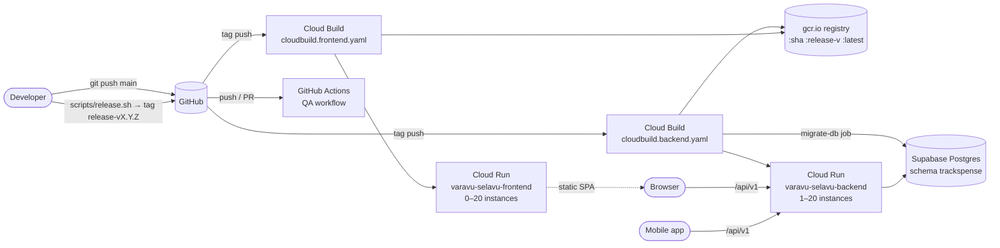
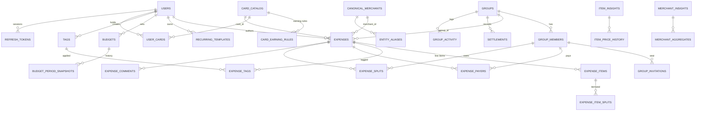

# TrackSpense by Cerebroos — Complete Product & Technical Specification

> **Document version:** 3.0 — full rewrite  
> **As of:** 2026-09-19 · verified against `main` at commit `a759584`  
> **Product:** TrackSpense · **Company:** Cerebroos · **Repository:** `VaravuSelavuSeyali`  
> **Production:** web `https://expense.cerebroos.com` · API `https://trackspense-api.cerebroos.com`

> **How this document was produced.** Version 1.0 was written in March 2026 and described a single-user expense tracker; the product has since grown into a personal-plus-shared finance platform (groups, budgets, Card Coach, tags, entity resolution, a redesigned mobile app, a hardened auth layer and a split CI/CD pipeline). This revision was written from the code, not from earlier documents: the endpoint tables (§8) and the data-model appendix (Appendix A) are **generated from the source** (`api/*.py` route decorators and `models/api_models.py`), and every behavioural claim was checked against the implementation. Where something is designed but not built, or built but switched off, the text says so explicitly. Per-ticket history lives in `docs/features/` and `docs/design/`; [`docs/FEATURE_STATUS.md`](FEATURE_STATUS.md) and [`docs/INFRASTRUCTURE.md`](INFRASTRUCTURE.md) are older, narrower documents — see Appendix C for what in them is now stale.

---

## Table of Contents

1. [Product Overview](#1-product-overview)
2. [Users, Goals & Business Rules](#2-users-goals--business-rules)
3. [Feature Catalog](#3-feature-catalog)
4. [System Architecture](#4-system-architecture)
5. [Technology Stack](#5-technology-stack)
6. [Repository Structure](#6-repository-structure)
7. [Data Model](#7-data-model)
8. [Backend API Specification](#8-backend-api-specification)
9. [Authentication & Security](#9-authentication--security)
10. [Business-Logic Engines](#10-business-logic-engines)
11. [AI & ML Services](#11-ai--ml-services)
12. [Web Application](#12-web-application)
13. [Mobile Application](#13-mobile-application)
14. [Expense Category Taxonomy](#14-expense-category-taxonomy)
15. [Deployment & Infrastructure](#15-deployment--infrastructure)
16. [Configuration Reference](#16-configuration-reference)
17. [Development Setup & Tooling](#17-development-setup--tooling)
18. [Quality: Testing & QA](#18-quality-testing--qa)
19. [Known Gaps, Risks & Roadmap](#19-known-gaps-risks--roadmap)
- [Appendix A — API Request/Response Models](#appendix-a--api-requestresponse-models)
- [Appendix B — Ticket Series Index](#appendix-b--ticket-series-index)
- [Appendix C — Related Documents & What Is Stale](#appendix-c--related-documents--what-is-stale)

---

## 1. Product Overview

**TrackSpense** is an AI-assisted personal and shared-expense tracker. A user logs spending in seconds — by typing a sentence, using a keypad, or photographing a receipt — and the product categorizes it, tracks it against budgets, splits it with friends, and lets the user interrogate their own data in plain language ("Has the price of milk gone up?", "Log 42.10 groceries at India Bazaar").

It ships as three clients over one backend:

| Surface | Stack | Where |
|:---|:---|:---|
| **Web app** | React 19 SPA (MUI 7), served by nginx on Cloud Run | `expense.cerebroos.com` |
| **Mobile app** | Expo 54 / React Native 0.81 (iOS + Android) | app stores / EAS builds |
| **Backend API** | FastAPI on Cloud Run, PostgreSQL (Supabase) | `trackspense-api.cerebroos.com` |

### Product name
- **TrackSpense** — "Track" + "Expense"; the product and brand name.
- **VaravuSelavuSeyali** — Tamil for "Income · Expense · App" (*varavu* = income, *selavu* = expense, *seyali* = app); the repository and internal service name.

### Value proposition
> Make tracking money effortless, accurate and insightful — remove data entry with AI, make shared expenses fair and settle-able, and let people ask questions of their own finances instead of reading charts.

### Product pillars

| Pillar | What it means in the product |
|:---|:---|
| **Capture in seconds** | Keypad-first quick capture, a type-to-log bar that parses "coffee 6.75 at Blue Bottle", AI receipt scanning with line items, AI auto-categorization, recurring templates. |
| **Understand** | Dashboard with six-month history, category breakdown, "what changed" insights, per-item price history, merchant insights, budgets with projected pace. |
| **Share & settle** | Groups with equal/exact/percent/shares/adjustment/itemized splits, multi-payer, multi-currency, simplified debts, settlements, comments, push notifications. |
| **Ask** | A tool-calling AI analyst that answers from the user's real data and can log expenses on request. Every answer states the period and scope it looked at. |
| **Optimize** | Budgets, and Card Coach — which credit card would have earned the most on each category/merchant. |
| **Trust** | Money is `Decimal`, never float; HttpOnly-cookie sessions with CSRF; rate limits; sanitized input; a QA framework and a dependency-audit gate in CI. |

### Maturity at a glance (2026-09-19)

| Area | State |
|:---|:---|
| Core expense tracking, receipts, recurring, analytics, AI chat | Shipped, in production |
| Groups (split & settle) | Shipped, **enabled in production** |
| Budgets, Card Coach, Tags | Shipped, **enabled in production** |
| Smart Entity Resolution | Built, **disabled in production** (`ENTITY_RESOLUTION_ENABLED=false`) |
| Mobile V2 redesign (all 20 screens) | Implemented 2026-09-19; drawer removed, five tabs |
| CI/CD | Split backend/frontend pipelines triggered by `release-vX.Y.Z` tags (see §15) |
| Test suites | ~630 backend, ~103 web, ~115 mobile unit tests, ~93 Playwright QA tests (§18) |

---

## 2. Users, Goals & Business Rules

### Target users
- **Individuals** who want fast, low-friction expense logging and spending visibility.
- **Households, couples, roommates and travel groups** who share costs and need a fair, auditable ledger and easy settlement.
- **Budget- and rewards-conscious users** who set monthly limits or want to know which card to use.
- **Receipt-heavy spenders** (groceries, dining) who want line-item price tracking.
- **Users who prefer to ask** rather than navigate — the conversational analyst is a first-class surface.

### Business goals
1. Remove friction from expense entry (typed sentence, keypad, receipt scan, recurring).
2. Give real-time, trustworthy spend analytics — including what changed and why.
3. Make shared expenses fair, transparent and easy to settle without TrackSpense ever handling money.
4. Offer natural-language access to the user's own financial data, with visible provenance.
5. Keep one consistent experience across web, iOS and Android.
6. Classify and normalize data (categories, merchants, items) well enough to power insights.

### Key business rules

| # | Rule |
|:---|:---|
| R1 | Every record belongs to a registered user, identified by **email**. All personal data is private per user; every query is scoped by the authenticated user derived from the token — a client-supplied `user_id` is never trusted. |
| R2 | Money is `Decimal` with two places (`NUMERIC(12,2)`), positive, and capped at **1,000,000** per expense at the API. Zero is allowed only where meaningful (a payer who paid nothing, zero tax). |
| R3 | Expenses carry a date, description, category + subcategory, amount, optional merchant/notes/card/tags. The API accepts dates as `MM/DD/YYYY`; storage is a timestamp (`purchased_at`). |
| R4 | Free text is normalized on write (HTML tags stripped, control characters removed, length capped: description 200, names/categories 100, notes 500). |
| R5 | Receipts are de-duplicated with a SHA-256 fingerprint of merchant + hour + amount + first items. |
| R6 | **Settlements never change spend.** Recording a payment between members moves balances only; it never touches `expenses` or any spend total (rule TS-GRP-R2, enforced by test). |
| R7 | **No double counting.** A user's *personal* totals only count expenses where `group_id IS NULL`; a group expense contributes to a user's *combined* total only as their **share**. |
| R8 | Groups require a **verified email** to create a group or accept an invite. |
| R9 | Group balance identity: `net(m) = Σpaid − Σowed + Σsettlements_sent − Σsettlements_received`, and Σnet over a group is always 0. |
| R10 | Splits are **cent-exact**: rounding remainders are always assigned, never lost. |
| R11 | TrackSpense never moves money and never stores card numbers or issuer credentials. Payment handles (Venmo/PayPal.me/UPI) only build deep links opened on the user's own device. |
| R12 | Currency defaults to USD; groups may declare another ISO-4217 currency and expenses may carry their own currency with an FX rate to the group currency. |
| R13 | Deleting an account hard-deletes the user's personal expenses; their group contributions survive with the member renamed to "Anonymous User". |
| R14 | An AI write action can only ever act on the authenticated user's own ledger; the agent's tools close over the caller's identity. |

---

## 3. Feature Catalog

Legend — **Web / Mobile**: ✅ shipped · — not applicable. **Flag** is the backend feature flag gating the API (all flags fail closed with `404`); production values were read from `GET /api/v1/config` on 2026-09-19.

### 3.1 Accounts & authentication

| Capability | Behaviour | Web | Mobile |
|:---|:---|:---|:---|
| Register | Name + email + password (phone optional; the mobile V2 form asks only three fields). bcrypt hash; passwords must be at least 8 characters and passwords over **72 bytes are rejected** rather than silently truncated. Sends a verification email. | ✅ | ✅ |
| Email verification | One-time token (only its SHA-256 is stored) → `POST /auth/verify-email`. Unverified users see a banner on web; `email_verified` is returned by `/auth/me`. **Required to create a group or accept an invite.** Google-verified emails are auto-verified. | ✅ | via web link |
| Login / logout | Password login; web receives HttpOnly cookies + a CSRF token, mobile receives bearer tokens stored in the OS secure store. | ✅ | ✅ |
| Google sign-in | Web only: Google `id_token` verified server-side. | ✅ | — |
| Session refresh | Refresh-token **rotation with reuse detection** (token families in Postgres, one-minute grace for legitimate concurrent refreshes). | ✅ | ✅ |
| Forgot / reset password | Emailed link valid for **1 hour**; the response never reveals whether an email exists. | ✅ | — |
| Profile | Name, phone, address, and payment handles (Venmo, PayPal.me, UPI) with a strict character set and 64-char cap. | ✅ | ✅ (Account → Edit) |
| Delete account | Confirmation by typing `DELETE`. Personal expenses are hard-deleted; group memberships anonymized (R13). | ✅ | ✅ |
| Legal | Privacy policy and Terms of Service served by the backend at `/privacy-policy` and `/terms-of-service`. | ✅ | ✅ (links) |

### 3.2 Expense capture & management

| Capability | Behaviour |
|:---|:---|
| **Quick Capture** | The single fast-entry surface on both clients. Mobile: a bottom sheet with a numeric keypad — amount, one description, then Save; category is AI-suggested and, with date, "More" (merchant, card, repeat-monthly) sit behind chips. Web: a shared `QuickCaptureSheet` (bottom sheet on small screens, dialog on desktop) opened from the header "+ New expense", the mobile FAB, the Expenses page, or a group's own "Add expense" (pre-scoped to that group). |
| **Type-to-log bar** | A one-line input (`"coffee 6.75 at Blue Bottle"`, optionally naming a group/split) parsed client-side by `quickLogParse`; a clean parse saves directly (personal or group), a question routes to the AI Analyst, anything else falls back to the full capture sheet. Shows a "Will log…" preview. |
| **AI categorization** | `POST /expenses/categorize` asks the LLM for `(main, sub, merchant)` and **validates** it against the taxonomy (§14); on any failure it falls back to `Other / General`. |
| **Receipt scan** | Image (PNG/JPEG; web also converts HEIC with an on-demand converter) or PDF, max **12 MB**, content type verified by magic bytes. The OCR engine (Gemini Vision by default; Ollama or a text mock for tests) returns a header (merchant, date, totals, tax/tip/discount, category) plus line items with normalized names. Nothing is saved until the user reviews and confirms. Repeat scans are detectable by `fingerprint`. |
| **Itemized expenses** | `POST /expenses/with_items` stores line items (`expense_items`) that feed item-price history; items can be edited after saving (`PUT /expenses/{id}/items`). Group expenses can be itemized and assigned per person (§3.6). |
| **Browse / search / filter** | Combined feed of personal and group rows; month, free-text search, tag filter and scope (personal / groups / combined). Edit, delete, and *move to group* (§3.6). |
| **Expense detail** | Personal detail with merchant, split, tags, receipt info and card; the mobile sheet adds an **"above your usual"** note when an amount is ≥1.5× the mean of at least three other expenses at the same merchant (a client-side heuristic over loaded rows). |
| **Card attribution** | An optional card per expense (§3.8) so Card Coach can compute *actual* earnings. |
| **Export** | `GET /expenses/export.csv` (all personal expenses). Cells that start with `= + - @` are neutralized against spreadsheet formula injection. |

**Capture recovery (2026-10-06).** Quick Capture preserves the complete structured draft, including receipt items and customized payers/splits, in web tab session storage or native secure storage. Recovery expires one hour after the last update. Reopen/reload or same-account reauthentication restores the entry for review; receipt photos and tokens are not part of the draft. Success, explicit discard and deliberate local sign-out clear it; a different account cannot recover it. Recovered groups are fetched again and invalid member references block saving. An interrupted or ambiguous save is marked unknown and requires checking Expenses before allowing another save; there is no automatic write replay. Closing the sheet keeps the draft, with a separate confirmed Discard action.

**Browse recovery.** Web search, month, tags and scope are URL parameters retained through Back/Forward; list scroll position is retained per history entry in tab session storage. Failed or partial expense reads show an incomplete-data warning and a Retry action rather than an empty ledger.

### 3.3 Recurring expenses

Templates store description, category, merchant, **day of month**, default cost, start date and status (`Active` / `Paused`); a template may also be **group-scoped** with a `split_config`, in which case executing it creates a split group expense.

- **Due calculation** is monthly: from the template's start (or last-processed month) up to the requested date, one occurrence per elapsed month, with day 31 clamped to the month's last day. Missed months therefore come back as multiple due items.
- `POST /recurring/confirm` bulk-creates expenses from due items; `POST /recurring/execute_now` runs one template for the current month immediately.
- **Surfaces:** a prompt on app open lists what is due (web dialog, mobile `RecurringPrompt`); web Expenses → *Recurring* tab; mobile **Spend → Recurring** with a cyan "Due in N days" card (*Confirm now* / *Skip*), per-template on/off switch, run-now and inline edit. Toggling or editing a template preserves its group, split and merchant (the upsert endpoint overwrites omitted fields with null, so clients must send them back).

### 3.4 Analytics, dashboard & insights

| Feature | Behaviour |
|:---|:---|
| **Dashboard** | Spend this month (the *combined* figure: personal + the user's group shares), month-over-month delta, six-month history, **Net with people** and "owed to you", ask/log bar, recent rows. Web additionally shows Insight of the Day, spend spectrum, top categories, trend chart, My Groups strip, and Budgets / Card Coach summary cards. |
| **Analysis — Overview** | Category breakdown (donut + ranked legend with drill-down to a category's transactions), monthly trend, "what changed vs last month", tag filter, an **Analyse** picker (My spending or any single group's whole spend), and an *include group shares* toggle. |
| **Analysis scopes** | `personal`, `combined`, `groups`, `group` (one group), `i_paid`, `group_total`; `group_summaries` carry each group's share, amount paid, total and the user's running balance. With `GROUPS_ENABLED=false` any group scope silently downgrades to `personal`. Results are cached in memory for 60 s (`ANALYSIS_CACHE_TTL_SEC`) and invalidated on every write. |
| **Item Insights** | Ranked items with average/min/max unit price, quantity, total spent, price history, **store comparison** (only when ≥2 distinct merchants), month-over-month change, and a **confidence** grade (high/medium/low from purchase count and merchant spread). Low-confidence claims are suppressed rather than shown. Web adds a "personal inflation" summary card. |
| **Merchant Insights** | Ranked merchants with totals, transaction counts, monthly aggregates, recent and highest transactions, items bought, spend share; names are canonicalized (trim + case-fold). |
| **Change insights** | Seven ranked detectors: *New merchant detected*, *Spend increased/decreased at X*, *Category spend increased*, *Price increase for item*, *Unusually large transaction at X* (outlier vs history), and *Recurring bill increased* (vs active templates). Group-aware (a suffix names the group). |
| **Save-time aggregation** | Every expense create/update/delete schedules a background task that refreshes `item_insights`, `merchant_insights` and their aggregates; `scripts/backfill_insights.py` rebuilds and validates them (0.05 tolerance) against the source of truth. |
| **Tags & budgets in analysis** | The overview honours a tag filter, and a Budgets tab lives alongside Items and Merchants (on mobile; Card Coach sits under Account → Cards & accounts). |

### 3.5 AI Analyst ("Ask")

A LangGraph **ReAct tool-calling agent** (§11.3) that answers from the user's data and can log expenses.

- **Providers:** Gemini (default), OpenAI, or Ollama; a *Fast / Deep* picker chooses among the models the backend lists at `GET /models`.
- **Provenance:** every response carries `resolved_period` (`{start_date, end_date, label, source}`) and `resolved_scope` (`personal` or a named group). Clients render this as a mono **"LOOKED AT · SEPTEMBER 2026 · MY SPENDING"** line. It is what the backend actually resolved — never a client-side guess.
- **Write actions:** `create_expense` and `create_group_expense` (equal split among current members, optional natural-language `paid_by`). Update and delete are **deliberately not offered** — an LLM editing or removing the wrong existing record has no undo.
- **Safety:** retrieved data is fenced behind an injection boundary in the prompt (a co-member can name an expense to carry instructions); tools close over the authenticated user so injection cannot reach another user's data. Rate-limited to 5/minute.
- **Conversation recovery:** web Ask mounts lazily on first use; closing it or crossing a responsive breakpoint retains messages and pending work in account-scoped app memory. Logout/account change clears it. The native Ask tab already stays mounted across tab navigation. Slow work receives a delayed-state message; web Stop waiting aborts the client wait without promising cancellation or a quota refund on the server.
- **Client request budgets:** ordinary requests 30 seconds, analysis chat and receipt ingestion 120 seconds, refresh 15 seconds, including response-body consumption. Caller cancellation is honored. Only an explicit rejected refresh ends the session; transient refresh failure preserves authentication. A 401 can trigger one refresh/retry; network/timeout/5xx failures never automatically replay writes.
- **Surfaces:** web — an ambient right-hand *Ask overlay* (bottom sheet on small screens) plus an `/ask` page; mobile — the **Ask** tab, and hand-offs from Item/Merchant insights and the log bar.

### 3.6 Groups — split & settle (`GROUPS_ENABLED`, **on in production**)

**Groups.** Types `trip | home | couple | other`; a currency; `simplify_debts`; an optional default split. Lifecycle: `active → archived` (read-only, reversible) and soft-`deleted` (restorable for **30 days**). Roles are `admin` and `member`; the creator is admin.

**Members & invites.** Members are *registered* (added by account email) or *placeholders* (name only — for people without the app). A 7-day invite token can be minted **only for a vacant placeholder seat** (a fix for a seat-takeover escalation, VS-01); it is redeemed at `trackspense://join/{token}` (mobile) or `/groups/join/:token` (web). The mobile join screen asks the user to confirm before joining. Leaving or removing a member is guarded by the member's real balance.

**Expenses & splits.**

| Feature | Detail |
|:---|:---|
| Split types | `equal`, `exact`, `percentage`, `shares` (proportional), `adjustment` (fixed offsets), and **itemized** (per-line-item member ratios). Always cent-exact (R10). |
| Payers | One or many payers per expense; payer amounts must sum to the total. |
| Currency | Each expense may carry its own currency + `fx_rate_to_group_currency`, from a free daily-cached provider (`open.er-api.com`); a lookup failure falls back to 1:1 and never blocks saving. |
| Editing | Any member may edit or delete; every change writes per-expense **history** and a group **activity** row. |
| Comments | Flat, chronological, author-deletable. |
| Move to group | Convert a personal expense into a group expense in place (`POST /expenses/{id}/move_to_group`). |
| Suggestions | `GET /groups/{id}/items/suggest_assignment` proposes who usually gets an item. |
| Recurring | Group-scoped recurring templates create split expenses. |

**Balances & settlement.** `GET /groups/{id}/balances` returns per-member net and suggested transfers — either the literal pairwise ledger or, when `simplify_debts` is on, a **greedy-netting** simplification. `GET /friends/balances` aggregates the net with each *person* across every shared group (the mobile/web **People** view). Settlements can be recorded, listed and undone (only by the recorder or an admin — VS-08); a member's share of one specific expense can be settled individually. Payment deep links to Venmo, PayPal.me and UPI are built client-side.

**Notifications & activity.** Per-group activity feed (created/updated/deleted expenses, settlements, joins…). Push notifications via the Expo Push Service for `expense_added`, `expense_edited` (only when the recipient's share changed), `expense_deleted`, `settlement_recorded`, `member_joined`, `comment_added`; the actor is excluded and each user can mute a group or individual event types. Group data can be exported as CSV.

### 3.7 Budgets (`BUDGETS_ENABLED`, **on**)

- **Model:** monthly only; `scope` = `personal` or `combined` (includes group shares); `target_type` = `overall` or `category`; one live budget per (scope, target); creating a duplicate edits the existing one. Soft-delete keeps history.
- **Live figures** for the current period: `spent`, `committed` (recurring charges still due this month), `remaining`, `projected` (fixed bills — rent/mortgage or expenses matching an active recurring template — at face value, plus the rest ÷ fraction of month elapsed) and a **status**: `exceeded` (spent > amount), otherwise by projected ÷ amount: `on_track` (≤ 100%), `at_risk` (≤ 110%), `over_pace` (> 110%); pace statuses only apply from day 5 of the period.
- **History:** the first read of an already-ended period writes an immutable `budget_period_snapshots` row (lazily — no scheduler exists), so past figures never drift.
- **Extras:** transaction breakdown per budget, **suggested amounts** (median of the last three months per category), AI **Ask why** (grounded in the budget's contributing transactions), alert thresholds and a mute switch.
- **Known gaps:** `rollover` is stored and returned but does not yet alter the calculation; `alert_thresholds` has no per-element bounds validation.
- **Surfaces:** web Analysis → *Budgets* tab and a dashboard summary card; mobile **Insights → Budgets** with a "Left to spend · N days" hero when an overall budget exists.

### 3.8 Card Coach (`CARD_COACH_ENABLED`, **on**)

Answers "which of my cards should I have used?" without ever holding card data.

- **Catalog:** a curated, human-reviewed `card_catalog` with per-card `card_earning_rules` (flat, capped/bonus-category, merchant-specific and time-boxed rotating rules), seeded by migration; `source_url` and `last_verified_at` provide provenance. Users can also create **custom cards** and file **data-correction** reports (a manual review queue, never a scraper).
- **My cards:** a user *claims* cards (no numbers, no credentials), marks a **default**, and may attribute each expense to a specific card.
- **Engine** (§10.6): rule precedence *merchant > category > flat*; cashback (`%`) vs points/miles (points-per-dollar, converted to dollars only when the catalog has a `point_value_estimate_usd`); cap notes; "actual earned" summed across the buckets the user actually used vs the "optimal" card per category/merchant.
- **Surfaces:** `GET /cards/coach`; web Analysis → *Cards* tab with a card-detail dialog and custom-card form; mobile Insights → Cards; a dashboard summary card on web; two chat tools (`get_card_coach_summary`, `suggest_best_card_for_purchase`).
- **Explicit non-goal:** no real point-balance tracking.

### 3.9 Tags (`TAGS_ENABLED`, **on**)

Private, user-defined labels orthogonal to category (what) and group (who).

- Limits: **5 per expense**, **100 per user**, **1,000 per bulk operation**; names are normalized for uniqueness per user; tags can be renamed, recolored, archived and deleted (links cascade).
- Applying: on create/update via a write-through `tag_names` field, per expense via `POST/DELETE /expenses/{id}/tags`, and **in bulk** by explicit ids or a date-range + narrowing filter ("tag a trip").
- Retrieval: expense list and analysis accept `tag_ids`; the AI has a `get_tag_summary` tool. Group rows can be filtered by tag client-side.

### 3.10 Smart Entity Resolution (`ENTITY_RESOLUTION_ENABLED`, **off in production**)

Canonical merchant/item records with aliases so "Whole Foods", "WHOLEFDS #123" and "whole foods market" become one entity. A confidence-gated cascade (thresholds **0.85 link / 0.55 suggest**; ambiguous matches never write silently) plus a typo-tolerant typeahead. A curated global merchant dictionary is seeded by migration; `scripts/backfill_entity_resolution.py` and `reconcile_entity_resolution.py` migrate existing data. Web's capture form uses an `EntityAutocomplete`, and mobile's capture sheet uses the same suggest endpoint for merchant typeahead — both only when the flag is on. Until the flag is on, merchants are matched by canonicalized name only.

### 3.11 Notifications & the Activity stream

- **Push** (mobile): device tokens are registered on login/app start and removed on logout; tapping a push deep-links to its group. Send failures are logged, never raised into the request.
- **Mobile Activity screen** (bell on Home): one dated stream assembled *client-side* from existing endpoints — group activity, recurring items coming due, budgets at risk/exceeded and the top month-over-month change. There is no server-side notification inbox, so there is no unread state.

### 3.12 Feedback & email

`POST /email/send` (5/minute) delivers feature requests and contact messages through Gmail SMTP. Web has a Feedback dialog in the account menu and a `/contact` page; mobile has a Feedback screen under Account.

### 3.13 Feature flags

| Flag | Code default | Production (2026-09-19) | Gates |
|:---|:---|:---|:---|
| `GROUPS_ENABLED` | `False` | **true** | All `/groups`, `/friends`, `/devices` routes and group scopes in analysis |
| `BUDGETS_ENABLED` | `True` | **true** | `/budgets*` |
| `CARD_COACH_ENABLED` | `True` | **true** | `/cards*` |
| `TAGS_ENABLED` | `True` | **true** | `/tags*`, `/expenses/{id}/tags` |
| `ENTITY_RESOLUTION_ENABLED` | `False` | **false** | `/suggest/*`, `/resolve/*`, `/canonical/*` |

Flags are read fresh per request, are exposed to clients (unauthenticated) at `GET /api/v1/config`, and both clients gate UI on that endpoint instead of probing for a 404.

---

## 4. System Architecture

### 4.1 System context


```mermaid
C4Context
  title TrackSpense — System Context

  Person(user, "User", "Web or mobile")

  System_Boundary(ts, "TrackSpense") {
    System(web, "Web app", "React SPA — expense.cerebroos.com")
    System(api, "Backend API", "FastAPI — trackspense-api.cerebroos.com")
    System(mobile, "Mobile app", "Expo / React Native — iOS + Android")
  }

  System_Ext(cf, "Cloudflare", "DNS, TLS, CDN/proxy")
  System_Ext(db, "Supabase", "Managed PostgreSQL")
  System_Ext(gemini, "Google Gemini", "Receipt OCR, categorization, chat")
  System_Ext(openai, "OpenAI", "Chat (alt. provider)")
  System_Ext(google, "Google OAuth", "Sign in with Google")
  System_Ext(gmail, "Gmail SMTP", "Transactional email")
  System_Ext(expo, "Expo Push", "Mobile push")
  System_Ext(fx, "open.er-api.com", "FX rates")

  Rel(user, cf, "HTTPS")
  Rel(cf, web, "proxies")
  Rel(user, mobile, "uses")
  Rel(web, api, "fetch — HttpOnly cookies + CSRF header")
  Rel(mobile, api, "fetch — Bearer tokens")
  Rel(api, db, "SQLAlchemy / psycopg2, TLS")
  Rel(api, gemini, "OCR + categorize + chat")
  Rel(api, openai, "chat")
  Rel(api, google, "id_token verification")
  Rel(api, gmail, "SMTP")
  Rel(api, expo, "push send")
  Rel(api, fx, "rate lookup")
```

### 4.2 Runtime containers and delivery


```mermaid
flowchart LR
  dev([Developer]) -->|git push main| gh[(GitHub)]
  dev -->|scripts/release.sh → tag release-vX.Y.Z| gh
  gh -->|tag push| cbB[Cloud Build<br/>cloudbuild.backend.yaml]
  gh -->|tag push| cbF[Cloud Build<br/>cloudbuild.frontend.yaml]
  cbB --> reg[(gcr.io registry<br/>:sha :release-v :latest)]
  cbF --> reg
  cbB -->|migrate-db job| db[(Supabase Postgres<br/>schema trackspense)]
  cbB --> beRun[Cloud Run<br/>varavu-selavu-backend<br/>1–20 instances]
  cbF --> feRun[Cloud Run<br/>varavu-selavu-frontend<br/>0–20 instances]
  beRun --> db
  feRun -. static SPA .-> browser([Browser])
  browser -->|/api/v1| beRun
  mob([Mobile app]) -->|/api/v1| beRun
  gh -->|push / PR| qa[GitHub Actions<br/>QA workflow]
```

Two independent Cloud Run services and one Cloud Run *Job* (`migrate-db`) make up the runtime; delivery is described in §15.

### 4.3 Backend layering

```
HTTP  →  Middleware (CORS, CSRF)  →  Routers  →  Services  →  SQLAlchemy models  →  PostgreSQL
                                        │            │
                                        │            └── engines: SplitEngine, ItemSplitEngine, BalanceService,
                                        │                CardRewardsEngine, BudgetService, InsightAnalytics …
                                        └── Pydantic models (request validation + response shaping)
```

| Layer | Location | Responsibility |
|:---|:---|:---|
| **Entry** | `varavu_selavu_service/main.py` (root `main.py` is a `uvicorn` launcher) | Builds the FastAPI app, installs the rate limiter, `CSRFMiddleware`, CORS; serves `/`, `/privacy-policy`, `/terms-of-service`; fails fast if the JWT secret is unsafe outside `local`. |
| **Routers** | `api/routes.py` (`/api/v1`), `api/groups_routes.py`, `api/devices_routes.py`, `api/entity_resolution_routes.py`, `auth/routers.py` (`/api/v1/auth`) | HTTP concerns only: auth dependency, feature-flag dependency, rate limit, delegation. |
| **Services** | `services/*.py` (30+) | All business logic. Constructed per request from a `Session`. |
| **Models** | `models/api_models.py` (Pydantic, 131 classes), `db/models.py` (SQLAlchemy, 33 tables) | Contract vs persistence, kept separate. |
| **Core** | `core/` | `config` (settings), `csrf`, `limiter`, `money`, `text_sanitize`, `upload_safety`, `csv_safety`. |
| **DB** | `db/session.py` | Sync SQLAlchemy engine with `pool_pre_ping`; falls back to a local SQLite file only when `DATABASE_URL` is empty. `db/schema.sql` is the baseline schema used to bootstrap empty databases. |

**Cross-cutting design decisions**

- **The authenticated user always comes from the token** (`Depends(auth_required)`); handlers ignore any `user_id` a client still sends.
- **Feature flags are per-request dependencies** that raise `404`, so a disabled feature is indistinguishable from a non-existent route.
- **Background work** uses FastAPI `BackgroundTasks` (insight aggregation, push fan-out). There is **no scheduler**: Cloud Scheduler is not enabled, and time-based behaviour (budget snapshots, due recurring items) is computed lazily on read.
- **Caching:** only `AnalysisService` caches (in-process, 60 s, cleared on every write). It is per-instance, so with several Cloud Run instances a value can be up to 60 s stale on a different instance.

### 4.4 Key flows

**Logging an expense (personal).** Client → `POST /expenses` (validated + sanitized; optional `tag_names`, `card_id`) → `ExpenseService` writes the row → analysis cache invalidated → background task refreshes item/merchant insights.

**Logging a group expense.** Client → `POST /groups/{id}/expenses` → `GroupExpenseService` validates payers, runs `SplitEngine` (cent-exact) → writes `expenses` + `expense_payers` + `expense_splits` (+ per-item splits when itemized) → `ActivityService` records the event → cache invalidated → `NotificationService.fan_out` sends pushes (background).

**Receipt to expense.** Client uploads to `POST /ingest/receipt/parse` (type, size, magic-byte checks; 3/min) → `ReceiptService` (Gemini Vision) → validated header + items + fingerprint returned, **nothing persisted** → user edits → `POST /expenses/with_items` (or the group equivalent).

**Ask.** Client → `POST /analysis/chat` (5/min) → period and group scope resolved from the text and request params → LangGraph agent with the user's tools → response + `resolved_period` + `resolved_scope` → clients render the provenance line; any expense created triggers client-side cache invalidation.

**Auth (web).** Login → server sets `vs_token` (HttpOnly), `vs_refresh` (HttpOnly, path-scoped to auth routes) and `vs_csrf` (readable) cookies and returns a `csrf_token`; mutating requests echo it in `X-CSRF-Token`. **Auth (mobile).** Login returns tokens in the body; the app stores them in `expo-secure-store` and sends `Authorization: Bearer` (exempt from CSRF because nothing attaches it ambiently).

---

## 5. Technology Stack

### Backend (`varavu_selavu_app`)

| Concern | Technology |
|:---|:---|
| Language / runtime | Python **3.12** (container; project floor `^3.10`), Poetry (package-mode off) |
| Framework | FastAPI ≥ 0.141, Starlette ≥ 1.6, Uvicorn 0.35 |
| Validation | Pydantic (v2 models; settings use `pydantic.v1.BaseSettings`) |
| ORM / DB | SQLAlchemy 2, psycopg2-binary, Alembic (<1.14), PostgreSQL |
| Auth | PyJWT (HS256), bcrypt 4, `google-auth` |
| Rate limiting | slowapi + `limits` (in-memory by default; Redis via `RATE_LIMIT_STORAGE_URI`) |
| AI | LangChain 1.x, LangGraph 1.x, `langchain-openai`, `langchain-google-genai`, `langchain-ollama` |
| HTTP / misc | httpx, requests, python-multipart, email-validator, python-dateutil (`plotly` is declared but unused) |
| Security floors | Explicit lower bounds on transitive deps (urllib3, idna, cryptography, aiohttp, ujson, click, filelock, pyasn1, pygments) so patched versions keep flowing |
| Test / audit | pytest ≥ 9, pytest-env, testing-postgresql, pip-audit |

### Web (`varavu_selavu_ui`)

| Concern | Technology |
|:---|:---|
| Framework | React **19.1**, TypeScript, Create React App (`react-scripts`) — build tooling lives in `devDependencies` |
| UI | MUI **7** (`@mui/material`, icons), Emotion, framer-motion |
| Data | TanStack Query 5, `date-fns` 4 |
| Charts | Plotly (`react-plotly.js`, lazy-loaded custom bundle) |
| Routing | React Router 6 |
| Misc | `heic2any` (iPhone photo conversion), `web-vitals` |
| Serving | nginx on Cloud Run (SPA fallback, security headers, CSP) |
| Tests | Jest + Testing Library |

### Mobile (`varavu_selavu_mobile`)

| Concern | Technology |
|:---|:---|
| Framework | Expo **~54**, React Native **0.81.5**, React 19.1, Hermes, TypeScript |
| Navigation | React Navigation 6 (native stack + bottom tabs) |
| Data | TanStack Query 5, `big.js` for money math |
| UI | Custom CerebroOS components; `expo-linear-gradient`, `expo-blur`, `react-native-svg`, `react-native-reanimated` 4, `@shopify/flash-list`, `react-native-chart-kit` |
| Device | `expo-secure-store`, `expo-notifications`, `expo-device`, `expo-image-picker` (receipt photos), `expo-haptics`, `@react-native-community/netinfo`, `@react-native-community/datetimepicker` |
| Fonts | Bricolage Grotesque (display), Instrument Sans (text), IBM Plex Mono (labels) |
| Tests | Jest (`jest-expo`) + `@testing-library/react-native` |

### Infrastructure & tooling

Google Cloud Run · Cloud Build · Artifact Registry (`gcr.io` domain) · Secret Manager · Supabase Postgres · Cloudflare · GitHub Actions (QA) · Playwright 1.62 (QA framework) · Docker.

---

## 6. Repository Structure

A single monorepo (`git ls-files`: ~209 web, ~183 backend, ~149 mobile, ~56 QA, ~123 docs files).

```
VaravuSelavuSeyali/
├── cloudbuild.backend.yaml        # Backend release pipeline (audit → build → push → migrate → deploy)
├── cloudbuild.frontend.yaml       # Frontend release pipeline (audit → build → push → deploy)
├── cloudbuild.yaml                # DEPRECATED all-in-one pipeline; delete once cutover is complete
├── .cloudbuild/
│   ├── README.md                  # How releases, rollback and registry retention work
│   ├── registry-cleanup-policy.json   # Keep newest 10 images per service
│   └── triggers/{backend,frontend}.yaml   # Cloud Build trigger definitions (tag-triggered)
├── .github/workflows/qa.yml       # Playwright + API QA on push/PR (mobile/docs paths ignored)
├── scripts/
│   ├── release.sh                 # Guarded `release-vX.Y.Z` tag-and-push
│   └── backfill_insights.py       # Rebuild + validate item/merchant insight tables
├── Makefile                       # Dev, test, QA, audit and `release-check` shortcuts
├── docker-compose.yml             # Local container run (see §17 — ports are out of date)
├── shared/tokens.ts               # Design-token stub (not imported by any client)
├── docs/                          # This spec, INFRASTRUCTURE, FEATURE_STATUS, design & feature tickets
├── qa/                            # Playwright QA framework (e2e + API), TEST-PLAN, TEST-CASES
│
├── varavu_selavu_app/             # ── BACKEND ──
│   ├── main.py                    # `uvicorn` launcher (imports varavu_selavu_service.main:app)
│   ├── Dockerfile, pyproject.toml, poetry.lock, alembic.ini
│   ├── alembic/versions/          # 23 migrations (schema `trackspense`)
│   ├── scripts/                   # entity-resolution backfill/reconcile, card-catalog seed SQL
│   ├── privacy_policy.html, terms_of_service.html
│   ├── tests/                     # 70 test files
│   └── varavu_selavu_service/
│       ├── main.py                # FastAPI app assembly
│       ├── api/                   # routes.py, groups_routes.py, devices_routes.py, entity_resolution_routes.py
│       ├── auth/                  # routers.py, service.py, security.py (JWT/bcrypt), cookies.py
│       ├── core/                  # config, csrf, limiter, money, text_sanitize, upload_safety, csv_safety
│       ├── db/                    # models.py (33 tables), session.py, schema.sql
│       ├── models/api_models.py   # Pydantic request/response models
│       └── services/              # expense, group, group_expense, balance, settlement, split_engine,
│                                  # item_split_engine, analysis, analytics, insight_analytics,
│                                  # insights_aggregation, budget, card, card_rewards_engine, tag, tag_bulk,
│                                  # entity_resolution, chat, categorization, receipt, recurring, activity,
│                                  # notification, fx_rate, email, expense_comment, friend_balance,
│                                  # group_export, personal_export, split_suggestion
│
├── varavu_selavu_ui/              # ── WEB ──
│   ├── Dockerfile, nginx.conf, package.json, .env.{development,production}
│   └── src/
│       ├── App.tsx, theme.ts, index.tsx
│       ├── api/                   # typed clients per domain + csrf.ts
│       ├── pages/                 # 16 pages (Dashboard, Expenses, ExpenseAnalysis, Groups, Ask, Account, auth pages…)
│       ├── components/            # analysis, ask, budgets, common, dashboard, expenses, groups, layout, recurring, tags
│       ├── context/               # ThemeMode, QuickCapture, Ask
│       ├── hooks/                 # feature-flag hooks, useLogExpense, useQuickLogBar, useReceiptScan…
│       └── utils/                 # amount, balance, date, money, quickLogParse, splitPreview, paymentDeepLinks…
│
└── varavu_selavu_mobile/          # ── MOBILE ──
    ├── App.tsx                    # Providers, tab navigator, stack, deep links
    ├── app.json, babel.config.js, jest.config.js, AGENTS.md
    └── src/
        ├── api/                   # typed clients per domain (apiFetch with 401 refresh + offline check)
        ├── screens/               # 20 screens (Home, Activity, Expenses, Groups, GroupDetail, Analysis, AIAnalyst,
        │                          #   AddExpense (capture), Profile, Login, Register, JoinGroup, Recurring, About, Feedback,
        │                          #   ItemDetail, MerchantDetail, Cards, Tags)
        ├── components/            # ListRow, TopTabs, ScreenHeader, Sheet, ExpenseQuickSheet, SettleUpSheet,
        │                          #   SplitEditor, ItemSplitBoard, Budgets/Cards content, SegmentDonut, MonthChip, OptionSheet, ToggleSwitch …
        ├── context/               # AuthContext, ThemeContext
        ├── hooks/                 # feature-flag hooks, useQuickLogBar
        └── utils/                 # currencyMath, dashboardTotals, spendTrend, activityFeed, categoryCode, expenseInsights,
                                   #   chatScope, segments, quickLogParse, paymentDeepLinks
```

Local-only files that are **git-ignored**: backend `.env*`, the GCP service-account key `gold-circlet-*.json`, the mobile `ios/` and `android/` native projects (generated by Expo), and `.playwright-mcp/`.

---

## 7. Data Model

All tables live in the PostgreSQL schema **`trackspense`** (not `public`); Alembic keeps its version table there too. There are **33 tables** across seven domains. Personal and group expenses share one `expenses` table — a group expense simply has `group_id` set.

### 7.1 Table catalog

| Domain | Table | Purpose / key columns |
|:---|:---|:---|
| **Identity** | `users` | `email` (unique), `name`, `phone`, `address`, `password_hash`, `venmo_handle`, `paypal_handle`, `upi_id`, `email_verified` |
| | `email_tokens` | One-time verification/reset tokens — **only the SHA-256 hash** is stored; `expires_at`, `used_at` |
| | `refresh_tokens` | Rotation state: `jti`, `family_id`, `expires_at`, `revoked_at`, `revoked_reason`, `replaced_by` |
| **Ledger** | `expenses` | `id`, `user_email` (author), `group_id` (null = personal), `purchased_at`, `merchant_name`, `merchant_id`→canonical merchant, `category_id` (**holds the subcategory name**, not an FK), `amount`, `currency`, `tax`, `tip`, `discount`, `payment_method`, `card_id`→`card_catalog`, `description`, `notes`, `fingerprint`, `split_type`, `fx_rate_to_group_currency` |
| | `expense_items` | Line items: `line_no`, `item_name`, `normalized_name`, `quantity`, `unit`, `unit_price`, `line_total`, `tax`, `discount`, `attributes_json` |
| | `recurring_templates` | `description`, `category`, `merchant_name`, `day_of_month`, `default_cost`, `start_date`, `last_processed_date`, `status`, `group_id`, `split_config` (JSON) |
| **Insights** | `item_insights`, `item_price_history` | Per-user item rollups (avg/min/max price, quantity, spent) and per-purchase price points |
| | `merchant_insights`, `merchant_aggregates` | Per-user merchant totals and per-month aggregates |
| **Groups** | `groups` | `name`, `group_type`, `cover`, `currency`, `simplify_debts`, `default_split_json`, `created_by`, `status`, `archived_at`, `deleted_at` |
| | `group_members` | `group_id`, `user_email` (null for placeholders), `display_name`, `role`, `status`; unique (group, email). Placeholders are `status=invited`; the member DTO's computed `invite_pending` is true only while an unaccepted, unexpired invitation exists for the seat |
| | `group_invitations` | `member_id` (the seat), `invited_email`, `token`, `expires_at`, `accepted_at` |
| | `expense_payers` | Who paid: (`expense_id`, `member_id`, `amount_paid`) — unique per pair |
| | `expense_splits` | Who owes: `amount_owed`, `basis_type`, `basis_value`, `settled_via_settlement_id` |
| | `expense_item_splits` | Itemized ratios per line item (`ratio` in (0,1], `amount`) |
| | `settlements` | `from_member_id`, `to_member_id` (must differ), `amount`, `method`, `settled_at`, `notes`, `created_by` |
| | `group_activity` | Append-only feed: `action`, `actor_member_id`, `entity_id`, `payload_json` (`settlement_created` carries `amount`, `from_member_id`, `to_member_id`; `member_added` carries `display_name`, `user_email`); indexed by (group, created) |
| | `expense_comments` | Flat comments: `member_id`, `body`, `edited_at` |
| | `group_notification_preferences` | Per (user, group): `muted`, `muted_events` |
| | `device_tokens` | Expo push tokens per user/device |
| | `fx_rates` | Daily rate cache keyed by (date, from, to) |
| **Budgets** | `budgets` | `scope`, `target_type`, `category`, `amount`, `currency`, `period_type`, `rollover`, `alert_thresholds` (JSON), `muted`, `start_date`, soft `deleted_at` |
| | `budget_period_snapshots` | Immutable per-(budget, period) result written lazily for ended periods |
| **Card Coach** | `card_catalog` | Curated cards: `issuer`, `card_name`, `points_currency_name`, `point_value_estimate_usd`, `annual_fee`, `source_url`, `last_verified_at`, `is_active`, `created_by_user_email` (custom cards) |
| | `card_earning_rules` | `category_id`, `merchant_name`, `multiplier`, `cap_amount`, `exclusions_note`, `rotation_start/end` |
| | `user_cards` | A user's claim to hold a card; `is_default` — no numbers or credentials |
| | `card_data_corrections` | User-filed stale-data reports (manual review queue) |
| **Tags** | `tags` | Per-user; unique (user, normalized name); status active/archived |
| | `expense_tags` | Link rows; `user_email` is denormalized so a tag can never leak onto another user's view |
| **Entity resolution** | `canonical_merchants`, `canonical_items` | Master records (`user_email` NULL = global curated dictionary) |
| | `entity_aliases` | Raw variant → canonical entity, with `confidence` and `confirmed` |

### 7.2 Entity relationships (core)


```mermaid
erDiagram
  USERS ||--o{ EXPENSES : authors
  USERS ||--o{ RECURRING_TEMPLATES : owns
  USERS ||--o{ BUDGETS : sets
  USERS ||--o{ TAGS : creates
  USERS ||--o{ USER_CARDS : holds
  USERS ||--o{ REFRESH_TOKENS : "sessions"
  EXPENSES ||--o{ EXPENSE_ITEMS : "line items"
  EXPENSES ||--o{ EXPENSE_TAGS : tagged
  TAGS ||--o{ EXPENSE_TAGS : applied
  GROUPS ||--o{ GROUP_MEMBERS : has
  GROUPS ||--o{ EXPENSES : "group_id"
  GROUPS ||--o{ SETTLEMENTS : records
  GROUPS ||--o{ GROUP_ACTIVITY : logs
  GROUP_MEMBERS ||--o{ GROUP_INVITATIONS : "seat"
  GROUP_MEMBERS ||--o{ EXPENSE_PAYERS : pays
  GROUP_MEMBERS ||--o{ EXPENSE_SPLITS : owes
  EXPENSES ||--o{ EXPENSE_PAYERS : ""
  EXPENSES ||--o{ EXPENSE_SPLITS : ""
  EXPENSES ||--o{ EXPENSE_COMMENTS : ""
  EXPENSE_ITEMS ||--o{ EXPENSE_ITEM_SPLITS : "itemized"
  CARD_CATALOG ||--o{ CARD_EARNING_RULES : "earning rules"
  CARD_CATALOG ||--o{ USER_CARDS : ""
  CARD_CATALOG ||--o{ EXPENSES : "card_id"
  BUDGETS ||--o{ BUDGET_PERIOD_SNAPSHOTS : "history"
  CANONICAL_MERCHANTS ||--o{ EXPENSES : "merchant_id"
  CANONICAL_MERCHANTS ||--o{ ENTITY_ALIASES : ""
  ITEM_INSIGHTS ||--o{ ITEM_PRICE_HISTORY : ""
  MERCHANT_INSIGHTS ||--o{ MERCHANT_AGGREGATES : ""
```

### 7.3 Migration history (Alembic, 23 revisions)

| Date | Revision | Change |
|:---|:---|:---|
| 2026-06-18 | `0f0766accf80`, `bb6805ddfcad` | Baseline schema; `address` on users |
| 2026-07-04 | `fa0f13339186`, `fdb24441b181` | Groups phase 1; `device_tokens` |
| 2026-07-07 | `66285244…`, `b221e1af…`, `efa7d37e…`, `eb058f5a…` | Groups phase 3 (notification prefs, comments, settle-by-expense, payment handles); `expense_item_splits`; recurring group expenses; `archived_at`/`deleted_at` |
| 2026-07-08 | `1e2c5419…` | Payment handles on users |
| 2026-07-17 | `c5c9d0ac…`, `d5f5cfe6…`, `c0cf6118…`, `fcc03f73…` | Entity-resolution canonical tables, `expenses.merchant_id`, insight canonical FKs, seeded merchant dictionary |
| 2026-08-04 | `a1b2c3d4e5f6` | Budgets |
| 2026-08-14 | `b2c3d4e5f6a7` | `refresh_tokens` (DB-backed rotation) |
| 2026-08-15 | `c3d4e5f6a7b8` | Email verification |
| 2026-08-17 | `b26d9152…`, `3eb188c7…`, `609704f8…` | Card Coach tables, `user_cards.is_default`, seeded card catalog |
| 2026-08-21/22 | `81c6ede1…`, `e77bb25a…` | Custom cards; merchant earning rules |
| 2026-08-24 | `f4a7c2e9…`, `04112bc8…` | Tags; per-expense card attribution |

Migrations are applied automatically before every backend deploy by the `migrate-db` Cloud Run Job (§15.4).

### 7.4 Design decisions

- **One ledger table.** Personal and group expenses share `expenses`; every personal-only query guards `group_id IS NULL` (rule R7), and group queries join payers/splits.
- **`category_id` is text.** It stores the subcategory name (e.g. `Groceries`), validated against the taxonomy in code rather than by a foreign key.
- **Money is `NUMERIC(12,2)`** end to end; FX rates are `NUMERIC(12,6)`.
- **Soft lifecycle where undo matters:** groups (`archived_at`, `deleted_at` + 30-day restore) and budgets (`deleted_at`); everything else deletes for real, with FK `ON DELETE` rules documented per relationship (e.g. `expenses.user_email` is `SET NULL` so group history survives account deletion).
- **Tokens and secrets are hashed:** email-verification/reset tokens store only a SHA-256; passwords use bcrypt.
- **Entity IDs in `entity_aliases` are logical** (no DB constraint) because one column references two tables (merchants and items).

---

## 8. Backend API Specification

### 8.0 Conventions

| Topic | Convention |
|:---|:---|
| **Base path** | All product endpoints live under **`/api/v1`**. Outside it, the API serves `GET /` (welcome), `GET /privacy-policy` and `GET /terms-of-service` (HTML). |
| **Volume** | **109 endpoints** across 14 areas (tables below are generated from the route decorators; the *Flag*, *Auth* and *Rate limit* columns are read from each handler's dependencies). |
| **Authentication** | *Bearer / cookie*: `Authorization: Bearer <access>` **or** the `vs_token` HttpOnly cookie. *Public*: no credentials. The refresh endpoints read the refresh token from the `vs_refresh` cookie or body. The user identity is **always** derived from the token; any `user_id` a client sends is ignored. |
| **CSRF** | Mutating requests (`POST/PUT/PATCH/DELETE`) that authenticate by **cookie** must send `X-CSRF-Token` equal to the `vs_csrf` cookie, else `403`. Bearer-authenticated requests and the session-establishing auth routes are exempt. |
| **Feature flags** | A disabled feature returns `404 Not Found`, identical to an unknown route. Current values are at `GET /config`. |
| **Errors** | FastAPI's `{"detail": "…"}`; `422` for validation errors (amounts, currency codes, handles, split sums…), `401` unauthenticated, `403` forbidden/CSRF, `404` not found or flag off, `409` conflicts (e.g. already a member), `413`/`415` for uploads, `429` when rate limited. |
| **Rate limits** | A default of **100 requests / 15 min per client IP** on every route, plus the stricter per-route limits in the tables. The key is the Cloudflare-asserted `CF-Connecting-IP`; counters are in-process unless `RATE_LIMIT_STORAGE_URI` points at Redis (§9.9). |
| **Dates** | Personal expense create/list use `MM/DD/YYYY`; analysis, insights, recurring, budgets and group rows use ISO `YYYY-MM-DD`. Timestamps are timezone-aware. |
| **Money** | JSON numbers, parsed to `Decimal`, two decimal places, positive and ≤ 1,000,000 per expense. |
| **Pagination** | List endpoints take `limit`/`offset` and return `{items, next_offset}`. |
| **Uploads** | Receipt parsing takes `multipart/form-data` (`file`), PNG/JPEG/PDF, ≤ `MAX_UPLOAD_MB` (12). |

**Analysis query parameters** (`GET /analysis`): `year`, `month`, `start_date`, `end_date` (a date range overrides year/month), `scope` (`personal` default · `combined` · `groups` · `group` · `i_paid` · `group_total`), `group_id` (required for `scope=group`), `tag_ids` (repeatable; OR within the set). With `GROUPS_ENABLED=false`, group scopes downgrade to `personal`.

**Chat payload** (`POST /analysis/chat`): `messages[{role, content}]`, optional `model`, `provider` (`gemini` default · `openai` · `ollama`), and optional `year`/`month`/`start_date`/`end_date`. The response is `{response, resolved_period, resolved_scope}`.

### 8.1 Platform & health

| Method | Path | Description | Auth | Flag | Rate limit |
|:---|:---|:---|:---|:---|:---|
| GET | `/healthz` | Liveness probe | Public | — | — |
| GET | `/readyz` | Readiness probe | Public | — | — |
| GET | `/config` | Client-visible feature flags | Public | — | — |

### 8.2 Authentication & profile

| Method | Path | Description | Auth | Flag | Rate limit |
|:---|:---|:---|:---|:---|:---|
| POST | `/auth/forgot-password` | Email a one-hour password-reset link (always responds the same, so it can't be used to probe which emails exist) | Public | — | 5/hour |
| POST | `/auth/reset-password` | Set a new password from a reset token | Public | — | 5/hour |
| POST | `/auth/verify-email` | Confirm an email address from a verification token | Public | — | 10/hour |
| POST | `/auth/resend-verification` | Re-send the verification email | Bearer / cookie | — | 3/hour |
| POST | `/auth/register` | Create an account and send a verification email | Public | — | 5/hour |
| POST | `/auth/login` | Password login; returns tokens and sets auth cookies | Public | — | 5/minute |
| POST | `/auth/refresh` | Rotate the refresh token (family-based reuse detection) and issue a new session | Refresh token | — | 20/minute |
| POST | `/auth/logout` | Revoke the refresh-token family and clear cookies | Refresh token (optional) | — | — |
| GET | `/auth/me` | Current session: email, CSRF token, `email_verified` | Bearer / cookie | — | — |
| POST | `/auth/google` | Sign in with a Google `id_token` (verified server-side; Google-verified emails skip email verification) | Public | — | 10/minute |
| GET | `/auth/profile` | Read profile incl. payment handles | Bearer / cookie | — | — |
| PUT | `/auth/profile` | Update name/phone/address and Venmo/PayPal/UPI handles | Bearer / cookie | — | — |
| DELETE | `/auth/profile` | Delete the account (personal expenses hard-deleted; group history anonymized) | Bearer / cookie | — | — |

### 8.3 Expenses & receipts

| Method | Path | Description | Auth | Flag | Rate limit |
|:---|:---|:---|:---|:---|:---|
| POST | `/expenses/categorize` | Suggest category and subcategory for a description | Bearer / cookie | — | 10/minute |
| POST | `/expenses` | Create a new expense | Bearer / cookie | — | — |
| GET | `/expenses/export.csv` | Export all my personal expenses as CSV | Bearer / cookie | — | — |
| GET | `/expenses` | List expenses for a user | Bearer / cookie | — | — |
| PUT | `/expenses/{row_id}` | Update an existing expense | Bearer / cookie | — | — |
| DELETE | `/expenses/{row_id}` | Delete an expense | Bearer / cookie | — | — |
| POST | `/ingest/receipt/parse` | OCR and parse a receipt without persisting | Bearer / cookie | — | 3/minute |
| POST | `/expenses/with_items` | Create an expense with itemized lines | Bearer / cookie | — | — |
| GET | `/expenses/{expense_id}/items` | Get line items for an itemized expense | Bearer / cookie | — | — |
| PUT | `/expenses/{expense_id}/items` | Replace line items on an already-saved itemized expense | Bearer / cookie | — | — |

### 8.4 Analysis & AI chat

| Method | Path | Description | Auth | Flag | Rate limit |
|:---|:---|:---|:---|:---|:---|
| GET | `/analytics/changes` | Get spend change insights | Bearer / cookie | — | — |
| GET | `/analytics/items` | Get top items | Bearer / cookie | — | — |
| GET | `/analytics/items/{item_name}` | Get item details | Bearer / cookie | — | — |
| GET | `/analytics/merchants` | Get top merchants | Bearer / cookie | — | — |
| GET | `/analytics/merchants/{merchant_name}` | Get merchant details | Bearer / cookie | — | — |
| GET | `/analysis` | Get expense analysis | Bearer / cookie | — | — |
| POST | `/analysis/chat` | Ask a question about your expenses | Bearer / cookie | — | 5/minute |
| GET | `/models` | List available LLM models | Bearer / cookie | — | — |

### 8.5 Groups & membership

| Method | Path | Description | Auth | Flag | Rate limit |
|:---|:---|:---|:---|:---|:---|
| POST | `/groups` | Create a group | Bearer / cookie | GROUPS | — |
| GET | `/groups` | List my groups | Bearer / cookie | GROUPS | — |
| POST | `/groups/invites/accept` | Accept a group invite | Bearer / cookie | GROUPS | — |
| GET | `/groups/{group_id}` | Group detail | Bearer / cookie | GROUPS | — |
| PUT | `/groups/{group_id}` | Update group name/type/cover (admin) | Bearer / cookie | GROUPS | — |
| DELETE | `/groups/{group_id}` | Soft-delete a group (admin) | Bearer / cookie | GROUPS | — |
| POST | `/groups/{group_id}/archive` | Archive a group (admin) | Bearer / cookie | GROUPS | — |
| POST | `/groups/{group_id}/unarchive` | Unarchive a group (admin) | Bearer / cookie | GROUPS | — |
| POST | `/groups/{group_id}/restore` | Restore a deleted group (admin) | Bearer / cookie | GROUPS | — |
| POST | `/groups/{group_id}/members` | Add a registered or placeholder member | Bearer / cookie | GROUPS | — |
| DELETE | `/groups/{group_id}/members/{member_id}` | Remove a member (admin) | Bearer / cookie | GROUPS | — |
| POST | `/groups/{group_id}/invites` | Create an invite link for a member seat | Bearer / cookie | GROUPS | — |
| POST | `/groups/{group_id}/leave` | Leave a group | Bearer / cookie | GROUPS | — |

### 8.6 Group expenses

| Method | Path | Description | Auth | Flag | Rate limit |
|:---|:---|:---|:---|:---|:---|
| POST | `/groups/{group_id}/expenses` | Create a group expense | Bearer / cookie | GROUPS | — |
| POST | `/groups/{group_id}/expenses/itemized` | Create an itemized group expense | Bearer / cookie | GROUPS | — |
| GET | `/groups/{group_id}/expenses` | List group expenses | Bearer / cookie | GROUPS | — |
| PUT | `/groups/{group_id}/expenses/{expense_id}` | Edit a group expense (any member). `payers` and `split` are optional together: omit both to keep the stored split (rescaled if `amount` changed) | Bearer / cookie | GROUPS | — |
| GET | `/groups/{group_id}/expenses/{expense_id}/items` | Get line items for an itemized group expense | Bearer / cookie | GROUPS | — |
| PUT | `/groups/{group_id}/expenses/{expense_id}/items` | Replace line items on an already-saved itemized group expense | Bearer / cookie | GROUPS | — |
| DELETE | `/groups/{group_id}/expenses/{expense_id}` | Delete a group expense (any member) | Bearer / cookie | GROUPS | — |
| GET | `/groups/{group_id}/expenses/{expense_id}/history` | Per-expense edit history | Bearer / cookie | GROUPS | — |
| GET | `/groups/{group_id}/expenses/{expense_id}/comments` | List comments on a group expense | Bearer / cookie | GROUPS | — |
| POST | `/groups/{group_id}/expenses/{expense_id}/comments` | Add a comment on a group expense | Bearer / cookie | GROUPS | — |
| DELETE | `/groups/{group_id}/expenses/{expense_id}/comments/{comment_id}` | Delete a comment (author only) | Bearer / cookie | GROUPS | — |
| POST | `/groups/{group_id}/expenses/{expense_id}/settle_share` | Settle one member's share of a specific expense | Bearer / cookie | GROUPS | — |
| GET | `/groups/{group_id}/items/suggest_assignment` | Suggest which member(s) usually get a given item | Bearer / cookie | GROUPS | — |
| POST | `/expenses/{expense_id}/move_to_group` | Convert a personal expense into a group expense in place | Bearer / cookie | GROUPS | — |

### 8.7 Balances & settlements

| Method | Path | Description | Auth | Flag | Rate limit |
|:---|:---|:---|:---|:---|:---|
| POST | `/groups/{group_id}/settlements` | Record a settlement | Bearer / cookie | GROUPS | — |
| GET | `/groups/{group_id}/settlements` | Settlement history | Bearer / cookie | GROUPS | — |
| DELETE | `/groups/{group_id}/settlements/{settlement_id}` | Undo a settlement | Bearer / cookie | GROUPS | — |
| GET | `/groups/{group_id}/balances` | Get member balances and transfers (Phase 1+2) | Bearer / cookie | GROUPS | — |
| GET | `/friends/balances` | Net balance with each person across all shared groups | Bearer / cookie | GROUPS | — |

### 8.8 Group activity, notifications & export

| Method | Path | Description | Auth | Flag | Rate limit |
|:---|:---|:---|:---|:---|:---|
| GET | `/groups/{group_id}/activity` | Get group activity feed | Bearer / cookie | GROUPS | — |
| GET | `/groups/{group_id}/notification_preferences` | Get my notification preferences for this group | Bearer / cookie | GROUPS | — |
| PUT | `/groups/{group_id}/notification_preferences` | Update my notification preferences for this group | Bearer / cookie | GROUPS | — |
| GET | `/groups/{group_id}/export.csv` | Export group expenses + settlements as CSV | Bearer / cookie | GROUPS | — |
| POST | `/devices/register` | Register (or refresh) an Expo push token | Bearer / cookie | GROUPS | — |
| DELETE | `/devices/register` | Unregister an Expo push token (e.g. on logout) | Bearer / cookie | GROUPS | — |

### 8.9 Recurring

| Method | Path | Description | Auth | Flag | Rate limit |
|:---|:---|:---|:---|:---|:---|
| GET | `/recurring/templates` | List recurring templates for the authenticated user | Bearer / cookie | — | — |
| POST | `/recurring/upsert` | Create or update a recurring template | Bearer / cookie | — | — |
| GET | `/recurring/due` | Get due recurring occurrences up to as_of date (excludes months already added) | Bearer / cookie | — | — |
| POST | `/recurring/confirm` | Confirm due recurring occurrences and create expenses | Bearer / cookie | — | — |
| POST | `/recurring/execute_now` | Execute a template for the current month immediately and mark processed | Bearer / cookie | — | — |
| DELETE | `/recurring/templates/{template_id}` | Delete a recurring template | Bearer / cookie | — | — |

### 8.10 Budgets

| Method | Path | Description | Auth | Flag | Rate limit |
|:---|:---|:---|:---|:---|:---|
| GET | `/budgets` | List budgets with live spent/committed/remaining/projected/status | Bearer / cookie | BUDGETS | — |
| POST | `/budgets` | Create a budget, or edit the existing one for the same (scope, category) — FR-2 | Bearer / cookie | BUDGETS | — |
| PATCH | `/budgets/{budget_id}` | Update a budget's amount/rollover/thresholds/mute | Bearer / cookie | BUDGETS | — |
| DELETE | `/budgets/{budget_id}` | Delete a budget (soft — past-period snapshots are retained, FR-8) | Bearer / cookie | BUDGETS | — |
| GET | `/budgets/{budget_id}/breakdown` | Contributing transactions for a budget's period — feeds "Ask why" | Bearer / cookie | BUDGETS | — |
| GET | `/budgets/suggestions` | Median-of-last-3-months suggested budget amounts per category | Bearer / cookie | BUDGETS | — |
| POST | `/budgets/{budget_id}/ask-why` | AI explanation of a budget's status, grounded in its contributing transactions | Bearer / cookie | BUDGETS | 5/minute |

### 8.11 Card Coach

| Method | Path | Description | Auth | Flag | Rate limit |
|:---|:---|:---|:---|:---|:---|
| GET | `/cards/catalog` | Search the curated card catalog by issuer/name | Bearer / cookie | CARD_COACH | — |
| GET | `/cards/catalog/{card_id}` | Full detail for one catalog card, including earning rules and provenance | Bearer / cookie | CARD_COACH | — |
| GET | `/cards/mine` | List the current user's held cards | Bearer / cookie | CARD_COACH | — |
| POST | `/cards/mine` | Add a held card | Bearer / cookie | CARD_COACH | — |
| DELETE | `/cards/mine/{user_card_id}` | Remove a held card | Bearer / cookie | CARD_COACH | — |
| POST | `/cards/mine/{user_card_id}/set_default` | Mark a held card as the default used for CardRewardsEngine's actual-earned figure | Bearer / cookie | CARD_COACH | — |
| POST | `/cards/custom` | Add a user-created custom card (outside the curated catalog) and hold it in one call | Bearer / cookie | CARD_COACH | — |
| GET | `/cards/coach` | Card Coach analysis: per-category and per-merchant actual vs. optimal reward estimate for the given period. Rent/Mortgage are excluded (`excluded_spend`); `default_assumed_spend` is spend with no card recorded, priced on the default card | Bearer / cookie | CARD_COACH | — |
| POST | `/cards/corrections` | File a data-correction report against a catalog card | Bearer / cookie | CARD_COACH | — |

### 8.12 Smart entity resolution

| Method | Path | Description | Auth | Flag | Rate limit |
|:---|:---|:---|:---|:---|:---|
| GET | `/suggest/merchants` | Typo-tolerant merchant typeahead | Bearer / cookie | ENTITY_RESOLUTION | — |
| GET | `/suggest/items` | Typo-tolerant item typeahead | Bearer / cookie | ENTITY_RESOLUTION | — |
| POST | `/resolve/merchant` | Resolve a raw merchant string to a canonical entity | Bearer / cookie | ENTITY_RESOLUTION | — |
| POST | `/resolve/item` | Resolve a raw item string to a canonical entity | Bearer / cookie | ENTITY_RESOLUTION | — |
| POST | `/canonical/merchants` | Create a user-scoped canonical merchant | Bearer / cookie | ENTITY_RESOLUTION | — |
| POST | `/canonical/items` | Create a user-scoped canonical item | Bearer / cookie | ENTITY_RESOLUTION | — |

### 8.13 Tags

| Method | Path | Description | Auth | Flag | Rate limit |
|:---|:---|:---|:---|:---|:---|
| GET | `/tags` | List / autocomplete the caller's own tags, ranked most-recently-used then most-used | Bearer / cookie | TAGS | — |
| POST | `/tags` | Create a tag — returns the existing tag (HTTP 200) on an exact-normalized-name collision | Bearer / cookie | TAGS | — |
| PUT | `/tags/{tag_id}` | Rename, recolor, or archive/unarchive a tag | Bearer / cookie | TAGS | — |
| DELETE | `/tags/{tag_id}` | Delete a tag and cascade its expense links | Bearer / cookie | TAGS | — |
| POST | `/expenses/{expense_id}/tags` | Apply one or more tags to an expense (idempotent) | Bearer / cookie | TAGS | — |
| DELETE | `/expenses/{expense_id}/tags/{tag_id}` | Remove one tag from one expense (idempotent) | Bearer / cookie | TAGS | — |
| POST | `/tags/bulk_apply` | Apply one tag to many expenses at once — explicit id list or a date-range+narrowing filter (Tags PRD §7.3, 'tag a trip') | Bearer / cookie | TAGS | — |
| POST | `/tags/bulk_remove` | Remove one tag from many expenses at once — same shape as bulk_apply | Bearer / cookie | TAGS | — |

### 8.14 Email

| Method | Path | Description | Auth | Flag | Rate limit |
|:---|:---|:---|:---|:---|:---|
| POST | `/email/send` | Send a generic email (feature request, contact us, etc.) | Bearer / cookie | — | 5/minute |

---

## 9. Authentication & Security

### 9.1 Tokens

| Token | Format | Lifetime | Notes |
|:---|:---|:---|:---|
| **Access** | JWT, HS256, claim `type=access`, `sub`=email | `JWT_EXPIRE_MINUTES` (default **30**) | Decoded with an explicit algorithm allow-list (`["HS256"]`) — never read from the token. |
| **Refresh** | JWT, `type=refresh`, unique `jti` | `REFRESH_EXPIRE_MINUTES` (default **7 days**) | Rotated on every use (§9.3). |
| **Signing secret** | `JWT_SECRET` (Secret Manager) | — | The app **refuses to start** outside `ENVIRONMENT=local` if the secret is a known placeholder (`change-me`, `secret`, empty…) or shorter than 32 characters. |

### 9.2 Web sessions: cookies + CSRF

- **`vs_token`** (access) — HttpOnly, site-wide. **`vs_refresh`** — HttpOnly and **path-scoped to the auth routes**, so it is only sent where it is needed. **`vs_csrf`** — deliberately readable by JavaScript.
- `Secure` is on except for local HTTP development; **`SameSite=strict`** in production (confirmed on the live service). Frontend and API are same-site (`expense.` and `trackspense-api.cerebroos.com`); this replaced an interim `SameSite=none` configuration that Safari/WebKit's tracking prevention broke.
- **Double-submit CSRF:** the client echoes `vs_csrf` in `X-CSRF-Token`. Because a cross-origin page could historically not read the cookie, the web client also keeps the token **in memory**, taken from the `csrf_token` field of every login/refresh/`/auth/me` response (`readCsrfToken()` falls back to the cookie for same-origin setups).
- Tokens are **never in `localStorage`** — page JavaScript cannot read the credentials.
- **Native clients** send `Authorization: Bearer` and are exempt from CSRF (nothing attaches the credential ambiently). Mobile stores tokens in `expo-secure-store`.

### 9.3 Refresh-token rotation and revocation

Refresh tokens are tracked in Postgres (`refresh_tokens`), replacing an in-memory set that could not span Cloud Run instances or survive a restart. Each login starts a **family**; each refresh marks the presented token used and issues a successor. Presenting an already-used token **outside a one-minute grace period** is treated as theft and revokes the whole family; the grace period tolerates legitimate concurrent refreshes (two tabs). Logout revokes the family. Modelled on RFC 9700.

### 9.4 Passwords, email verification and reset

- **bcrypt** (default cost); passwords must be **8 characters or more** and are rejected above **72 bytes** (bcrypt would silently ignore the excess). Accounts created through Google carry an unusable hash (`"!"`), so no password can ever authenticate as them.
- **Email tokens** (verification, password reset) are random, single-use and stored **only as a SHA-256 hash**; reset links expire after 1 hour. Forgot-password answers identically whether or not the address exists.
- **Verified email is required** to create a group or accept an invite (VS-07); the web shows a verification banner and offers *resend*.
- Registration and login errors are deliberately generic ("Unable to complete registration", "Invalid credentials").

### 9.5 Authorization

- **Per-user isolation:** every query filters by the token's user; personal endpoints never accept another user's identity.
- **Group access** is membership-based (`require_membership`); admin-only actions (update, archive, unarchive, restore, delete, remove member) check `role == "admin"`.
- **Seat integrity (VS-01):** an invite can only be minted for a *vacant placeholder* seat. Previously any member could mint one for the admin's live seat, redeem it from a second account, inherit admin and lock the owner out; occupied seats can no longer be targeted.
- **Settlement undo (VS-08):** only the recorder or an admin.
- **Comments:** only the author may delete.
- **Tags** are private; `expense_tags.user_email` is denormalized specifically so a tag can never surface on another user's view of a shared expense.

### 9.6 Input hardening

| Control | Where | Effect |
|:---|:---|:---|
| **Text normalization** | `core/text_sanitize.py` | HTML tags and dangling fragments are *stripped* (not escaped — escaping on write would double-escape under React), control characters removed, whitespace collapsed, lengths capped (description 200, name/category 100, notes 500). Arithmetic like `5 < 10` is preserved. |
| **Money types** | `core/money.py` | `Decimal`, 2 dp, `> 0`, `≤ 1,000,000`; out-of-range or over-precise values are a `422`. |
| **Currency codes** | `models/api_models.py` | ISO-4217 shape (`^[A-Za-z]{3}$`, upper-cased) — the code is interpolated into the FX provider URL (VS-15). |
| **Payment handles** | `models/api_models.py` | `^[A-Za-z0-9._@+-]{1,64}$` (VS-16) because they decide where another member sends money. |
| **Upload safety** | `core/upload_safety.py` | Declared content type must be allowed **and** the file's magic bytes must match (PNG, JPEG, PDF, WebP, HEIC); size is read in a bounded fashion (`413` over the limit, `415` on mismatch) (VS-14). |
| **CSV formula injection** | `core/csv_safety.py` | Cells beginning `= + - @` (or tab/CR) are prefixed with `'` in every export. |
| **Category validation** | categorization/receipt services | LLM output is validated against the taxonomy, falling back to `Other / General`. |

### 9.7 AI-specific safeguards

- **Prompt-injection boundary (VS-11):** everything the agent retrieves — expense descriptions, merchant and group names, all attacker-influenceable once a group is shared — is placed after an explicit "this is data, not instructions" boundary in the prompt.
- **Tools close over the caller** (`user_id`, groups, cards, tags are fixed at agent-build time), so even a successful injection can only write to the *victim's own* ledger, never read or write another user's data.
- **No update/delete tools**; creates only.
- **Rate limit** 5/min on chat and Ask-why; LLM calls are timeout-bound (`LLM_TIMEOUT_SEC`).
- **Provider secrets** are server-side only; the web/mobile clients never see model API keys.

### 9.8 Transport and browser security

- **CORS** (`allow_credentials=True`): `http://localhost:3000`, `http://127.0.0.1:3000`, the frontend's Cloud Run URL, `cerebroos.com`, `www.cerebroos.com`, `expense.cerebroos.com`; plus `http://localhost:<any port>` only when `ENVIRONMENT=local`. The CSRF middleware sits *inside* CORS so a rejected cross-origin request still receives CORS headers and the browser can show the `403`.
- **nginx (web)** sends `Strict-Transport-Security` (2 years, subdomains), `X-Content-Type-Options: nosniff`, `X-Frame-Options: SAMEORIGIN`, `Referrer-Policy: strict-origin-when-cross-origin`, `Permissions-Policy` (camera, microphone, geolocation disabled) and a **Content-Security-Policy** limiting scripts to self, Google Tag Manager and Google sign-in, connections to the API, Cloud Run and Google Analytics, and `frame-ancestors 'self'`. The CSP still allows `'unsafe-inline'` for scripts and styles.
- **Analytics consent:** Google Analytics (GA4) is injected **only after the visitor accepts** the consent banner; `index.html` contains just an inert `dataLayer` stub.
- **TLS** terminates at Cloudflare/Google; the database connection uses TLS.

### 9.9 Rate limiting

| Limit | Routes |
|:---|:---|
| 3 / minute | `POST /ingest/receipt/parse` |
| 5 / minute | `POST /auth/login`, `POST /analysis/chat`, `POST /budgets/{id}/ask-why`, `POST /email/send` |
| 10 / minute | `POST /expenses/categorize`, `POST /auth/google` |
| 20 / minute | `POST /auth/refresh` |
| 3 / hour | `POST /auth/resend-verification` |
| 5 / hour | `POST /auth/register`, `POST /auth/forgot-password`, `POST /auth/reset-password` |
| 10 / hour | `POST /auth/verify-email` |
| 100 / 15 min | Everything else (per client IP) |

The limiter keys on `CF-Connecting-IP` (set by Cloudflare) rather than the TCP peer — behind Cloud Run every caller previously shared Google's front-end address, so one attacker exhausting login's 5/minute locked out every user (VS-05). Two caveats are tracked in §19: counters are **per instance** unless Redis is configured (it is not in production), and the `run.app` URL is reachable without Cloudflare, so a direct caller could forge the header.

### 9.10 Supply chain and secrets

- **Dependency audit gate:** every backend build runs `pip-audit` against the exported production lock (poetry `main` group only) and every frontend build runs `npm audit --omit=dev --audit-level=high`; a *new* high/critical advisory fails the build. The dev-only `react-scripts` toolchain is deliberately out of scope because none of it is served to browsers. Backend `pyproject.toml` carries explicit **security floors** for transitive dependencies.
- **Secrets** live in GCP Secret Manager and are injected as environment variables at container start (`DATABASE_URL`, `JWT_SECRET`, `MAIL_USERNAME`, `MAIL_PASSWORD`, `GEMINI_API_KEY`, `OPENAI_API_KEY`). Rotating a secret does not affect running instances until they are recycled. `.env` files and the service-account key are git-ignored and excluded from Docker contexts.

### 9.11 Security remediation history

| Round | Outcome |
|:---|:---|
| **Pre-launch remediation (P0–P2, mid-2026)** | Tokens moved out of `localStorage` into HttpOnly cookies + CSRF; free text sanitized; balance inconsistency fixed; money validation added; mobile rendering fixes; DB-backed refresh rotation added afterwards. See `docs/product_review&testing_report/remediation-outcome.md` and `TS-SEC-101-same-origin-auth-cookies.md`. |
| **Security audit VS-01 … VS-16 (Sept 2026)** | Remediated: invite seat takeover (VS-01); real client IP for rate limiting (VS-05); one-time session-migration endpoint removed (VS-06); verified email required for groups (VS-07); settlement-delete permissions (VS-08); prompt-injection boundary (VS-11); upload magic-byte verification (VS-14); currency-code validation (VS-15); payment-handle and password-length constraints (VS-16). Regression tests: `test_group_invite_seat_takeover.py`, `test_security_audit_fixes.py`, `test_auth_cookies.py`, `test_receipt_ingestion.py`. |
| **Dependency advisories** | Backend advisories driven from 138 to 0 and frontend from 37 to 0 as of the last audit; CI now blocks regressions. |

---

## 10. Business-Logic Engines

### 10.1 SplitEngine (`services/split_engine.py`)

Pure functions, no DB. `resolve_split(amount, split_type, entries, member_ids)` returns cent-exact `amount_owed` per member.

| Type | Input | Rule |
|:---|:---|:---|
| `equal` | participants | `amount / n` each |
| `exact` | per-member amounts | must sum to the total |
| `percentage` | per-member % | must sum to 100 |
| `shares` | positive **integer** shares | proportional to shares |
| `adjustment` | signed offsets | `(amount − Σadj) / n + adj_i`; offsets may not exceed the total |

**Rounding:** each share is rounded *down* to the cent, the remaining cents are handed out by **largest fractional remainder, ties broken by member id ascending** — so sums are exact and results deterministic. Members whose resolved share is zero are dropped. `validate_payers` requires payer amounts to sum to the expense total.

### 10.2 Itemized splits (`services/item_split_engine.py`)

Each line item carries `member_ratios` summing to 1 (±0.001, then normalized). A member's subtotal is the sum of their share of each line; **tax, tip and discount are pro-rated by each member's subtotal**; the same largest-remainder rounding then guarantees the members' totals equal the expense total. Persisted per line in `expense_item_splits`.

### 10.3 Balances and debt simplification (`services/balance_service.py`)

`net(m) = Σpaid − Σowed + Σsettlements_sent − Σsettlements_received` (Σnet = 0). **Transfers** are returned in one of two modes, chosen by the group's `simplify_debts`:

- **Literal** — an expense-by-expense pairwise ledger (who actually owes whom).
- **Simplified** — **greedy netting**: debtors and creditors are sorted by magnitude and matched largest-to-largest, producing at most *n − 1* transfers.

`FriendBalanceService` aggregates the net with each person across all shared groups (the *People* view) with a per-group breakdown. Group balance guards use the same `net` when deciding whether a member may leave or be removed.

### 10.4 Settlements and FX

- **Settlements** (`from` ≠ `to`) are records only; they never touch `expenses` (R6). *Settle-by-expense* records the payment and marks that expense's split as settled (`settled_via_settlement_id`).
- **FX** (`FxRateService`): daily granularity, DB-cached per (date, from, to); a rate is a *historical fact* snapshotted on the expense at creation (`fx_rate_to_group_currency`); the same currency is exactly `1.0`; on any provider failure it falls back to `1.0` and never blocks saving.

### 10.5 Budget math (`services/budget_service.py`)

Period bounds are the calendar month (`period_str = YYYY-MM`). For the current period: `spent` (from the same unified ledger `AnalysisService` uses — no third calculation path), `committed` (due recurring occurrences not yet posted), `remaining = amount − spent − committed`, `projected = fixed + (spent − fixed) ÷ fraction_of_period_elapsed`, where `fixed` is rent/mortgage plus expenses matching an active recurring template (same description and category). **Status:** `exceeded` if `spent > amount`; before day 5 (`MIN_PACE_DAYS`) otherwise `on_track`; then by `projected ÷ amount` — `on_track` ≤ 1.0, `at_risk` ≤ 1.10, `over_pace` > 1.10. Ended periods are frozen in `budget_period_snapshots` on first read. Suggestions use the median of the previous three months per category.

### 10.6 CardRewardsEngine (`services/card_rewards_engine.py`)

Pure functions over plain dicts — no DB or FastAPI. **Rule precedence: merchant > category > "All Purchases" flat > nothing**; merchant wins even when its rate is *lower* than the category rate (an issuer's deliberate carve-out). Cashback cards: `earned_usd = spend × multiplier / 100`. Points/miles: `earned_raw = spend × multiplier`, converted to dollars **only** when `point_value_estimate_usd` is set — never fabricated; cards without one are excluded from "best card" ranking but still show raw points. Caps produce a `cap_note`. Merchant matching is case-insensitive exact on the *raw* `merchant_name` (no canonical normalization — a known accuracy limit). "Actual earned" sums the user's real usage across `(category, merchant, card)` buckets; `compute_category_gap` / `compute_merchant_gap` compare it with the best available card, and `compute_coach_summary` rolls both up.

### 10.7 Insight analytics (`services/insight_analytics_service.py`, `insights_aggregation_service.py`)

- **Confidence:** `high` = ≥ 6 observations (and, for items, ≥ 2 distinct merchants); `medium` = ≥ 3; else `low`. Month-over-month figures and store comparisons are **suppressed at low confidence**.
- **Canonicalization:** merchant names are trimmed and case-folded before grouping.
- **Date filtering:** `end_date` is converted to an exclusive next-day bound so transactions recorded later on the end date are not dropped (`purchased_at` is a timestamp, not a date).
- **Change insights** rank by relative magnitude across the seven detectors listed in §3.4.

---

## 11. AI & ML Services

### 11.1 Receipt OCR (`ReceiptService`)

`OCR_ENGINE` selects **`gemini`** (default, model `OCR_MODEL=gemini-2.5-flash`, called over the Generative Language API), **`ollama`** (local vision model) or **`mock`** (parses UTF-8 text — used by tests and CI so no real model is ever called). The output is a *header* (merchant, normalized merchant, `purchased_at`, amount, tax/tip/discount, main + subcategory) and *items* (name, normalized name, quantity, unit price, line total, category). Post-processing: the normalized merchant becomes the merchant used downstream (raw kept as `merchant_name_raw`); header and item categories are validated against the taxonomy (paraphrases like "Food and Drink" are corrected or fall back); a **fingerprint** is computed as SHA-256 of raw merchant + hour of purchase + amount + first three item names. Nothing is persisted by the parse endpoint.

### 11.2 Categorization (`CategorizationService`)

`classify(description)` asks the LLM (Gemini, `OCR_MODEL`) for `(main, sub, merchant)`, parses the JSON, rejects any pair not in the taxonomy, and otherwise returns `("Other", "General", None)`. There is no keyword/rule layer — the LLM is the only classifier, with a safe fallback.

### 11.3 The AI Analyst agent (`chat_service.call_chat_model`)

A **LangGraph ReAct agent** (temperature 0) built per request with tools closed over the caller.

**Model selection.** `provider` defaults to `gemini`. Defaults: Gemini `gemini-3.1-flash-lite` (`GEMINI_MODEL`), OpenAI `gpt-4o-mini` (`OPENAI_MODEL`), Ollama `llama3.1` (`OLLAMA_MODEL`, `OLLAMA_BASE_URL`). A missing key returns `500` for that provider. `GET /models` lists the models whose provider has credentials; clients map *Fast* / *Deep* onto that list by id patterns.

**Period resolution** (`resolved_period.source`): a natural-language phrase in the query wins (`this/last month`, `this/last year`, `last quarter`, `last/past N months`, `since <month> [year]`), then explicit `year/month/start_date/end_date` parameters, then the current-month default. **Scope resolution:** the query is matched case-insensitively against the *caller's own* group names; a match makes `resolved_scope` that group, otherwise `personal` — generic "I owe"/"split" language never guesses a group.

**Context.** Before the agent runs, a summary of the resolved period, targeted item/merchant context (`build_rag_context`), group context and the resolved scope are injected into the system prompt, the conversation history is appended as text, and retrieved data is fenced behind the injection boundary (§9.7).

**Tools.**

| Tool | Kind | Available when |
|:---|:---|:---|
| `get_expense_summary(start_date?, end_date?)` | read | always |
| `get_item_insights(item_name, …)`, `get_merchant_insights(merchant_name)` | read | always |
| `create_expense(description, amount, category, expense_date?, merchant_name?)` | **write** | always |
| `get_group_balance_summary(group_name)`, `get_group_spend_summary(group_name)`, `get_top_group_by_spend()` | read | groups enabled |
| `create_group_expense(…, paid_by?)` | **write** (equal split among current members; `paid_by` resolved by case-insensitive member-name match, with a clear error if none matches) | groups enabled |
| `get_card_coach_summary()`, `suggest_best_card_for_purchase(category, merchant?, amount?)` | read | Card Coach enabled |
| `get_tag_summary(tag_name)` | read | tags enabled |

The write tools delegate to standalone, LLM-free helpers so they can be unit-tested deterministically (`test_chat_create_expense_tools.py`).

### 11.4 Smart Entity Resolution (`EntityResolutionService`)

Normalizes a raw merchant/item string, then resolves it through a confidence-gated cascade: exact alias → normalized match → **high-confidence fuzzy link (≥ 0.85, links silently and writes an alias)** → **suggested (0.55–0.85, writes nothing — waits for an explicit confirm)** → create a new user-scoped canonical entity. Typeahead (`/suggest/*`) uses a looser trigram threshold (0.3) plus prefix matching, since a short prefix has low trigram overlap by construction. Global curated merchants (`user_email IS NULL`) are shared read-only. Feature-flagged off in production.

### 11.5 Where the AI touches data

| Flow | Provider | Data sent | Persisted? |
|:---|:---|:---|:---|
| Receipt parse | Gemini Vision | the uploaded image/PDF | image not stored; parsed fields returned |
| Categorize | Gemini | the description text | no |
| Chat / Ask-why | Gemini / OpenAI / Ollama | the user's question, history, and tool results scoped to the user | no; only explicit create tools write expenses |

---

## 12. Web Application

### 12.1 Architecture

A React 19 single-page app (Create React App, TypeScript) built to static files and served by nginx on Cloud Run.

- **Providers** (`App.tsx`): TanStack Query → `ThemeModeProvider` → `AskProvider` → `QuickCaptureProvider`. A single app-wide `QuickCaptureSheet` and `AskOverlay` are mounted once and opened from context, so every entry point (header button, mobile FAB, Expenses page, a group's "Add expense") shares the same surface.
- **API access** (`src/api/api.ts` → `fetchWithAuth`): every call sends `credentials: include`, adds `X-CSRF-Token` on mutating methods, aborts after 180 s (LLM calls are slow), and on a `401` performs **one single-flight refresh** (concurrent 401s share one `/auth/refresh`) then retries; if refresh fails it clears the display identity and redirects to `/login`. Typed clients exist per domain (`expenses`, `analysis`, `analytics`, `groups`, `budgets`, `cards`, `tags`, `recurring`, `entityResolution`, `profile`, `email`, `models`, `config`).
- **Route guards** (`RequireAuth`, `RequireGuest`) key off a non-sensitive `vs_user` marker in `localStorage` — a **routing hint, not a security boundary**; the server authorizes every request. Tokens themselves are HttpOnly cookies the page cannot read.
- **Feature flags:** `useGroupsEnabled`, `useBudgetsEnabled`, `useCardCoachEnabled`, `useTagsEnabled`, `useEntityResolutionEnabled` all read `GET /config` once and gate navigation and components.
- **Cross-page refresh:** a `window` `CustomEvent` (`vs:expense-changed`, `utils/expenseEvents.ts`) lets any mounted page refetch after an expense changes, including pages that fetch outside TanStack Query.
- **Client storage:** `localStorage` `vs_user` (display identity), `vs_analytics_consent`; `sessionStorage` for the recurring-prompt "shown this session" flag and a pending group-invite token (`vs_pending_invite_token`, so an invite survives the login round-trip). Legacy `vs_token`/`vs_refresh` keys are only ever *removed*.
- **Resilience:** an `ErrorBoundary` wraps the routes; Plotly is lazy-loaded through a custom bundle (`LazyPlot`, `plotlyBundle`).
- **Consent:** `ConsentBanner` + `utils/analyticsConsent.ts` inject GA4 only after an explicit accept (§9.8).

### 12.2 Design system — "CerebroOS"

`src/theme.ts` defines a violet→cyan brand with light and dark modes (dark: ink canvas `#05060a`, opaque cards `#0D0E13`, floating surfaces `#14151C`, hairline borders; accents violet `#9C93FF` / cyan `#00D2D3`; light accents re-tuned for contrast on white). Money direction uses `positive`/`negative` tokens only for signed amounts. Gradients and glows are mode-independent; MUI receives hex variants because its colour manipulator cannot parse `oklch()`. `AmbientBackground` paints the soft orbs behind the canvas.

### 12.3 Route map

| Path | Page | Guard | Notes |
|:---|:---|:---|:---|
| `/` | `HomePage` | public | Marketing landing page |
| `/login`, `/register` | `LoginPage`, `RegisterPage` | guest | Logged-in users are redirected to `/dashboard`; Google sign-in on login |
| `/forgot-password`, `/reset-password`, `/verify-email` | matching pages | public | Token links from email |
| `/contact` | `ContactPage` | public | Feedback/contact form |
| `/groups/join/:token` | `JoinGroupPage` | public | Stores the token in `sessionStorage` if the user must sign in first |
| `/dashboard` | `DashboardPage` | auth | |
| `/expenses` | `ExpensesPage` | auth | `?tab=recurring` selects the Recurring sub-tab |
| `/analysis` | `ExpenseAnalysisPage` | auth | `?tab=overview\|items\|merchants\|budgets\|cards` |
| `/groups`, `/groups/:id` | `GroupsPage` | auth | List rail + detail in one page |
| `/ask` | `AskPage` | auth | Full-page Ask; also an ambient overlay everywhere |
| `/account` | `AccountPage` → `ProfilePage` | auth | Profile, payment handles, tags management, delete account |
| Redirects | `/recurring`→`/expenses?tab=recurring`; `/ai-analyst`→`/ask` (keeps `?q=`); `/item-insights`, `/merchant-insights`→`/analysis?tab=…`; `/profile`→`/account` | | Keeps old bookmarks and links working |
| `*` | `NotFoundPage` | | |

### 12.4 Layout and navigation

`MainLayout` wraps authenticated pages. **Four primary destinations** — Dashboard, Expenses, Analysis, Groups (`navItems.ts`) — rendered as desktop pills (`NavPills`) or a mobile `BottomNav` with a floating add button; a `SideNav` drawer serves small screens. AI Analyst is no longer a nav destination but an **ambient overlay** (right-anchored panel on desktop, bottom sheet on small screens); Recurring, Item Insights and Merchant Insights fold into Expenses and Analysis as sub-tabs; Feedback lives in the avatar menu (`UserMenu` → `FeedbackDialog`). Desktop adds a header **type-to-log bar** (rendered in `App.tsx` on top of the `useQuickLogBar` hook) and a "+ New expense" button. Banners: `EmailVerificationBanner`, `ConsentBanner`.

### 12.5 Feature components

| Area | Components |
|:---|:---|
| **Dashboard** | `TrueTotalHero` (spend, MoM delta, lens toggle My expenses / I paid, Net with people), `SpendSpectrum`, `TopCategoriesChart`, `MonthlyTrendChart`, `MyGroupsStrip`, `InsightOfTheDay`, `TypeToLogBar`, `BudgetsSummaryCard`, `CardCoachSummaryCard` |
| **Expenses** | `ExpenseFeed` (day-grouped combined feed), `QuickCaptureSheet`, `AddExpenseForm` (used for editing), `ExpenseDetailSheet`, `MoveToGroupDialog`, `ScannedItemsCard`, `CategoryPickerField`, `CardPickerField`, `TagInput`, `EntityAutocomplete`, `RecurringTab`, `RecurringPrompt`, `WillLogPreview` |
| **Analysis** | `OverviewTab` (`CategorySpectrum`, `TrendNavigator`, `WhatChangedRail`, `SmartChangeInsightsCard`, group picker, include-group-shares toggle), `ItemsTab` (`PriceHistoryChart`, `StoreComparisonChips`, `PurchaseTape`, `StatBlock`), `MerchantsTab` (`MonthlySpendSparkline`, `WhatChangedCallout`), `BudgetsTab`, `CardsTab` (`CardDetailDialog`, `CustomCardForm`), `AskSheet`, `MoneyFlowSankey` |
| **Groups** | `GroupsListRail`, `GroupCard`, `GroupAvatar`, `MemberAvatarStack`, `SplitEditor`, `PaidBySplitSummary`, `PayerPicker`, `ItemSplitBoard`, `BalanceList`, `GroupBalancesPanel`, `SettleUpDialog`, `ExpenseDetailDialog` (comments, history, settle-my-share), `ActivityFeed`, `GroupSettingsDialog`, `PeopleList` |
| **Ask** | `AIAnalystChat` (Fast/Deep picker, starter prompts, "Looked at" scope chip), `AskOverlay` |
| **Tags & budgets** | `TagManagementSection`, `TagFilterSelect`, `TagBulkApplyDialog`, `BulkTagDialog`, `BudgetCard`, `BudgetProgressBar` |
| **Common** | `SegmentedTabs`, `ConfirmDialog`, `FormSheet`, `EmptyState`, `StatusBadge`, `ErrorBoundary`, `GroupScopeFilter`, `InsightScopeFilter`, `LazyPlot`, `ScrollReveal` |

Shared utilities: `quickLogParse` (type-to-log parser), `splitPreview` (mirrors `SplitEngine` for live rounding previews), `balance`, `paymentDeepLinks` (Venmo / PayPal.me / UPI), `amount`, `money`, `levenshtein`, `html`.

### 12.6 Build and serving

`varavu_selavu_ui/Dockerfile` is multi-stage: `node:18` runs `npm ci` and `npm run build` (API base URL and Google client ID are baked in at build time from `.env.production`), then `nginx:alpine` serves `/build` on **8080** with SPA fallback (`try_files … /index.html`) and the security headers in §9.8.

### 12.7 Tests

19 Jest/Testing-Library files (~103 tests) cover the add-expense form, dashboard, expenses and groups pages, the split editor, payer picker, item split board, settle-up dialog, items/merchants tabs, the CSRF helper and utilities. The Playwright suite in `qa/` (§18) drives the built app end to end.

---

## 13. Mobile Application

### 13.1 Architecture

Expo SDK 54 / React Native 0.81 (Hermes), TypeScript, React Navigation 6. The app talks to the same `/api/v1` as the web client with **Bearer** tokens.

- **Providers** (`App.tsx`): `ErrorBoundary` → `QueryClientProvider` (5-minute stale time, one retry, no refetch-on-focus) → `SafeAreaProvider` → `ThemeProvider` → `AuthProvider` → navigation. Fonts (Instrument Sans, Bricolage Grotesque, IBM Plex Mono) load before first render.
- **Data:** `apiFetch` attaches the token from `expo-secure-store`, refuses to run offline (NetInfo), and on `401` performs a **single-flight refresh** and one retry before forcing logout. TanStack Query caches server state; `expenseEvents` is a tiny publish/subscribe used to invalidate several screens after an expense changes.
- **Money math:** `big.js`-backed helpers in `utils/currencyMath.ts`.
- **Configuration:** the API base URL is `EXPO_PUBLIC_API_URL` in development, otherwise the production Cloud Run URL compiled in (it uses the `*.run.app` address, not `trackspense-api.cerebroos.com` — see §19).
- **Secure storage keys:** `access_token`, `refresh_token`, `user_email`, `vs_theme_preference`.
- **Auth:** login/register; `AuthContext` restores the session at start, registers the device for push, and on sign-out unregisters the push token *before* clearing credentials.

### 13.2 Navigation (V2, 2026-09)

The drawer (`CustomDrawer`, `DrawerContext`) was **removed**. Five bottom tabs; native headers are off — every screen draws its own title with `ScreenHeader`.

| Tab | Route name | Screen | Sub-navigation |
|:---|:---|:---|:---|
| **Home** | `Dashboard` | `HomeScreen` | avatar → Account, bell → Activity |
| **Spend** | `Expenses` | `ExpensesScreen` | Transactions · Recurring |
| **Groups** | `GroupsTab` | `GroupsScreen` | Groups · People · Archived |
| **Insights** | `Analysis` | `AnalysisScreen` | Overview · Items · Merchants · Budgets\* (\* only when the flag is on); a month chip in the header drives every tab |
| **Ask** | `AI Analyst` | `AIAnalystScreen` | Fast / Deep toggle |

Route names are unchanged from the pre-V2 app so deep links, `navigate()` calls and notification handlers keep working; only the labels are new. The floating add button appears **only over Home, Spend and Groups**.

**Pushed stack screens:** `Activity`, `Profile` (Account), `Recurring`, `ItemDetail`, `MerchantDetail`, `Cards`, `Tags`, `About`, `Feedback`, `Groups` (list, pushed variant), `GroupDetail`, `JoinGroup`. **Auth stack:** `Login`, `Register`.

**Deep links:** scheme `trackspense://` (Android intent filter on host `join`) and prefix `https://trackspense.app`; config maps `JoinGroup` → `join/:token`, `Groups` → `groups`, `GroupDetail` → `groups/:groupId`. Tapping a push notification navigates to its group.

### 13.3 The V2 design implementation

The redesign ("TrackSpense V2 Flows", 20 screens in 7 flows) is implemented on top of the existing CerebroOS tokens (`src/theme.ts`: ink canvas, hairline separation instead of cards, violet→cyan gradient reserved for the single primary action, Bricolage for money, IBM Plex Mono for labels).

| Flow | Screens | Implementation notes |
|:---|:---|:---|
| **01 Get in** | Sign in, Create account, Invite | Brand statement + two fields; three-field register with inline consent (phone no longer collected); the invite screen **asks the user to confirm** before joining (the backend has no invite-preview endpoint, so it cannot yet name the inviter/group). |
| **02 Log something** | Quick capture, Split, Scan, Itemized split | `AddExpenseScreen` provider hosts a keypad-first sheet: amount, one caption, one chip row (Category · date · Who · Card · *More*), keypad, gradient **Save**. *Who* and *Card* open option sheets (Just me / a group; a card you own); merchant, category picker and *repeat monthly* sit behind *More*. When a group is chosen a *paid · Equal* chip opens **`SplitSheet`** (Equal / Exact / Percent / Shares / Adjust over the restyled `SplitEditor`, a *PAID BY* line that swaps to the payer picker, a running *$X left*, Done). **Scan** opens `ReceiptScanScreen` — a receipt-shaped viewfinder with a *Reading receipt…* status and a shutter; there is no live preview (that needs `expo-camera`), so the shutter hands off to the system camera through `expo-image-picker` and *Choose from library* covers saved photos (on web the shutter opens the file picker). A successful read opens **`ReceiptItemsSheet`**: the merchant, *N items read*, each line with quantity × unit price, and — for group expenses — tap-to-assign chips per line (unassigned lines split among everyone), the tax + tip, *Your share* (`utils/receiptSplit.ts`, integer-cent maths) and *Save N items*; the per-line assignments are sent as `member_ratios` to the itemised group-expense endpoint. The parser returns no confidence figure, so none is shown. *Edit items* returns to the capture sheet, where `ScannedItemsCard` still edits names and prices. |
| **03 Home** | Dashboard, Activity, Account | Two figures then the feed: spend this month with a six-bar history and MoM delta, Net with people, the ask/log bar, three recent rows. **Activity** is client-assembled (§3.11). **Account** is the design's eight-row menu — Cards & accounts, Categories & tags, Budgets, Notifications (opens OS settings; On/Off from the OS permission), Appearance (Dark / Light / System), Export data (CSV via the share sheet), Feedback, About — plus **Sign out**. *Edit profile* holds the profile form, payment handles and account deletion; Terms/Privacy links moved into About. *Cards & accounts* (`CardsScreen`) hosts the card wallet and Card Coach; *Categories & tags* (`TagsScreen`) creates, renames, recolours, archives and deletes tags (this widens the original mobile scope, which was apply-only) and lists the fixed categories read-only. The home greeting uses the profile's first name. |
| **04 Spend** | Transactions, Expense detail, Recurring | Flat hairline `ListRow`s with a three-letter category code; a filter-chip row (Month — defaulting to the current month — · Category · Tags · Scope, each an option sheet), search, and a *This month* subtotal; personal rows open `ExpenseQuickSheet` (edit, view items, move to group, delete, and the "above your usual" note). Recurring shows a due-soon prompt, per-template switch (`ToggleSwitch`), run-now and inline edit. |
| **05 Groups** | Groups, Group detail, Settle up | Aggregate net "Across all groups"; group detail leads with the balance (with a balance-tinted glow), **Add expense** and **Settle up** beneath, per-expense "you +$X / −$X" deltas; tapping an expense opens its detail sheet, which now holds **Edit**. **Settle up** opens `SettleUpSheet` in list mode — one row per transfer you owe, Venmo / PayPal / Cash method chips, and a single *Record $total paid*; the per-member path keeps the single-payment form with payment-app deep links. Recording never changes spend totals. |
| **06 Insights** | Overview, Item detail, Merchant detail, Budgets | `MonthChip` header; `SegmentDonut` with a top-5 legend straight under the tabs (tap to drill); "What changed vs <month>" rows that link to the item or merchant behind them; Items/Merchants ranked lists open `ItemDetailScreen` (average price, change vs six months ago, price-history chart, cheapest-where, *Ask about this item*) and `MerchantDetailScreen`; **Budgets** open with a *Left to spend · N days* hero and one bar per category (green on track, amber at risk, red over — status, not category, sets the colour; mute, *Ask why* and delete live in the edit sheet). The analyse-group picker, tag filter and *Include group shares* switch sit in a **Scope** block at the foot of Overview. |
| **07 Ask** | Conversation | Right-aligned user bubbles, tinted assistant bubbles, and the backend-supplied **LOOKED AT** provenance line above each answer. |

**Shared V2 primitives** (`src/components/`): `ListRow`, `TopTabs`, `ScreenHeader`, `IconButton`, `SectionLabel`, `Chip`, `FieldBox`, `Sheet`, `OptionSheet`, `MonthChip`, `ToggleSwitch`, `TabBarIcon`, `SegmentDonut`, `PriceAreaChart`, `StatCard`, `TintGlow`, `SpendFilterChips`, `ExpenseQuickSheet`, `SplitSheet`, `ReceiptScanScreen`, `ReceiptItemsSheet`. Pure helpers with unit tests: `categoryCode`/`categoryTone` (deterministic tile code + colour per category), `spendTrend` (six-month bars, MoM %), `activityFeed`, `expenseInsights` (short dates, anomaly note, ordinals, next recurring occurrence, share delta, days left), `segments` (donut geometry, top-N fold), `chatScope` (provenance line), `insightsFormat` (month list, change rows, price change, confidence badge, donut colours), `spendFilters` (month/category/scope/search matching), `identity` (first name, initial), `receiptSplit` (per-line assignment, cent-exact shares incl. prorated tax − discount).

**Deliberately not built** (would need a backend change or a new native dependency): an invite-preview screen with inviter/group name; the Ask "N purchases · M merchants" line, follow-up chips and create-expense *Undo*; a live camera preview inside the Scan screen (needs `expo-camera`); Google/Apple sign-in; an in-app notification-preferences screen (the row opens OS settings); an Activity unread badge; a per-group expense count on the Groups list.

### 13.4 Native configuration

`app.json`: name TrackSpense, version 1.0.0, portrait, automatic light/dark, scheme `trackspense`, Hermes; iOS bundle id and Android package `com.anonymous.varavuselavumobile`; plugins for `expo-image-picker` (camera/photo permission strings) and the date-time picker. The `ios/` and `android/` directories are **generated** (git-ignored); there is no `eas.json` in the repo.

### 13.5 Tests

19 Jest files (~141 tests): groups math and deep-link parsing, notifications, payer picker, item split board, payment deep links, quick-log parser, currency math, dashboard totals, and the V2 helpers and primitives (`v2Primitives.test.tsx` renders them against the real dark and light themes). `npm test` runs them; `tsc --noEmit` is clean.

---

## 14. Expense Category Taxonomy

Two levels: a **main** category and a **subcategory**. The expense's `category_id` column stores the *subcategory*. The list below is the backend's `CATEGORY_GROUPS` (`categorization_service.py`); the mobile app carries a matching copy in `src/constants/categories.ts`, and both clients present it in pickers. Duplicate labels across groups (`Other`, `Services`, `Electronics`) are intentional.

| Main | Subcategories |
|:---|:---|
| **Home** | Rent, Electronics, Furniture, Household supplies, Maintenance, Mortgage, Pets, Services, Other |
| **Transportation** | Gas/fuel, Car, Parking, Plane, Bicycle, Bus/Train, Taxi, Hotel, Other |
| **Food & Drink** | Groceries, Dining out, Liquor, Other |
| **Entertainment** | Movies, Games, Music, Sports, Other |
| **Life** | Medical expenses, Insurance, Taxes, Education, Childcare, Clothing, Gifts, Other |
| **Utilities** | Heat/gas, Electricity, Water, Cleaning, Trash, TV/Phone/Internet, Other |
| **Other** | Services, General, Electronics |

Anything the LLM proposes outside this table is rejected and replaced by `Other / General`. On mobile, every category maps to a deterministic three-letter code and tint (`utils/categoryCode.ts`, e.g. Dining out → `DIN`, Groceries → `GRO`, Gifts → `GFT`; unknown names use their first three letters), and the error red is never used as a category colour.

---

## 15. Deployment & Infrastructure

Everything here was checked against the live GCP project (`gold-circlet-424313-r7`, number `952416556244`) on 2026-09-19/20. [`docs/INFRASTRUCTURE.md`](INFRASTRUCTURE.md) has the longer narrative and C4 diagrams but predates the pipeline split (Appendix C).

### 15.1 Platform overview

| Layer | Provider | What lives there |
|:---|:---|:---|
| Domain registrar | **Porkbun** | Owns `cerebroos.com`; registrar only — DNS is served by Cloudflare. |
| DNS + edge | **Cloudflare** | Authoritative nameservers; proxies `expense.cerebroos.com`. |
| Compute | **GCP Cloud Run**, `us-central1` | Frontend and backend services, plus the `migrate-db` Cloud Run Job. |
| CI/CD | **GCP Cloud Build** | Two tag-triggered pipelines (§15.4). GitHub Actions runs QA only. |
| Container registry | **Artifact Registry** (`gcr.io` domain, `us`) | `varavu-selavu-backend`, `varavu-selavu-frontend`. |
| Database | **Supabase** (managed Postgres) | Schema `trackspense`. |
| Secrets | **GCP Secret Manager** | DB URL, JWT secret, mail credentials, AI keys. |
| AI / OCR | **Google Gemini**, **OpenAI**, Ollama (local) | §11. |
| Email | **Gmail SMTP** | Transactional email via an app password. |
| Push | **Expo Push Service** | Mobile notifications. |
| FX | **open.er-api.com** | Group multi-currency conversion. |
| Mobile builds | **Expo / EAS** | Configuration is not in this repo (no `eas.json`). |

The same GCP project also hosts two unrelated apps (`cerebroos`, `stock-analyzer-agent`) with their own services and triggers; they share IAM and Secret Manager but nothing else.

### 15.2 Cloud Run services

| | `varavu-selavu-frontend` | `varavu-selavu-backend` |
|:---|:---|:---|
| Runtime | nginx serving the static build | Uvicorn / FastAPI |
| Scaling | **0–20** instances (scale to zero) | **1–20** instances (always warm) |
| CPU / memory | 1 vCPU / 512 Mi | 1 vCPU / 512 Mi |
| Concurrency / timeout | 80 / 300 s | 80 / 300 s |
| Startup CPU boost | on | on |
| Runtime service account | default compute SA | `varavu-selavu-seyali@…` (custom) |
| Custom domain | `expense.cerebroos.com` (Cloudflare CNAME) | `trackspense-api.cerebroos.com` (Cloud Run domain mapping) |
| Traffic | `--allow-unauthenticated` (public) | `--allow-unauthenticated` (public API) |

**Backend runtime environment (production):** `ENV`, `ENVIRONMENT=prod`, `GROUPS_ENABLED=true`, `AUTH_COOKIE_SAMESITE=strict`, `USE_POSTGRES` (legacy), `MAIL_FROM`, `MAIL_TO`, and the secrets `DATABASE_URL`, `JWT_SECRET`, `MAIL_USERNAME`, `MAIL_PASSWORD`, `GEMINI_API_KEY`, `OPENAI_API_KEY`. Everything else runs on code defaults — notably `BUDGETS_ENABLED`, `CARD_COACH_ENABLED`, `TAGS_ENABLED` (all default `True`), `OCR_ENGINE=gemini`, and `PUBLIC_APP_URL` / `GOOGLE_CLIENT_ID` / `RATE_LIMIT_STORAGE_URI`, which are **not set** (see §19).

### 15.3 Domains and DNS

| Host | Mechanism | Cloudflare proxy | Origin |
|:---|:---|:---|:---|
| `expense.cerebroos.com` | Plain CNAME to the frontend's `*.run.app` URL | **Proxied** (resolves to Cloudflare IPs) | `varavu-selavu-frontend` |
| `trackspense-api.cerebroos.com` | Cloud Run **domain mapping** (`CNAME → ghs.googlehosted.com`) | **DNS-only** (resolves to Google; responses carry `server: Google Frontend`, no Cloudflare headers) | `varavu-selavu-backend` |
| `cerebroos.com`, `www.cerebroos.com` | Domain mapping | Proxied | `cerebroos` (unrelated marketing service) |

The API host must stay DNS-only so Google can validate its managed certificate. A consequence: **API traffic never passes through Cloudflare**, so the `CF-Connecting-IP` header the rate limiter prefers is never present (§9.9, §19).

### 15.4 CI/CD — release-tag pipelines

Production deploys are triggered **only by a `release-vX.Y.Z` git tag**. Merging to `main` deploys nothing (it runs QA).

```
scripts/release.sh 1.4.0      # on a clean, up-to-date main: shows the diff since the last release,
                              # asks for confirmation, then tags release-v1.4.0 and pushes it
```

| Trigger (Cloud Build, global) | Build file | Steps |
|:---|:---|:---|
| `varavu-backend-release` — tag `^release-v[0-9]+\.[0-9]+\.[0-9]+$` | `cloudbuild.backend.yaml` | require SHA → **`pip-audit`** on the production lock → docker build → push (`:<sha>`, `:latest`, `:release-vX.Y.Z`) → **`migrate-db` Cloud Run Job** (`alembic upgrade head` with the just-built image) → deploy backend |
| `varavu-frontend-release` — same tag pattern | `cloudbuild.frontend.yaml` | require SHA → **`npm audit`** (`--omit=dev --audit-level=high`) → docker build → push (same tag scheme) → deploy frontend |

- The two pipelines run **in parallel** and fail independently; both run as the custom service account `varavu-selavu-seyali@…` with `logging: CLOUD_LOGGING_ONLY`.
- Migrations run **before** the backend deploy so new code never queries a column that does not exist yet. They run in a Cloud Run **Job** because Cloud Build's default worker pool cannot reach Supabase over IPv6; the standing `migrate-db` job is re-pointed at each new image and executed with `--wait`.
- Cloud Run always deploys the **SHA-tagged image**, so every revision maps to one commit. **Rollback** is a redeploy of an older tag — `gcloud run deploy … --image …:release-vX.Y.Z` (see `.cloudbuild/README.md`); rolling the backend back does *not* undo migrations.
- **Registry retention:** `.cloudbuild/registry-cleanup-policy.json` keeps the newest 10 versions of each image. It is applied in **dry-run** mode (logs only) pending review; enforce with `gcloud artifacts repositories set-cleanup-policies gcr.io --location=us --policy=… --no-dry-run`. The one-time pruning of 188 old images already happened (104 → 10 versions each).
- **Cutover status:** the legacy all-in-one trigger `varavuselavuseyali` (push to `main` → `cloudbuild.yaml`) is **disabled**; `cloudbuild.yaml` is retained only until the first tagged release has succeeded, then it should be deleted. The last production deploy (2026-09-19, commit `a759584`) used the legacy pipeline.
- **QA** (`.github/workflows/qa.yml`) is separate: it runs on PRs to and pushes to `main` (skipping mobile-only and docs-only changes) and can be run on demand.

### 15.5 Container images

- **Backend** (`varavu_selavu_app/Dockerfile`): `python:3.12-slim`; copies `pyproject.toml`/`poetry.lock` first for layer caching; `poetry install --only main --no-root` (no test toolchain in the runtime image); `CMD uvicorn varavu_selavu_service.main:app --host 0.0.0.0 --port ${PORT:-8080}`.
- **Frontend** (`varavu_selavu_ui/Dockerfile`): `node:18` build stage → `nginx:alpine` serving on 8080 with the SPA config in `nginx.conf`.
- The root-level `Dockerfile` is a leftover from an earlier Streamlit prototype and is not used.

### 15.6 Database

- Supabase Postgres; connection string injected from Secret Manager as `DATABASE_URL`. All tables are in schema **`trackspense`**; `alembic/env.py` keeps the version table there and limits autogenerate to that schema.
- **Local development** uses a separate local Postgres (`postgresql://localhost/trackspense_dev`, same schema convention) or, for tests only, a disposable Docker Postgres; nothing local ever touches Supabase.
- **Known gap — cannot rebuild from scratch:** `alembic upgrade head` does not work on an empty database. The baseline migration assumes `db/schema.sql` was applied by hand, and several later tables (item/merchant insight tables, …) exist only as ORM models. Bootstrapping a new database therefore uses `Base.metadata.create_all()` + `alembic stamp head` + the card-catalog seed (`qa/scripts/bootstrap_schema.py` does exactly this). Prod is unaffected because it was built incrementally, but disaster recovery would need that path.

### 15.7 Secrets and identity

| Secret | Injected as | Used for |
|:---|:---|:---|
| `SUPABASE_PG_DB_URL` | `DATABASE_URL` | Postgres |
| `jwt_secret` | `JWT_SECRET` | Token signing |
| `MAIL_USERNAME` / `MAIL_PASSWORD` | same | Gmail SMTP |
| `gemini_api_key` | `GEMINI_API_KEY` | OCR, categorization, chat |
| `openai_api_key` | `OPENAI_API_KEY` | Chat (alternate provider) |

Secrets are bound at `latest` and read **at container start** — rotate, then redeploy or recycle instances. The custom runtime/build identity `varavu-selavu-seyali@…` currently holds `roles/editor`, `run.admin`, `iam.serviceAccountUser`, `secretmanager.secretAccessor`, `artifactregistry.writer`, `storage.admin` and `logging.logWriter` — broader than least privilege, tracked in §19.

### 15.8 Third-party services

| Service | Purpose | Config |
|:---|:---|:---|
| Google Gemini | Receipt OCR, categorization, chat | `GEMINI_API_KEY`, `OCR_MODEL`, `GEMINI_MODEL` |
| OpenAI | Chat (alternate provider) | `OPENAI_API_KEY`, `OPENAI_MODEL` |
| Ollama | Local development chat / OCR | `OLLAMA_BASE_URL`, `OLLAMA_MODEL` |
| Google OAuth | Sign in with Google (web) | `GOOGLE_CLIENT_ID` (backend), `REACT_APP_GOOGLE_CLIENT_ID` (web build) |
| Gmail SMTP | Verification, reset, invite and feedback email | `MAIL_*` (`smtp.gmail.com:587`) |
| Expo Push Service | Push notifications | `EXPO_PUSH_URL`, `EXPO_ACCESS_TOKEN` |
| open.er-api.com | FX rates | `FX_RATE_API_URL` (no key) |
| Google Analytics 4 | Web analytics, after consent only | measurement id in `analyticsConsent.ts` |

### 15.9 Mobile distribution

Built and released with Expo/EAS from `varavu_selavu_mobile` (native `ios/` and `android/` projects are generated by Expo and git-ignored). Bundle identifier / package `com.anonymous.varavuselavumobile`. The Android manifest carries an intent filter for `trackspense://join/…`; **`https://trackspense.app` App Links / Universal Links are referenced in the linking config but not yet set up** on the domain side. Push delivery uses Expo's service, so no FCM/APNs plumbing lives in this repo.

### 15.10 Observability

Structured logging to Cloud Logging (root log level `DEBUG` when `DEBUG=true`, else `INFO`); Cloud Build logs go to Cloud Logging only. `GET /healthz` and `GET /readyz` are the liveness/readiness probes. There is no scheduler, APM, or alerting configured in the repository.

---

## 16. Configuration Reference

### 16.1 Backend environment variables

Read by `core/config.py` (`Settings`, `.env` loaded when present) unless noted.

| Variable | Default | Purpose |
|:---|:---|:---|
| `PROJECT_NAME`, `VERSION`, `DEBUG` | `TrackSpense Service`, `1.0.0`, `True` | App metadata; `DEBUG` sets log verbosity |
| `ENVIRONMENT` (also `ENV`) | `local` | `local` relaxes the JWT-secret guard and allows any `localhost:<port>` origin |
| `DATABASE_URL` | empty | PostgreSQL URL (`postgres://` is rewritten to `postgresql://`); empty falls back to a local SQLite file for tests |
| `CORS_ALLOW_ORIGINS` | localhost:3000, Cloud Run URL, `cerebroos.com`, `www.`, `expense.` | Allowed browser origins |
| `JWT_SECRET` | `change-me` | **Must** be ≥ 32 chars and non-placeholder outside `local` |
| `JWT_EXPIRE_MINUTES` / `REFRESH_EXPIRE_MINUTES` | `30` / `10080` | Token lifetimes |
| `AUTH_COOKIE_SECURE` / `AUTH_COOKIE_SAMESITE` / `AUTH_COOKIE_DOMAIN` | `True` / `strict` / unset | Cookie attributes (`AUTH_COOKIE_SECURE=false` is required for local HTTP) |
| `GROUPS_ENABLED` | `False` | Groups, friends, devices routes |
| `BUDGETS_ENABLED` / `CARD_COACH_ENABLED` / `TAGS_ENABLED` | `True` | Feature routes |
| `ENTITY_RESOLUTION_ENABLED` | `False` | Entity-resolution routes |
| `TAG_MAX_PER_EXPENSE` / `TAG_MAX_PER_USER` / `TAG_BULK_MAX` | `5` / `100` / `1000` | Tag limits |
| `PUBLIC_APP_URL` | `http://localhost:3000` | **Base URL used in emailed links** (verify, reset, group, invite) — must be set in production |
| `ANALYSIS_CACHE_TTL_SEC` | `60` | In-process analysis cache TTL |
| `OCR_ENGINE` / `OCR_MODEL` | `gemini` / `gemini-2.5-flash` | Receipt engine (`gemini` \| `ollama` \| `mock`) and model (also used by categorization) |
| `MAX_UPLOAD_MB` / `ALLOWED_MIME` | `12` / `image/png,image/jpeg,application/pdf` | Upload limits |
| `LLM_TIMEOUT_SEC` | `180` | Timeout for LLM calls |
| `GEMINI_API_KEY`, `GEMINI_MODEL` | — / `gemini-3.1-flash-lite` | Gemini credentials / chat model |
| `OPENAI_API_KEY`, `OPENAI_MODEL` | — / `gpt-4o-mini` | OpenAI credentials / chat model |
| `OLLAMA_BASE_URL` (`OLLAMA_HOST`), `OLLAMA_MODEL` | `http://localhost:11434` / `llama3.1` | Local model server |
| `GOOGLE_CLIENT_ID` | unset | OAuth client id for Google sign-in (read directly by `auth/routers.py`) — **must be set in production** |
| `MAIL_USERNAME`, `MAIL_PASSWORD`, `MAIL_FROM`, `MAIL_TO`, `MAIL_SERVER`, `MAIL_PORT` | —, —, `unknown_user`, —, `smtp.gmail.com`, `587` | SMTP; with credentials unset the mailer logs and no-ops (used by CI/QA) |
| `EXPO_PUSH_URL`, `EXPO_ACCESS_TOKEN` | Expo endpoint, empty | Push |
| `FX_RATE_API_URL` | `https://open.er-api.com/v6/latest` | FX provider |
| `RATE_LIMIT_STORAGE_URI` | unset | e.g. `redis://…` to make rate limits global and durable |
| `TRUSTED_CLIENT_IP_HEADER` | `cf-connecting-ip` | Header the limiter trusts for the client IP |
| `USE_POSTGRES` | — | Legacy toggle read by `db/postgres.py` |

### 16.2 Web (build-time)

| Variable | Purpose |
|:---|:---|
| `REACT_APP_API_BASE_URL` | API origin baked into the bundle (`http://localhost:8080` in development; the production `.env.production` points at `https://trackspense-api.cerebroos.com`) |
| `REACT_APP_GOOGLE_CLIENT_ID` | Google OAuth web client id |

### 16.3 Mobile

| Variable | Purpose |
|:---|:---|
| `EXPO_PUBLIC_API_URL` | Development API override; **release builds compile in the production Cloud Run URL** |

### 16.4 QA framework (`qa/.env`)

`BASE_URL`, `API_BASE_URL`, `PROD_BASE_URL` / `PROD_API_BASE_URL` (read-only smoke), `QA_USER_PASSWORD`, `QA_DATABASE_URL` (marks QA personas email-verified), `ALLOW_PROD_WRITES` (must stay `false`).

---

## 17. Development Setup & Tooling

### 17.1 Prerequisites
Python 3.11+ with Poetry; Node 20 (the web build image uses Node 18); PostgreSQL 15 (or Docker); for mobile, Xcode / Android Studio or Expo Go.

### 17.2 Backend
```bash
cd varavu_selavu_app
poetry install
cp varavu_selavu_service/.env.example .env      # set DATABASE_URL, JWT_SECRET, GEMINI_API_KEY …
make start-backend          # uvicorn main:app --port 8080 --reload   (from repo root)
```
Set `AUTH_COOKIE_SECURE=false` when using the browser over plain `http://localhost`. Leave `MAIL_*` unset locally so no real email is sent. A fresh database needs the bootstrap path described in §15.6 (`qa/scripts/bootstrap_schema.py`) rather than a bare `alembic upgrade head`.

### 17.3 Web
```bash
cd varavu_selavu_ui && npm install && npm start      # http://localhost:3000 → API on :8080
```

### 17.4 Mobile
```bash
cd varavu_selavu_mobile && npm install
npx expo start --web          # browser preview (SecureStore has no web implementation — see note)
npx expo run:ios | run:android
npm test                      # jest;  npx tsc --noEmit for types
```
*Note:* `expo-secure-store` has no working web module, so authenticated flows cannot be exercised in the browser preview without a temporary local patch to `AuthContext`/`apiFetch`; layout and unauthenticated screens work.

### 17.5 Make targets (root `Makefile`)

| Target | Runs |
|:---|:---|
| `install-backend/web/mobile/qa`, `install-all` | Dependency installs |
| `start-backend`, `start-web`, `start-mobile-web`, `start-mobile-android/ios` | Dev servers |
| `test-backend` | `pytest` |
| `qa-smoke`, `qa-regression`, `qa-regression-full`, `qa-api`, `qa-mobile`, `qa-prod-smoke`, `qa-all`, `qa-report`, `qa-db-bootstrap` | Playwright QA (§18) |
| `audit-backend/web/mobile/qa`, `audit-all` | Dependency audits (`pip-audit`, `npm audit`; mobile gated at *critical* because Expo's toolchain carries advisories that need an SDK bump) |
| **`release-check`** | `test-backend` + `audit-all` + `qa-all` — run before tagging a release |

`docker-compose.yml` still maps the API to port 8000 while the image listens on 8080, so `docker compose up` is out of date (§19).

---

## 18. Quality: Testing & QA

| Suite | Location | Size | What it covers |
|:---|:---|:---|:---|
| **Backend** | `varavu_selavu_app/tests/` | 70 files, ~630 tests | Auth & cookies, CSRF, expenses, analysis, insights, split/balance/settlement engines, groups (unit, API and e2e), budgets, Card Coach, tags, entity resolution, chat tools and period/scope resolution, receipt ingestion, exports, security-audit regressions, account deletion, multi-currency, notifications. Mostly in-process with mocks; Postgres variants (`*_pg.py`, `run_e2e_pg_tests.sh`) skip when no Postgres is available. |
| **Web** | `varavu_selavu_ui/src/**/*.test.*` | 19 files, ~103 tests | Add-expense form, dashboard/expenses/groups pages, split editor, payer picker, item split board, settle-up dialog, items/merchants tabs, CSRF helper, utilities. |
| **Mobile** | `varavu_selavu_mobile/src/**/*.test.*` | 15 files, ~115 tests | Groups math & deep links, notifications, payer picker, item split board, payment links, quick-log parser, currency math, dashboard totals, V2 helpers and primitives. |
| **QA framework** | `qa/` (Playwright 1.62, TypeScript) | ~93 tests | Page-object browser tests (auth, dashboard, expense CRUD/validation/search, groups splits & balances, authorization, profile settings, responsive mobile viewport, production read-only smoke) and API tests (auth, expenses, groups, budgets, analysis calculations, negative paths). |

**QA design points** (`qa/README.md`, `TEST-PLAN.md`): one `playwright.config.ts` with projects `setup`, `api`, `chromium`, `firefox`, `webkit`, `mobile-iphone`, `prod-smoke`; two QA *personas* provisioned once per run (registration/login are rate-limited) and marked email-verified directly in the DB; tests assert exact totals only against run-unique categories or before/after deltas because personas are shared across parallel files; the `prod-smoke` project is strictly read-only (`ALLOW_PROD_WRITES=false`).

**CI** (`qa.yml`): one job with a Postgres 15 service — install backend, bootstrap schema, start the API, build and serve the web app, then smoke → regression → (main/manual: full browser matrix) → API. `OCR_ENGINE=mock` so CI never calls a real model; mail credentials stay unset. Reports upload as an artifact.

**Gates before production:** the audit steps inside both Cloud Build pipelines; `make release-check` locally. There is **no automated pre-deploy smoke gate** against a staging slot — none exists (§19).

**Coverage gaps:** no dedicated frontend tests for the Budgets UI on either client; the mobile V2 screens are verified by type-check, helper/primitive tests and manual browser checks, not by screen-level automated tests; the native app has no end-to-end suite.

---

## 19. Known Gaps, Risks & Roadmap

Items marked **⚠ verify** were derived from reading code and live configuration but were not exercised end to end; they deserve a quick confirmation before being treated as defects.

### 19.1 Security and configuration — highest priority

| # | Finding | Evidence | Suggested action |
|:---|:---|:---|:---|
| S1 ⚠ | **Google ID-token audience is probably not validated in production.** `POST /auth/google` passes `os.getenv("GOOGLE_CLIENT_ID")` as the expected audience; `google-auth` skips the `aud` check when that value is `None`. The production Cloud Run service does not define `GOOGLE_CLIENT_ID`. A Google ID token minted for *another* application could then be replayed to sign in as that Google user. | `auth/routers.py`; installed `google/auth/jwt.py` (`if audience is not None`); live env var list | Set `GOOGLE_CLIENT_ID` (the same value as the web `REACT_APP_GOOGLE_CLIENT_ID`) on the backend service, and make the handler refuse to run when it is unset outside `local`. |
| S2 ⚠ | **`PUBLIC_APP_URL` is not set in production**, so its default `http://localhost:3000` would appear in verification, password-reset, group and invite emails. | `core/config.py`; live env var list; used in `auth/routers.py`, `groups_routes.py`, `group_service.py` | Set `PUBLIC_APP_URL=https://expense.cerebroos.com`; send a test verification/reset email. |
| S3 ⚠ | **Rate limiting probably keys on a shared address.** The limiter prefers `CF-Connecting-IP`, but `trackspense-api.cerebroos.com` is DNS-only (no Cloudflare in the path) and the mobile app calls the `*.run.app` URL directly, so the header is never present and it falls back to the TCP peer. Counters are also per instance (`RATE_LIMIT_STORAGE_URI` is unset). Login's 5/minute may therefore be shared across users — the very issue VS-05 set out to fix. | `core/limiter.py`; DNS; `mobile/src/api/apiconfig.ts` | Read the real client IP from `X-Forwarded-For` behind Cloud Run (with a trusted-proxy count), or front the API with Cloudflare; back the limiter with Redis. |
| S4 | Runtime/build service account holds `roles/editor`, `storage.admin`, `run.admin` and more. | IAM policy | Split "deploy" and "run" identities and drop `editor`. |
| S5 | The API is `--allow-unauthenticated` and reachable at its `*.run.app` URL, bypassing any edge protection. | Cloud Run config | Restrict ingress or require an edge-injected header once an edge is in the path. |
| S6 | CSP allows `'unsafe-inline'` for scripts and styles. | `nginx.conf` | Move to nonces/hashes when the CRA build allows. |

### 19.2 Reliability and delivery

- **First tagged release not yet run** — the new pipelines are imported and validated but unproven; `cloudbuild.yaml` remains until they succeed. Registry cleanup is in dry-run.
- **No staging environment or deploy-time smoke gate;** a tag is a production deploy.
- **Cannot rebuild the database from scratch with Alembic** (§15.6).
- **Analysis cache is per-instance** (≤ 60 s staleness across instances); there is no scheduler, so anything time-based is computed lazily.
- **Mobile calls the raw Cloud Run URL** rather than the custom API domain.
- **Mobile App Links** (`https://trackspense.app`) are not configured.
- `docker-compose.yml` ports are stale; a legacy root `Dockerfile` (Streamlit) is unused.

### 19.3 Product gaps

| Area | Gap |
|:---|:---|
| Budgets | `rollover` is stored but not applied; `alert_thresholds` has no bounds validation; no frontend tests. |
| Invites | No invite-preview endpoint, so the join screens cannot name the inviter or group before joining. |
| AI | No follow-up chips or Undo for chat-created expenses; no update/delete tools (by design); no Text-to-SQL agent; no proactive "cheaper elsewhere" alerts; no hallucination cross-check of AI-quoted numbers. |
| Insights | Item/unit-level canonicalization and vector/fuzzy entity resolution are only partly done (entity resolution is off in production). |
| Mobile | No live-camera scan, Google/Apple sign-in, notification preferences, data export or categories/tags management screens; Item and Merchant detail views carry the V2 header but are otherwise the previous design. |
| Notifications | No server-side inbox or unread state. |
| Product breadth | No savings goals, bank sync (Plaid), reviewer demo-account seed, or store-compliance artifacts (Apple privacy label, Google Play data-safety form — business tasks). |

### 19.4 Repository hygiene
- Tracked scratch/legacy files: `test.db`, `backfill_merchants.py`, `varavu_selavu_app/patch_analysis.py`, `patch_group_leg.py`, root-level `test_*.py` under the backend, and `MOBILE_APP_ROADMAP.md` (still describes Google Sheets as the datastore).
- Dead client code: the web app still tries to exchange legacy `localStorage` tokens through `POST /auth/session`, an endpoint removed in VS-06 (harmless — it fails and is caught — but it can be deleted).
- Older docs are partly stale (Appendix C).

### 19.5 Suggested next steps (in order)
1. Resolve **S1–S3** (a config change and a small code change each).
2. Run the first `release-vX.Y.Z`, confirm both pipelines, then delete `cloudbuild.yaml`; enforce the registry cleanup policy after reviewing the dry-run log.
3. Add an invite-preview endpoint and a staging environment with a deploy-time smoke gate.
4. Decide whether to enable Entity Resolution, and finish item canonicalization.
5. Close the mobile gaps above and add screen-level tests for the V2 flows.

---

## Appendix A — API Request/Response Models

Generated from `varavu_selavu_app/varavu_selavu_service/models/api_models.py` (131 models) plus the nine models declared next to the auth routes in `auth/routers.py`. *Type* shows the annotation (`?` = optional, `A[…]` = a constrained/annotated type such as `MoneyAmount`); *Default* shows the literal default, `optional`, or `required`. Semantics — bounds, sanitization, cross-field rules — are described in PRD §2, PRD §9.6 and PRD §10.

### A.1 Auth & profile

**`LoginRequest`**

| Field | Type | Default |
|:---|:---|:---|
| `username` | `str` | required |
| `password` | `str` | required |

**`LoginResponse`**

| Field | Type | Default |
|:---|:---|:---|
| `access_token` | `str` | required |
| `token_type` | `str` | required |

**`PaymentHandlesDTO`**

| Field | Type | Default |
|:---|:---|:---|
| `venmo_handle` | `PaymentHandle` | optional |
| `paypal_handle` | `PaymentHandle` | optional |
| `upi_id` | `PaymentHandle` | optional |

**`UpdatePaymentHandlesRequest`**

| Field | Type | Default |
|:---|:---|:---|
| `venmo_handle` | `PaymentHandle` | optional |
| `paypal_handle` | `PaymentHandle` | optional |
| `upi_id` | `PaymentHandle` | optional |

**Models defined alongside the auth routes** (`auth/routers.py`):

**`RegisterRequest`**

| Field | Type | Default |
|:---|:---|:---|
| `name` | `str` | required |
| `phone` | `str?` | optional |
| `email` | `EmailStr` | required |
| `password` | `str` | `Field(min_length=8, max_length=MAX_PASS…` |

**`TokenResponse`**

| Field | Type | Default |
|:---|:---|:---|
| `access_token` | `str` | required |
| `refresh_token` | `str` | required |
| `token_type` | `str` | `'bearer'` |
| `email` | `str?` | optional |
| `csrf_token` | `str?` | optional |

**`RefreshRequest`**

| Field | Type | Default |
|:---|:---|:---|
| `refresh_token` | `str?` | optional |

**`ForgotPasswordRequest`**

| Field | Type | Default |
|:---|:---|:---|
| `email` | `EmailStr` | required |

**`ResetPasswordRequest`**

| Field | Type | Default |
|:---|:---|:---|
| `token` | `str` | required |
| `password` | `str` | `Field(min_length=8, max_length=MAX_PASS…` |

**`VerifyEmailRequest`**

| Field | Type | Default |
|:---|:---|:---|
| `token` | `str` | required |

**`GoogleLoginRequest`**

| Field | Type | Default |
|:---|:---|:---|
| `id_token` | `str` | required |

**`ProfileResponse`**

| Field | Type | Default |
|:---|:---|:---|
| `email` | `EmailStr` | required |
| `name` | `str?` | optional |
| `phone` | `str?` | optional |
| `address` | `str?` | optional |
| `venmo_handle` | `str?` | optional |
| `paypal_handle` | `str?` | optional |
| `upi_id` | `str?` | optional |

**`UpdateProfileRequest`**

| Field | Type | Default |
|:---|:---|:---|
| `name` | `str?` | optional |
| `phone` | `str?` | optional |
| `address` | `str?` | optional |
| `venmo_handle` | `PaymentHandle` | optional |
| `paypal_handle` | `PaymentHandle` | optional |
| `upi_id` | `PaymentHandle` | optional |

### A.2 Expenses, receipts & items

**`ExpenseRequest`**

| Field | Type | Default |
|:---|:---|:---|
| `user_id` | `str` | required |
| `cost` | `MoneyAmount` | required |
| `category` | `CategoryStr` | required |
| `description` | `DescriptionStr` | required |
| `date` | `str` | `Field(pattern='\\d{2}/\\d{2}/\\d{4}')` |
| `merchant_name` | `OptionalMerchantStr` | optional |
| `tag_names` | `List[str]?` | optional |
| `card_id` | `str?` | optional |
| `notes` | `OptionalNotesStr` | optional |

**`Expense`**

| Field | Type | Default |
|:---|:---|:---|
| `user_id` | `str` | required |
| `date` | `str` | `Field(pattern='\\d{2}/\\d{2}/\\d{4}')` |
| `description` | `str` | required |
| `category` | `str` | required |
| `cost` | `float` | required |
| `merchant_name` | `str?` | optional |
| `item_count` | `int` | `0` |
| `split_type` | `str?` | optional |
| `tags` | `List[TagRefDTO]` | `Field(default_factory=list)` |
| `card` | `CardRefDTO?` | optional |
| `notes` | `str?` | optional |

**`ExpenseRow`**

| Field | Type | Default |
|:---|:---|:---|
| `row_id` | `Union[int, str]` | required |

**`ExpenseDetail`**

| Field | Type | Default |
|:---|:---|:---|
| `date` | `str` | required |
| `description` | `str` | required |
| `category` | `str` | required |
| `cost` | `float` | required |

**`ExpenseCreatedResponse`**

| Field | Type | Default |
|:---|:---|:---|
| `success` | `bool` | required |
| `expense` | `Expense` | required |

**`ExpenseDeleteResponse`** — Simple success flag for deletions.

| Field | Type | Default |
|:---|:---|:---|
| `success` | `bool` | required |

**`ExpenseListResponse`** — Paginated list of expenses.

| Field | Type | Default |
|:---|:---|:---|
| `items` | `List[ExpenseRow]` | required |
| `next_offset` | `int | None` | optional |

**`ReceiptParseResponse`**

| Field | Type | Default |
|:---|:---|:---|
| `header` | `Dict[str, Any]` | required |
| `items` | `List[Dict[str, Any]]` | required |
| `warnings` | `List[str]` | required |
| `fingerprint` | `str` | required |
| `ocr_text` | `str | None` | optional |

**`ExpenseItem`**

| Field | Type | Default |
|:---|:---|:---|
| `line_no` | `int` | required |
| `item_name` | `DescriptionStr` | required |
| `normalized_name` | `OptionalNameStr` | optional |
| `category_id` | `str | None` | optional |
| `quantity` | `float | None` | optional |
| `unit` | `str | None` | optional |
| `unit_price` | `OptionalNonNegativeMoney` | optional |
| `line_total` | `NonNegativeMoney` | required |
| `tax` | `OptionalNonNegativeMoney` | `Decimal('0')` |
| `discount` | `OptionalNonNegativeMoney` | `Decimal('0')` |
| `attributes_json` | `str | None` | optional |

**`ExpenseWithItemsRequest`**

| Field | Type | Default |
|:---|:---|:---|
| `user_email` | `str` | required |
| `header` | `Dict[str, Any]` | required |
| `items` | `List[ExpenseItem]` | required |
| `tag_names` | `List[str]?` | optional |
| `card_id` | `str?` | optional |

**`ExpenseWithItemsResponse`**

| Field | Type | Default |
|:---|:---|:---|
| `expense_id` | `str` | required |
| `item_ids` | `List[str]` | required |

**`ExpenseItemDTO`**

| Field | Type | Default |
|:---|:---|:---|
| `id` | `str` | required |
| `line_no` | `int` | required |
| `item_name` | `str` | required |
| `normalized_name` | `str | None` | optional |
| `category_id` | `str | None` | optional |
| `quantity` | `float | None` | optional |
| `unit` | `str | None` | optional |
| `unit_price` | `float | None` | optional |
| `line_total` | `float` | required |
| `tax` | `float | None` | `0` |
| `discount` | `float | None` | `0` |

**`ItemsUpdateRequest`** — Body for PUT .../items — full replace of an already-saved itemized expense's line

| Field | Type | Default |
|:---|:---|:---|
| `items` | `List[ExpenseItem]` | required |
| `amount` | `MoneyAmount` | required |
| `tax` | `NonNegativeMoney` | `Decimal('0')` |
| `discount` | `NonNegativeMoney` | `Decimal('0')` |

**`ItemsResponse`**

| Field | Type | Default |
|:---|:---|:---|
| `items` | `List[ExpenseItemDTO]` | required |
| `amount` | `float` | required |
| `tax` | `float` | required |
| `discount` | `float` | required |

**`CategorizeRequest`** — Request payload for expense categorization.

| Field | Type | Default |
|:---|:---|:---|
| `description` | `DescriptionStr` | required |

**`CategorizeResponse`** — Response with suggested main category and subcategory (and optional merchant name).

| Field | Type | Default |
|:---|:---|:---|
| `main_category` | `str` | required |
| `subcategory` | `str` | required |
| `merchant_name` | `str?` | optional |

**`TagRefDTO`** — A tag as it appears embedded on an expense row (PRD §10.2's `tags: [{id, name, color}]`)

| Field | Type | Default |
|:---|:---|:---|
| `id` | `str` | required |
| `name` | `str` | required |
| `color` | `str` | required |

**`CardRefDTO`** — TS-CARD-114: the held card attributed to an expense, as embedded on an expense row.

| Field | Type | Default |
|:---|:---|:---|
| `id` | `str` | required |
| `card_name` | `str` | required |
| `issuer` | `str` | required |

### A.3 Analysis & AI chat

**`AnalysisFilterInfo`**

| Field | Type | Default |
|:---|:---|:---|
| `applied_user_col` | `str?` | optional |
| `year` | `int?` | optional |
| `month` | `int?` | optional |
| `row_count` | `int` | required |
| `start_date` | `str?` | optional |
| `end_date` | `str?` | optional |
| `scope` | `str?` | optional |
| `group_id` | `str?` | optional |
| `tag_ids` | `List[str]?` | optional |

**`SpendBreakdown`**

| Field | Type | Default |
|:---|:---|:---|
| `personal` | `float` | required |
| `group_share` | `float` | required |

**`AnalysisGroupSummary`**

| Field | Type | Default |
|:---|:---|:---|
| `group_id` | `str` | required |
| `name` | `str` | required |
| `my_share` | `float` | required |
| `i_paid` | `float` | required |
| `group_total` | `float` | required |
| `my_balance` | `float` | required |

**`AnalysisResponse`**

| Field | Type | Default |
|:---|:---|:---|
| `top_categories` | `List[str]` | required |
| `category_totals` | `List[CategoryTotal]` | required |
| `monthly_trend` | `List[MonthlyTrendPoint]` | required |
| `total_expenses` | `float` | required |
| `category_expense_details` | `Dict[str, List[ExpenseDetail]]` | required |
| `filter_info` | `AnalysisFilterInfo` | required |
| `scope` | `str?` | optional |
| `spend_breakdown` | `SpendBreakdown?` | optional |
| `group_summaries` | `List[AnalysisGroupSummary]?` | optional |
| `my_expenses_total` | `float?` | optional |
| `i_paid_total` | `float?` | optional |

**`CategoryTotal`**

| Field | Type | Default |
|:---|:---|:---|
| `category` | `str` | required |
| `total` | `float` | required |

**`MonthlyTrendPoint`**

| Field | Type | Default |
|:---|:---|:---|
| `month` | `str` | required |
| `total` | `float` | required |

**`ChatRequest`** — Payload for the `/analysis/chat` endpoint.

| Field | Type | Default |
|:---|:---|:---|
| `messages` | `List[Dict[str, str]]` | `[]` |
| `model` | `str?` | optional |
| `provider` | `str?` | optional |
| `year` | `int?` | optional |
| `month` | `int?` | optional |
| `start_date` | `str?` | optional |
| `end_date` | `str?` | optional |

**`ChatResponse`**

| Field | Type | Default |
|:---|:---|:---|
| `response` | `str` | required |
| `resolved_period` | `ResolvedPeriod` | required |
| `resolved_scope` | `ResolvedScope` | required |

**`ResolvedPeriod`** — The concrete date range the chat agent actually used for a turn (TS-ANL-013)

| Field | Type | Default |
|:---|:---|:---|
| `start_date` | `str` | required |
| `end_date` | `str` | required |
| `label` | `str` | required |
| `source` | `Literal['parsed_from_query', 'explicit_param'…` | required |

**`ResolvedScope`** — The personal-vs-group scope the chat agent resolved for a turn (TS-ANL-013).

| Field | Type | Default |
|:---|:---|:---|
| `kind` | `Literal['personal', 'group']` | required |
| `group_id` | `str?` | optional |
| `group_name` | `str?` | optional |

**`ModelOption`**

| Field | Type | Default |
|:---|:---|:---|
| `provider` | `str` | required |
| `id` | `str` | required |
| `name` | `str` | required |

**`ModelListResponse`**

| Field | Type | Default |
|:---|:---|:---|
| `models` | `List[ModelOption]` | required |

**`DashboardResponse`**

| Field | Type | Default |
|:---|:---|:---|
| `total_expenses` | `float` | required |
| `total_categories` | `int` | required |
| `months_tracked` | `int` | required |

### A.4 Insights (items, merchants, changes)

**`InsightMetrics`**

| Field | Type | Default |
|:---|:---|:---|
| `total_spent` | `float` | required |
| `transaction_count` | `int` | required |
| `average_transaction_amount` | `float` | required |
| `month_over_month_change_amount` | `float?` | optional |
| `month_over_month_change_percent` | `float?` | optional |
| `average_unit_price` | `float?` | optional |
| `min_unit_price` | `float?` | optional |
| `max_unit_price` | `float?` | optional |
| `total_quantity_bought` | `float?` | optional |
| `last_paid_price` | `float?` | optional |
| `distinct_merchants_count` | `int?` | optional |
| `first_seen_at` | `str?` | optional |
| `last_seen_at` | `str?` | optional |
| `confidence` | `str?` | optional |

**`MerchantInsightSummary`**

| Field | Type | Default |
|:---|:---|:---|
| `merchant_name` | `str` | required |

**`ItemInsightSummary`**

| Field | Type | Default |
|:---|:---|:---|
| `item_name` | `str` | required |

**`ChangeInsight`**

| Field | Type | Default |
|:---|:---|:---|
| `metric_name` | `str` | required |
| `previous_value` | `float` | required |
| `current_value` | `float` | required |
| `change_amount` | `float` | required |
| `change_percent` | `float` | required |
| `time_scope` | `str` | required |
| `entity_name` | `str?` | optional |

### A.5 Recurring

**`RecurringTemplateDTO`**

| Field | Type | Default |
|:---|:---|:---|
| `id` | `str` | required |
| `description` | `str` | required |
| `category` | `str` | required |
| `merchant_name` | `str | None` | optional |
| `day_of_month` | `conint(ge=1, le=31)` | required |
| `default_cost` | `float` | required |
| `start_date_iso` | `str` | required |
| `last_processed_iso` | `str | None` | optional |
| `status` | `str` | `'Active'` |
| `group_id` | `str | None` | optional |
| `split_config` | `'GroupSplitConfig'?` | optional |

**`UpsertRecurringTemplateRequest`**

| Field | Type | Default |
|:---|:---|:---|
| `description` | `DescriptionStr` | required |
| `category` | `CategoryStr` | required |
| `merchant_name` | `OptionalMerchantStr` | optional |
| `day_of_month` | `conint(ge=1, le=31)` | required |
| `default_cost` | `MoneyAmount` | required |
| `start_date_iso` | `str | None` | optional |
| `status` | `str` | `'Active'` |
| `group_id` | `str | None` | optional |
| `split_config` | `'GroupSplitConfig'?` | optional |

**`DueOccurrenceDTO`**

| Field | Type | Default |
|:---|:---|:---|
| `template_id` | `str` | required |
| `date_iso` | `str` | required |
| `description` | `str` | required |
| `category` | `str` | required |
| `merchant_name` | `str | None` | optional |
| `suggested_cost` | `float` | required |

**`ConfirmRecurringRequest`**

| Field | Type | Default |
|:---|:---|:---|
| `items` | `List[Dict[str, str | float]]` | required |

### A.6 Groups — membership, invites, activity

**`CreateGroupRequest`**

| Field | Type | Default |
|:---|:---|:---|
| `name` | `NameStr` | required |
| `group_type` | `str` | `'other'` |
| `cover` | `str?` | optional |
| `currency` | `CurrencyCode` | `'USD'` |

**`UpdateGroupRequest`**

| Field | Type | Default |
|:---|:---|:---|
| `name` | `OptionalNameStr` | optional |
| `group_type` | `str?` | optional |
| `cover` | `str?` | optional |
| `simplify_debts` | `bool?` | optional |
| `default_split` | `'GroupSplitConfig'?` | optional |
| `currency` | `CurrencyCode?` | optional |

**`MemberDTO`**

| Field | Type | Default |
|:---|:---|:---|
| `member_id` | `str` | required |
| `display_name` | `str` | required |
| `role` | `str` | required |
| `status` | `str` | required |
| `user_email` | `str?` | optional |

**`GroupSummary`**

| Field | Type | Default |
|:---|:---|:---|
| `group_id` | `str` | required |
| `name` | `str` | required |
| `group_type` | `str` | required |
| `currency` | `CurrencyCode` | `'USD'` |
| `member_count` | `int` | required |
| `my_balance` | `float` | `0.0` |
| `status` | `str` | required |
| `archived_at` | `datetime?` | optional |
| `deleted_at` | `datetime?` | optional |

**`GroupDetailResponse`**

| Field | Type | Default |
|:---|:---|:---|
| `group_id` | `str` | required |
| `name` | `str` | required |
| `group_type` | `str` | required |
| `cover` | `str?` | optional |
| `currency` | `str` | required |
| `simplify_debts` | `bool` | required |
| `default_split` | `'GroupSplitConfig'?` | optional |
| `archived_at` | `datetime?` | optional |
| `deleted_at` | `datetime?` | optional |
| `status` | `str` | required |
| `members` | `List[MemberDTO]` | required |

**`AddMemberRequest`**

| Field | Type | Default |
|:---|:---|:---|
| `email` | `EmailStr?` | optional |
| `display_name` | `OptionalDisplayNameStr` | optional |

**`CreateInviteRequest`**

| Field | Type | Default |
|:---|:---|:---|
| `member_id` | `str` | required |
| `email` | `EmailStr?` | optional |

**`CreateInviteResponse`**

| Field | Type | Default |
|:---|:---|:---|
| `token` | `str` | required |
| `url` | `str` | required |
| `expires_at` | `str` | required |
| `invited_email` | `str?` | optional |
| `email_sent` | `bool` | `False` |

**`AcceptInviteRequest`**

| Field | Type | Default |
|:---|:---|:---|
| `token` | `str` | required |

**`AcceptInviteResponse`**

| Field | Type | Default |
|:---|:---|:---|
| `group_id` | `str` | required |
| `member_id` | `str` | required |
| `display_name` | `str` | required |

**`GroupActivityDTO`**

| Field | Type | Default |
|:---|:---|:---|
| `id` | `str` | required |
| `action` | `str` | required |
| `actor_member_id` | `str?` | optional |
| `entity_id` | `str?` | optional |
| `payload` | `Dict[str, Any]?` | optional |
| `created_at` | `str` | required |

**`GroupActivityListResponse`**

| Field | Type | Default |
|:---|:---|:---|
| `items` | `List[GroupActivityDTO]` | required |
| `next_offset` | `int?` | optional |

### A.7 Groups — expenses, splits, balances, settlements

**`GroupSplitEntry`**

| Field | Type | Default |
|:---|:---|:---|
| `member_id` | `str` | required |
| `value` | `float?` | optional |

**`GroupSplitConfig`** — Configuration for how an expense is divided among members.

| Field | Type | Default |
|:---|:---|:---|
| `type` | `str` | `Field(..., description='The split mecha…` |
| `entries` | `List[GroupSplitEntry]` | `[]` |

**`GroupExpensePayerEntry`**

| Field | Type | Default |
|:---|:---|:---|
| `member_id` | `str` | required |
| `amount_paid` | `NonNegativeMoney` | required |

**`GroupExpenseRequest`**

| Field | Type | Default |
|:---|:---|:---|
| `date` | `str` | `Field(pattern='\\d{2}/\\d{2}/\\d{4}')` |
| `description` | `DescriptionStr` | required |
| `category` | `CategoryStr` | required |
| `amount` | `MoneyAmount` | required |
| `merchant_name` | `OptionalMerchantStr` | optional |
| `payers` | `List[GroupExpensePayerEntry]` | required |
| `split` | `GroupSplitConfig` | required |
| `currency` | `CurrencyCode?` | optional |
| `card_id` | `str?` | optional |
| `notes` | `OptionalNotesStr` | optional |

**`MoveToGroupRequest`** — TS-GRP-121: converts an existing personal expense into a group expense

| Field | Type | Default |
|:---|:---|:---|
| `group_id` | `str` | required |
| `split` | `GroupSplitConfig` | required |

**`GroupExpenseItemEntry`**

| Field | Type | Default |
|:---|:---|:---|
| `line_no` | `int` | required |
| `item_name` | `str` | required |
| `normalized_name` | `str | None` | optional |
| `category_id` | `str | None` | optional |
| `quantity` | `float | None` | optional |
| `unit` | `str | None` | optional |
| `unit_price` | `float | None` | optional |
| `line_total` | `float` | required |
| `tax` | `float | None` | `0` |
| `discount` | `float | None` | `0` |
| `attributes_json` | `str | None` | optional |
| `member_ratios` | `Dict[str, float]` | required |

**`GroupExpenseWithItemsRequest`**

| Field | Type | Default |
|:---|:---|:---|
| `date` | `str` | `Field(pattern='\\d{2}/\\d{2}/\\d{4}')` |
| `description` | `DescriptionStr` | required |
| `category` | `CategoryStr` | required |
| `amount` | `MoneyAmount` | required |
| `merchant_name` | `OptionalMerchantStr` | optional |
| `payers` | `List[GroupExpensePayerEntry]` | required |
| `items` | `List[GroupExpenseItemEntry]` | required |
| `currency` | `CurrencyCode?` | optional |
| `card_id` | `str?` | optional |

**`GroupExpenseWithItemsResponse`**

| Field | Type | Default |
|:---|:---|:---|
| `expense_id` | `str` | required |
| `item_ids` | `List[str]` | required |
| `my_share` | `float` | required |

**`PayerSummaryItem`**

| Field | Type | Default |
|:---|:---|:---|
| `member_id` | `str` | required |
| `amount_paid` | `float` | required |

**`ExpenseSplitItem`**

| Field | Type | Default |
|:---|:---|:---|
| `member_id` | `str` | required |
| `share` | `float` | required |

**`GroupExpenseRow`**

| Field | Type | Default |
|:---|:---|:---|
| `row_id` | `str` | required |
| `date` | `str` | required |
| `description` | `str` | required |
| `category` | `str` | required |
| `cost` | `float` | required |
| `merchant_name` | `str?` | optional |
| `my_share` | `float` | required |
| `payer_summary` | `List[PayerSummaryItem]` | required |
| `splits` | `List[ExpenseSplitItem]` | `[]` |
| `currency` | `CurrencyCode?` | optional |
| `fx_rate_to_group_currency` | `float?` | optional |
| `split_type` | `str?` | optional |
| `tags` | `List[TagRefDTO]` | `Field(default_factory=list)` |
| `card` | `CardRefDTO?` | optional |
| `notes` | `str?` | optional |

**`GroupExpenseCreatedResponse`**

| Field | Type | Default |
|:---|:---|:---|
| `success` | `bool` | required |
| `expense` | `GroupExpenseRow` | required |

**`GroupExpenseListResponse`**

| Field | Type | Default |
|:---|:---|:---|
| `items` | `List[GroupExpenseRow]` | required |
| `next_offset` | `int?` | optional |

**`MemberBalance`**

| Field | Type | Default |
|:---|:---|:---|
| `member_id` | `str` | required |
| `display_name` | `str` | required |
| `net` | `float` | required |
| `venmo_handle` | `PaymentHandle` | optional |
| `paypal_handle` | `PaymentHandle` | optional |
| `upi_id` | `PaymentHandle` | optional |

**`BalanceTransfer`**

| Field | Type | Default |
|:---|:---|:---|
| `from_member_id` | `str` | required |
| `to_member_id` | `str` | required |
| `amount` | `float` | required |

**`BalanceResponse`**

| Field | Type | Default |
|:---|:---|:---|
| `group_id` | `str` | required |
| `members` | `List[MemberBalance]` | required |
| `transfers` | `List[BalanceTransfer]` | required |
| `simplified` | `bool` | required |

**`RecordSettlementRequest`**

| Field | Type | Default |
|:---|:---|:---|
| `from_member_id` | `str` | required |
| `to_member_id` | `str` | required |
| `amount` | `MoneyAmount` | required |
| `method` | `str?` | optional |
| `settled_at` | `str?` | optional |
| `notes` | `OptionalNotesStr` | optional |

**`SettlementDTO`**

| Field | Type | Default |
|:---|:---|:---|
| `id` | `str` | required |
| `group_id` | `str` | required |
| `from_member_id` | `str` | required |
| `to_member_id` | `str` | required |
| `amount` | `float` | required |
| `method` | `str?` | optional |
| `settled_at` | `str` | required |
| `notes` | `str?` | optional |
| `created_by` | `str?` | optional |

**`SettleExpenseShareRequest`**

| Field | Type | Default |
|:---|:---|:---|
| `member_id` | `str` | required |
| `payer_member_id` | `str?` | optional |
| `method` | `str?` | optional |
| `notes` | `OptionalNotesStr` | optional |

**`FriendBalanceGroupBreakdown`**

| Field | Type | Default |
|:---|:---|:---|
| `group_id` | `str` | required |
| `name` | `str` | required |
| `net` | `float` | required |

**`FriendBalanceDTO`**

| Field | Type | Default |
|:---|:---|:---|
| `counterparty_email` | `str?` | optional |
| `counterparty_display_name` | `str` | required |
| `net` | `float` | required |
| `groups` | `List[FriendBalanceGroupBreakdown]` | required |

**`FriendBalancesResponse`**

| Field | Type | Default |
|:---|:---|:---|
| `balances` | `List[FriendBalanceDTO]` | required |

**`SplitSuggestionDTO`**

| Field | Type | Default |
|:---|:---|:---|
| `member_id` | `str` | required |
| `display_name` | `str` | required |
| `confidence` | `str` | required |
| `times_assigned` | `int` | required |

**`SplitSuggestionResponse`**

| Field | Type | Default |
|:---|:---|:---|
| `suggestions` | `List[SplitSuggestionDTO]` | required |

### A.8 Groups — comments, history, notifications, devices

**`AddCommentRequest`**

| Field | Type | Default |
|:---|:---|:---|
| `body` | `str` | required |

**`ExpenseCommentDTO`**

| Field | Type | Default |
|:---|:---|:---|
| `id` | `str` | required |
| `expense_id` | `str` | required |
| `member_id` | `str` | required |
| `author_display_name` | `str` | required |
| `body` | `str` | required |
| `created_at` | `str` | required |
| `edited_at` | `str?` | optional |

**`ExpenseCommentListResponse`**

| Field | Type | Default |
|:---|:---|:---|
| `items` | `List[ExpenseCommentDTO]` | required |

**`ExpenseHistoryEntryDTO`**

| Field | Type | Default |
|:---|:---|:---|
| `action` | `str` | required |
| `actor_display_name` | `str` | required |
| `changed_fields` | `Dict[str, Any]` | required |
| `created_at` | `str` | required |

**`ExpenseHistoryResponse`**

| Field | Type | Default |
|:---|:---|:---|
| `items` | `List[ExpenseHistoryEntryDTO]` | required |

**`GroupNotificationPreferenceDTO`**

| Field | Type | Default |
|:---|:---|:---|
| `group_id` | `str` | required |
| `muted` | `bool` | required |
| `muted_events` | `List[str]` | required |

**`UpdateNotificationPreferenceRequest`**

| Field | Type | Default |
|:---|:---|:---|
| `muted` | `bool?` | optional |
| `muted_events` | `List[str]?` | optional |

**`RegisterDeviceRequest`**

| Field | Type | Default |
|:---|:---|:---|
| `expo_push_token` | `str` | required |
| `platform` | `str` | required |

**`RegisterDeviceResponse`**

| Field | Type | Default |
|:---|:---|:---|
| `success` | `bool` | required |

### A.9 Budgets

**`CreateBudgetRequest`** — FR-1/FR-2: creating a budget for a (scope, category, period_type) that already has one

| Field | Type | Default |
|:---|:---|:---|
| `scope` | `BudgetScope` | `'personal'` |
| `target_type` | `BudgetTargetType` | required |
| `category` | `CategoryStr?` | optional |
| `amount` | `MoneyAmount` | required |
| `currency` | `CurrencyCode` | `'USD'` |
| `rollover` | `bool` | `False` |
| `alert_thresholds` | `List[int]` | `Field(default_factory=lambda: list(DEFA…` |

**`UpdateBudgetRequest`** — All fields optional — PATCH semantics, only supplied fields change.

| Field | Type | Default |
|:---|:---|:---|
| `amount` | `MoneyAmount?` | optional |
| `rollover` | `bool?` | optional |
| `alert_thresholds` | `List[int]?` | optional |
| `muted` | `bool?` | optional |

**`BudgetDTO`**

| Field | Type | Default |
|:---|:---|:---|
| `id` | `str` | required |
| `scope` | `BudgetScope` | required |
| `target_type` | `BudgetTargetType` | required |
| `category` | `str?` | optional |
| `amount` | `float` | required |
| `currency` | `str` | required |
| `period_type` | `str` | required |
| `rollover` | `bool` | required |
| `alert_thresholds` | `List[int]` | required |
| `muted` | `bool` | required |
| `period_start` | `str` | required |
| `period_end` | `str` | required |
| `spent` | `float` | required |
| `committed` | `float` | required |
| `remaining` | `float` | required |
| `projected` | `float` | required |
| `status` | `BudgetStatus` | required |
| `is_snapshot` | `bool` | `False` |

**`BudgetTransactionRow`**

| Field | Type | Default |
|:---|:---|:---|
| `date` | `str` | required |
| `description` | `str` | required |
| `category` | `str` | required |
| `cost` | `float` | required |
| `kind` | `Literal['personal', 'group']?` | optional |
| `group_name` | `str?` | optional |

**`BudgetBreakdownResponse`** — Feeds the "Ask why" affordance (PRD §5.4) — the budget's own live figures plus every

| Field | Type | Default |
|:---|:---|:---|
| `budget` | `BudgetDTO` | required |
| `transactions` | `List[BudgetTransactionRow]` | required |

**`BudgetSuggestion`** — PRD §5.4 — median of the last 3 months' spend per category, a one-tap starting point when

| Field | Type | Default |
|:---|:---|:---|
| `category` | `str` | required |
| `suggested_amount` | `float` | required |
| `based_on_months` | `int` | required |

**`BudgetAskWhyResponse`** — PRD §5.4 "Ask why" — a plain-language explanation generated from the budget's own live

| Field | Type | Default |
|:---|:---|:---|
| `response` | `str` | required |

### A.10 Card Coach

**`CardEarningRuleDTO`**

| Field | Type | Default |
|:---|:---|:---|
| `id` | `str` | required |
| `category_id` | `str?` | optional |
| `merchant_name` | `str?` | optional |
| `multiplier` | `float` | required |
| `cap_amount` | `float?` | optional |
| `cap_period` | `str?` | optional |
| `exclusions_note` | `str?` | optional |
| `rotation_start` | `str?` | optional |
| `rotation_end` | `str?` | optional |

**`CardCatalogSummary`** — Lightweight shape for catalog search results — no earning rules (spec §7 GET /cards/catalog).

| Field | Type | Default |
|:---|:---|:---|
| `id` | `str` | required |
| `issuer` | `str` | required |
| `card_name` | `str` | required |
| `reward_type` | `str` | required |
| `annual_fee` | `float` | required |
| `is_custom` | `bool` | `False` |

**`CardCatalogDetail`** — Full catalog card detail per spec Appendix, including provenance (PRD §9.4). source_url/

| Field | Type | Default |
|:---|:---|:---|
| `id` | `str` | required |
| `issuer` | `str` | required |
| `card_name` | `str` | required |
| `reward_type` | `str` | required |
| `points_currency_name` | `str?` | optional |
| `point_value_estimate_usd` | `float?` | optional |
| `annual_fee` | `float` | required |
| `earning_rules` | `List[CardEarningRuleDTO]` | required |
| `source_url` | `str?` | optional |
| `last_verified_at` | `str?` | optional |
| `is_active` | `bool` | required |
| `is_custom` | `bool` | `False` |

**`UserCardDTO`** — A held card, joined with its catalog summary so the UI doesn't need a second fetch.

| Field | Type | Default |
|:---|:---|:---|
| `id` | `str` | required |
| `card_id` | `str` | required |
| `issuer` | `str` | required |
| `card_name` | `str` | required |
| `reward_type` | `str` | required |
| `is_default` | `bool` | required |
| `is_custom` | `bool` | `False` |
| `added_at` | `str` | required |

**`AddUserCardRequest`**

| Field | Type | Default |
|:---|:---|:---|
| `card_id` | `str` | required |

**`CustomCardEarningRuleInput`** — TS-CARD-112 — category_id is validated against the app's real taxonomy in

| Field | Type | Default |
|:---|:---|:---|
| `category_id` | `str` | required |
| `multiplier` | `float` | `Field(gt=0, le=100)` |

**`CreateCustomCardRequest`** — POST /cards/custom — self-reported card, cashback-only for v1 (spec follow-up decision).

| Field | Type | Default |
|:---|:---|:---|
| `issuer` | `str?` | optional |
| `card_name` | `DescriptionStr` | required |
| `annual_fee` | `NonNegativeMoney` | `0` |
| `rules` | `List[CustomCardEarningRuleInput]` | `Field(default_factory=list)` |

**`CardCorrectionRequest`** — POST /cards/corrections — spec §5 item 6, PRD §9.4.

| Field | Type | Default |
|:---|:---|:---|
| `card_id` | `str` | required |
| `note` | `DescriptionStr` | required |

**`CardCorrectionDTO`**

| Field | Type | Default |
|:---|:---|:---|
| `id` | `str` | required |
| `card_id` | `str` | required |
| `note` | `str` | required |
| `status` | `str` | required |
| `created_at` | `str` | required |

**`CardCoachPeriod`**

| Field | Type | Default |
|:---|:---|:---|
| `year` | `int?` | optional |
| `month` | `int?` | optional |

**`CardCoachCategoryDTO`**

| Field | Type | Default |
|:---|:---|:---|
| `category` | `str` | required |
| `actual_spend` | `float` | required |
| `spend_source` | `str` | required |
| `actual_earned_estimate` | `float?` | optional |
| `held_card_used` | `str?` | optional |
| `optimal_in_wallet_card` | `str?` | optional |
| `optimal_in_wallet_earned_estimate` | `float?` | optional |
| `optimal_catalog_card` | `str?` | optional |
| `optimal_catalog_earned_estimate` | `float?` | optional |
| `cap_note` | `str?` | optional |
| `is_using_best_held_card` | `bool` | `True` |

**`CardCoachMerchantDTO`** — TS-CARD-113 — only present for merchants at least one held/catalog card has an explicit

| Field | Type | Default |
|:---|:---|:---|
| `merchant` | `str` | required |
| `actual_spend` | `float` | required |
| `spend_source` | `str` | required |
| `actual_earned_estimate` | `float?` | optional |
| `held_card_used` | `str?` | optional |
| `optimal_in_wallet_card` | `str?` | optional |
| `optimal_in_wallet_earned_estimate` | `float?` | optional |
| `optimal_catalog_card` | `str?` | optional |
| `optimal_catalog_earned_estimate` | `float?` | optional |
| `cap_note` | `str?` | optional |
| `is_using_best_held_card` | `bool` | `True` |

**`CardCoachFilterInfo`**

| Field | Type | Default |
|:---|:---|:---|
| `year` | `int?` | optional |
| `month` | `int?` | optional |
| `group_share_included` | `bool` | required |

**`CardCoachResponse`**

| Field | Type | Default |
|:---|:---|:---|
| `period` | `CardCoachPeriod` | required |
| `total_estimated_gap` | `float` | required |
| `by_category` | `List[CardCoachCategoryDTO]` | required |
| `by_merchant` | `List[CardCoachMerchantDTO]` | `Field(default_factory=list)` |
| `filter_info` | `CardCoachFilterInfo` | required |

### A.11 Tags

**`TagCreateRequest`**

| Field | Type | Default |
|:---|:---|:---|
| `name` | `str` | required |
| `color` | `str?` | optional |

**`TagUpdateRequest`** — All fields optional — PUT applies only what's provided. `status` is 'Active' | 'Archived'.

| Field | Type | Default |
|:---|:---|:---|
| `name` | `str?` | optional |
| `color` | `str?` | optional |
| `status` | `str?` | optional |

**`TagDTO`**

| Field | Type | Default |
|:---|:---|:---|
| `id` | `str` | required |
| `name` | `str` | required |
| `color` | `str` | required |
| `status` | `str` | required |
| `created_at` | `datetime` | required |
| `usage_count` | `int` | required |
| `last_used_at` | `datetime?` | optional |

**`TagApplyRequest`** — PRD §10.2 — either or both may be given; tag_names are created-or-resolved.

| Field | Type | Default |
|:---|:---|:---|
| `tag_ids` | `List[str]` | `Field(default_factory=list)` |
| `tag_names` | `List[str]` | `Field(default_factory=list)` |

**`TagBulkFilterDTO`**

| Field | Type | Default |
|:---|:---|:---|
| `start_date` | `str?` | optional |
| `end_date` | `str?` | optional |
| `group_id` | `str?` | optional |
| `category` | `str?` | optional |
| `merchant_name` | `str?` | optional |

**`TagBulkRequest`** — PRD §10.3 — exactly one of tag_id/tag_name, and exactly one of expense_ids/filter.

| Field | Type | Default |
|:---|:---|:---|
| `tag_id` | `str?` | optional |
| `tag_name` | `str?` | optional |
| `expense_ids` | `List[str]?` | optional |
| `filter` | `TagBulkFilterDTO?` | optional |
| `dry_run` | `bool` | `True` |

**`TagBulkResponse`**

| Field | Type | Default |
|:---|:---|:---|
| `matched_count` | `int` | required |
| `already_tagged_count` | `int` | required |
| `applied_count` | `int` | required |
| `my_expenses_total` | `float` | required |
| `i_paid_total` | `float` | required |

### A.12 Entity resolution

**`EntitySuggestionDTO`**

| Field | Type | Default |
|:---|:---|:---|
| `id` | `str` | required |
| `display_name` | `str` | required |
| `score` | `float` | required |
| `category_id` | `str?` | optional |

**`SuggestResponse`**

| Field | Type | Default |
|:---|:---|:---|
| `suggestions` | `List[EntitySuggestionDTO]` | required |

**`ResolveRequest`**

| Field | Type | Default |
|:---|:---|:---|
| `raw` | `str` | required |
| `brand` | `str?` | optional |

**`CanonicalRefDTO`**

| Field | Type | Default |
|:---|:---|:---|
| `id` | `str` | required |
| `display_name` | `str` | required |
| `category_id` | `str?` | optional |

**`ResolveCandidateDTO`**

| Field | Type | Default |
|:---|:---|:---|
| `id` | `str` | required |
| `display_name` | `str` | required |
| `score` | `float` | required |
| `category_id` | `str?` | optional |

**`ResolveResponse`**

| Field | Type | Default |
|:---|:---|:---|
| `status` | `str` | required |
| `canonical` | `CanonicalRefDTO?` | optional |
| `candidates` | `List[ResolveCandidateDTO]` | `[]` |

**`CreateCanonicalMerchantRequest`**

| Field | Type | Default |
|:---|:---|:---|
| `display_name` | `DisplayNameStr` | required |
| `default_category_id` | `str?` | optional |

**`CreateCanonicalItemRequest`**

| Field | Type | Default |
|:---|:---|:---|
| `display_name` | `DisplayNameStr` | required |
| `brand` | `str?` | optional |
| `default_category_id` | `str?` | optional |
| `unit_type` | `str?` | optional |

**`CanonicalMerchantDTO`**

| Field | Type | Default |
|:---|:---|:---|
| `id` | `str` | required |
| `canonical_name` | `str` | required |
| `display_name` | `str` | required |
| `default_category_id` | `str?` | optional |
| `is_global` | `bool` | required |

**`CanonicalItemDTO`**

| Field | Type | Default |
|:---|:---|:---|
| `id` | `str` | required |
| `canonical_name` | `str` | required |
| `display_name` | `str` | required |
| `brand` | `str?` | optional |
| `default_category_id` | `str?` | optional |
| `unit_type` | `str?` | optional |
| `is_global` | `bool` | required |

### A.13 Platform

**`HealthResponse`**

| Field | Type | Default |
|:---|:---|:---|
| `status` | `str` | `'healthy'` |

**`FeatureFlagsResponse`**

| Field | Type | Default |
|:---|:---|:---|
| `groups_enabled` | `bool` | required |
| `entity_resolution_enabled` | `bool` | required |
| `budgets_enabled` | `bool` | required |
| `card_coach_enabled` | `bool` | required |
| `tags_enabled` | `bool` | required |

**`SendEmailRequest`**

| Field | Type | Default |
|:---|:---|:---|
| `form_type` | `str` | required |
| `user_email` | `str` | required |
| `subject` | `str` | required |
| `message_body` | `str` | required |
| `name` | `OptionalNameStr` | optional |

**`SendEmailResponse`**

| Field | Type | Default |
|:---|:---|:---|
| `success` | `bool` | required |
| `message` | `str` | `'Email sent'` |

**`ErrorResponse`**

| Field | Type | Default |
|:---|:---|:---|
| `code` | `str` | `Field(default='error')` |
| `message` | `str` | required |
| `details` | `Dict[str, Any]?` | optional |

---

## Appendix B — Ticket Series Index

Ticket files under `docs/` record intent, acceptance criteria and per-ticket notes; this spec describes the resulting behaviour.

| Prefix | Meaning | Where |
|:---|:---|:---|
| `TS-ANL-0xx` | Analytics: insights foundation, merchant/item insights, change insights, AI upgrades, backfill, data-quality guardrails, chat period/scope resolution | `docs/features/tickets/` (13) |
| `TS-GRP-1xx` | Groups: split engine, group service, expenses & balances, settlements, web/mobile screens, notifications, feature flag, shares/adjustments, multi-payer, itemized, simplify debts, activity, recurring, archive/restore, comments, settle-by-expense, FX, exports, QA findings | `docs/features/tickets/` (47) |
| `TS-DES-1xx/2xx` | Design: Reconcile then "Redesign v2" (nav consolidation, dashboard/expenses/analysis v2, groups v2, ambient Ask, desktop shell, mobile parity) | `docs/design/tickets/` (23) |
| `TS-BUD-…` | Budgets | `docs/features/budgeting/trackspense-budgets-prd.md` |
| `TS-CARD-…` | Card Coach (catalog, engine, attribution) | `docs/features/card_coach/` |
| `TS-TAG-…` | Custom tags | `docs/features/custom_tags/tags-prd-v0.2.0.md` |
| `TS-ENT-…` | Smart entity resolution | `docs/features/smart_entity/` |
| `TS-SEC-…` | Security (same-origin auth cookies) | `docs/product_review&testing_report/` |
| `TS-BUG-…` | Defects | `docs/engineering/tickets/` |
| `VS-01…VS-16` | Security-audit findings (Sept 2026), referenced in code comments and regression tests | `varavu_selavu_app/tests/`, code comments |

---

## Appendix C — Related Documents & What Is Stale

| Document | Status |
|:---|:---|
| `docs/INFRASTRUCTURE.md` | Good narrative and C4 diagrams of the GCP/Cloudflare/Supabase setup, verified 2026-08-14. **Stale:** its §1, §3, §6 and §11 still describe one `cloudbuild.yaml` trigger firing on every push to `main`, and its §10 says DB-backed refresh-token revocation is uncommitted (it has shipped). §15 of this spec supersedes those parts. |
| `docs/FEATURE_STATUS.md` | Feature-by-feature status through mid-August 2026; useful for ticket history. It predates the mobile V2 redesign, the security audit, and the release-tag pipelines, and does not cover Tags, Card Coach attribution or the latest Budgets work in full. |
| `docs/design/*`, `docs/design/tickets/*` | Design rationale and proposals; the implemented result is in §12–§13. |
| `docs/features/**` | Original PRDs and per-ticket specs; behaviour here is authoritative where they differ. |
| `docs/product_review&testing_report/*` | Audits and remediation outcomes; §9.11 summarizes them. |
| `qa/README.md`, `qa/TEST-PLAN.md`, `qa/TEST-CASES.md` | Current for the QA framework. |
| `.cloudbuild/README.md` | Current for releases, rollback and registry retention. |
| `MOBILE_APP_ROADMAP.md` | **Obsolete** — the original 2025 mobile plan (mentions Google Sheets as the datastore). |
