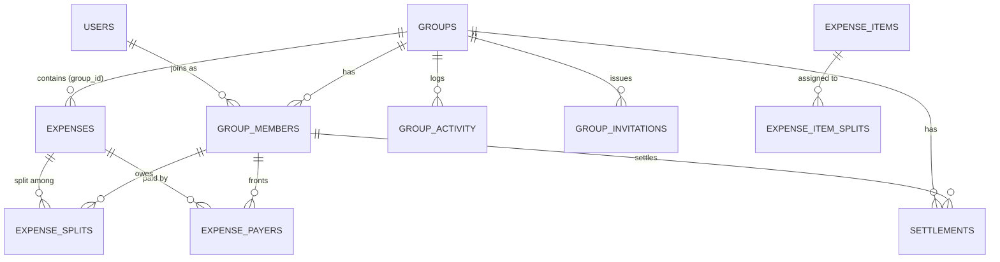

# TrackSpense Groups — Shared Expenses Product & Technical Specification

> **Document Version:** 0.9.0 (Draft for review)
> **Created:** 2026-07-04
> **Feature Codename:** TrackSpense Groups ("Split & Track")
> **Feature ID Prefix:** TS-GRP-###
> **Parent Document:** TrackSpense by Cerebroos — Complete Product & Technical Specification v1.0.0
> **Status:** 🟡 Proposed — pending review before implementation

---

## Table of Contents

1. [Problem Statement & Vision](#1-problem-statement--vision)
2. [Competitive Research (Splitwise)](#2-competitive-research-splitwise)
3. [Core Concepts & Accounting Model](#3-core-concepts--accounting-model)
4. [User Stories](#4-user-stories)
5. [Feature Catalog](#5-feature-catalog)
6. [Data Model](#6-data-model)
7. [Balance & Debt-Simplification Algorithms](#7-balance--debt-simplification-algorithms)
8. [Backend API Specification](#8-backend-api-specification)
9. [Analytics Unification](#9-analytics-unification)
10. [AI Feature Integration](#10-ai-feature-integration)
11. [Web Frontend Changes](#11-web-frontend-changes)
12. [Mobile App Changes](#12-mobile-app-changes)
13. [Migration & Backward Compatibility](#13-migration--backward-compatibility)
14. [Edge Cases & Business Rules](#14-edge-cases--business-rules)
15. [Non-Goals (v1)](#15-non-goals-v1)
16. [Phased Delivery Plan](#16-phased-delivery-plan)
17. [Open Questions for Product Review](#17-open-questions-for-product-review)

---

## 1. Problem Statement & Vision

### The Gap

Today there are two disjoint product categories:

| | Personal trackers (TrackSpense today) | Group splitters (Splitwise) |
|:---|:---|:---|
| Personal expenses | ✅ Rich (OCR, AI categorization, insights) | ❌ Awkward "non-group" hacks only |
| Group/shared expenses | ❌ Not supported | ✅ Core competency |
| "My true total spend" | ⚠️ Missing group shares | ⚠️ Missing personal spend; users complain charts don't distinguish *group total* vs *my share* |
| Debts / who-owes-whom | ❌ | ✅ |
| Item-level receipt intelligence | ✅ | ⚠️ Basic itemization only (Pro), 50/50 or 100/0 item splits |

A real person's financial life is a **mix**: rent split with roommates, a trip split with friends, groceries bought only for themselves, and a Netflix subscription shared with a partner. No single app today answers the question:

> **"How much did *I* actually spend this month — across everything?"**

### The Vision

TrackSpense becomes the **single ledger for your entire financial life**:

1. **One ledger, two scopes.** Every expense is either *personal* or belongs to a *group*. Group expenses carry per-member shares.
2. **Your share is your spend.** Analytics, categories, trends, item insights, and the AI Analyst all operate on *your effective spend* = personal expenses + your share of group expenses — regardless of who fronted the money.
3. **Debts are first-class but separate.** Who-paid vs. who-owes is tracked as balances and settlements, cleanly separated from consumption analytics (fixing Splitwise's most common user confusion).
4. **AI advantage carried forward.** Receipt OCR + item-level splitting ("Alice had the steak, Bob had the salad") is a differentiator no incumbent does well.

### Success Metrics (proposed)

- ≥30% of active users create or join at least one group within 90 days of launch
- ≥50% of group expenses entered via receipt scan (leveraging existing OCR)
- Retention lift: users in ≥1 group show higher 30-day retention than solo users
- Zero balance-integrity incidents (sum of splits ≠ expense amount)

---

## 2. Competitive Research (Splitwise)

### 2.1 Splitwise Core Features (free tier)

- Groups (trip, home, couple, other) and 1:1 "friendships"
- Add expenses with: total, payer(s), date, notes, photo, currency
- Split types: **equal, exact amounts, percentages, shares, adjustments (+/-)**
- Multiple payers on a single expense
- Informal debts / IOUs (no group needed)
- Recurring bills (weekly / fortnightly / monthly / yearly)
- Balances per group + total balance with a person across all groups
- **Simplify debts**: restructures who-pays-whom to minimize transactions
- Settle up: record cash payment, or pay via Venmo/PayPal (US) / Paytm (India)
- Activity feed, push notifications, expense comments, edit history
- Restore deleted groups/expenses
- 100+ currencies

### 2.2 Splitwise Pro Features

- Receipt scanning + itemization (limited: items split 50/50 or 100/0 only)
- Currency conversion (Open Exchange Rates)
- Spending-by-category charts / budgeting tools
- Default split per group (e.g. 60/40)
- Expense search, CSV/JSON export, 10GB receipt storage
- No expense-entry limits

### 2.3 Known Splitwise Pain Points (from user feedback & reviews)

1. **No personal expense tracking** — the exact gap this project fills.
2. **Chart ambiguity** — users can't tell if totals are the group's spend or their own share.
3. **Settle-up is all-or-nothing** — users want to pay/mark individual expenses, not only the full balance.
4. **Itemized splits are rigid** — items can't be split by custom percentages.
5. **Complex splits are tedious** — heavy manual entry for uneven bills; couples-in-groups workarounds are clunky.
6. **Weak budgeting/insight tools** — category analytics are shallow (Pro-only, basic).

### 2.4 TrackSpense Differentiators to Build On

| Splitwise weakness | TrackSpense answer |
|:---|:---|
| No personal tracking | Unified personal + group ledger (this spec's core) |
| Chart ambiguity | Explicit **"My share" vs "Group total" vs "I paid"** toggles everywhere |
| Rigid item splits | AI receipt OCR already extracts line items → assign any item to any member(s), any ratio |
| Shallow insights | Existing Item Insights / Merchant Insights / Change Insights extend to group shares |
| No AI | AI Analyst answers "How much do I owe Sam?" / "What did the Goa trip cost *me*?" |

---

## 3. Core Concepts & Accounting Model

This section is the heart of the spec. Getting the accounting model right prevents the ambiguity that plagues Splitwise.

### 3.1 Entities

- **Group** — a named container of members sharing expenses (e.g., "Apartment 4B", "Goa Trip 2026"). Types: `trip | home | couple | other`.
- **Member** — a participant in a group. A member is either a **registered user** (linked by email) or a **placeholder** (name only — for people not on the app yet; they can later claim the seat via invite).
- **Group Expense** — an expense with `group_id` set. It has one or more **payers** (who fronted money) and a set of **splits** (who consumed what share).
- **Personal Expense** — today's expense, `group_id = NULL`. Unchanged.
- **Settlement** — a payment between two members to reduce debt (cash/UPI/Venmo recorded manually in v1). Settlements are **not expenses** — they never appear in spend analytics.
- **Balance** — derived: for each member, `total paid − total owed` within a group; and pairwise net debts.

### 3.2 The Three Money Views (critical design decision)

Every group-aware surface in the app must be explicit about which of these it shows:

| View | Definition | Used for |
|:---|:---|:---|
| **My Share** (default) | Sum of my split amounts across expenses (+ all my personal expenses when combined) | All spend analytics, categories, trends, budgets, item/merchant insights, AI Analyst spend answers |
| **I Paid** (cash-out) | Sum of amounts I actually fronted | Cash-flow view, "who should pay next" |
| **Group Total** | Sum of full expense amounts in a group | Group dashboards, trip totals |

**Rule TS-GRP-R1:** Analytics default to **My Share**. The other views are opt-in toggles, always labeled. This directly resolves Splitwise pain point #2.

**Rule TS-GRP-R2:** Settlements never count as spend in any view. They only move balances.

### 3.3 Invariants

- `sum(splits.amount_owed) == expense.amount` (after rounding allocation, exact to the cent)
- `sum(payers.amount_paid) == expense.amount`
- A member's group balance = `Σ amount_paid − Σ amount_owed − Σ settlements_sent + Σ settlements_received`... (full formula in §7)
- Sum of all member balances in a group == 0, always.

### 3.4 Split Types (parity with Splitwise + one better)

| Type | Input | Example ($90, 3 people) |
|:---|:---|:---|
| `equal` | Selected participants | $30 / $30 / $30 |
| `exact` | Exact amount per person | $50 / $25 / $15 |
| `percentage` | % per person (must sum 100) | 50/30/20 → $45/$27/$18 |
| `shares` | Integer shares per person (couples = 2 shares) | 2/1/1 → $45/$22.50/$22.50 |
| `adjustment` | Equal base ± per-person adjustment | +$12 for Alice's cocktail, rest equal |
| `itemized` ⭐ | Each receipt line item assigned to member(s) in any ratio; tax/tip/discount pro-rated | Steak→Alice, salad→Bob, wine→50/50 |

⭐ `itemized` is the differentiator: it plugs directly into the existing AI receipt OCR pipeline (`ReceiptService`), which already extracts line items.

### 3.5 Rounding Rule

Splits are computed at full precision, then rounded to cents using **largest-remainder allocation**; any residual cent(s) are assigned deterministically to participants ordered by member UUID. This guarantees invariant §3.3-1 without "who ate the penny" randomness.

---

## 4. User Stories

### Persona: Priya — has roommates, travels with friends, tracks everything

1. **Create group:** "As a user, I create a group 'Apartment 4B' with roommates Arun and Meera by email, so shared rent and utilities live in one place." Meera isn't on TrackSpense yet — she's added as a placeholder and gets an invite link.
2. **Add split bill:** "I scan the grocery receipt; TrackSpense parses it; I mark it as a group expense, I paid, split equally among 3." My analytics show only my ⅓ share under Food & Drink.
3. **Itemized split:** "For the restaurant bill, I assign dishes to whoever ordered them; tax and tip pro-rate automatically."
4. **See balances:** "The group page shows Arun owes me $42.17 and I owe Meera $10." Simplify-debts nets it to a single instruction.
5. **Settle up:** "Arun pays me cash; I record a $42.17 settlement; balances update; my spend analytics don't change."
6. **Unified view:** "My monthly dashboard shows $1,830 total — $1,210 personal + $620 in group shares — with a Personal/Group/Combined filter."
7. **Recurring shared bill:** "Rent auto-prompts on the 1st as a group expense split 3 ways" (extends existing recurring templates).
8. **AI Analyst:** "I ask 'how much did the Goa trip cost me vs the group total?' and get both numbers, clearly labeled."
9. **Leave group:** "After moving out, I leave Apartment 4B once my balance is zero; my historical shares stay in my analytics."

---

## 5. Feature Catalog

### 5.1 Groups & Membership (TS-GRP-001)

| Feature | Description | Phase |
|:---|:---|:---|
| Create group | Name, type (trip/home/couple/other), optional cover emoji/color | P1 |
| Add members | By registered email (instant) or placeholder name + invite link/email | P1 |
| Invitations | Tokenized invite links (7-day expiry); accepting merges placeholder → registered member | P1 |
| Roles | `admin` (creator; can rename, remove members, delete group) and `member` | P1 |
| Leave group | Allowed only when member's balance = 0 (or admin force-remove with confirmation) | P1 |
| Archive/delete group | Soft delete; restorable (Splitwise parity) | P2 |
| Group settings | Default split (e.g., 60/40), simplify-debts toggle, default currency | P2 |

### 5.2 Group Expenses (TS-GRP-002)

| Feature | Description | Phase |
|:---|:---|:---|
| Add group expense | All existing expense fields + payer + split config | P1 |
| Split types: equal / exact / percentage | §3.4 | P1 |
| Split types: shares / adjustment | §3.4 | P2 |
| Multiple payers | Two+ members front portions of one bill | P2 |
| Itemized receipt split ⭐ | OCR line items → assign to members, any ratio; tax/tip pro-rated | P2 |
| Edit/delete group expense | Any member may edit; change logged to activity feed; balances recomputed | P1 |
| Expense comments | Threaded comments per expense | P3 |
| Convert personal ↔ group | Move an existing personal expense into a group (splits added) and back | P2 |

### 5.3 Balances & Settlements (TS-GRP-003)

| Feature | Description | Phase |
|:---|:---|:---|
| Per-group balances | Each member's net position + pairwise debts | P1 |
| Record settlement | Cash/UPI/other, amount, date, note; partial payments allowed | P1 |
| Simplify debts | Minimize number of transactions (greedy netting, §7.2); per-group toggle | P2 |
| Cross-group friend balance | Total owed to/from a person across all shared groups | P3 |
| Settle-by-expense | Mark specific expenses as settled (fixes Splitwise pain point #3) | P3 |
| Payment integrations | Venmo/PayPal/UPI deep links | P3 |

### 5.4 Unified Analytics (TS-GRP-004) — the flagship

| Feature | Description | Phase |
|:---|:---|:---|
| Scope filter | Every analytics surface gains **Personal / Groups / Combined** (default: Combined, "My Share" basis) | P1 |
| Group dashboard | Per-group: total, my share, my paid, category donut, member contribution bars, monthly trend | P1 |
| Category analytics include shares | Group expense category applies to each member's share amount | P1 |
| Item/Merchant Insights include shares | Itemized group expenses feed existing `item_insights` / `merchant_insights` with the member's share | P2 |
| Change Insights group-aware | "Your share of Apartment 4B utilities rose 18% this month" | P3 |

### 5.5 Recurring, Notifications, Feed (TS-GRP-005)

| Feature | Description | Phase |
|:---|:---|:---|
| Recurring group expenses | `recurring_templates` gains `group_id` + split config; existing due/confirm flow reused | P2 |
| Activity feed | Per-group event log: added/edited/deleted expense, settlement, member joined/left | P2 |
| Notifications | Push/email: "Arun added 'Groceries' — your share is $23.50" | P3 |
| Edit history | Per-expense change log (who changed what) | P3 |

### 5.6 AI Features (TS-GRP-006)

| Feature | Description | Phase |
|:---|:---|:---|
| Receipt → group expense | Scan flow gains "This is a group expense" step with split config | P1 (equal) / P2 (itemized) |
| AI split suggestion | LLM suggests item→member assignment from history ("Alice usually buys the oat milk") | P3 |
| AI Analyst group context | Analysis payload includes group shares, balances; supports "who owes me", "trip cost me vs total" | P2 |

---

## 6. Data Model

All new tables live in the existing `trackspense` PostgreSQL schema. UUID PKs via `gen_random_uuid()`, consistent with current design.

### 6.1 New Tables

```sql
-- ===== Groups =====
CREATE TABLE trackspense.groups (
    id              UUID PRIMARY KEY DEFAULT gen_random_uuid(),
    name            VARCHAR(255) NOT NULL,
    group_type      VARCHAR(20)  NOT NULL DEFAULT 'other',   -- trip|home|couple|other
    cover           VARCHAR(50),                              -- emoji/color token
    currency        VARCHAR(10)  NOT NULL DEFAULT 'USD',
    simplify_debts  BOOLEAN      NOT NULL DEFAULT FALSE,
    default_split_json JSONB,                                 -- optional default split config
    created_by      VARCHAR(255) NOT NULL REFERENCES trackspense.users(email),
    status          VARCHAR(20)  NOT NULL DEFAULT 'active',   -- active|archived|deleted
    created_at      TIMESTAMPTZ  NOT NULL DEFAULT now()
);

-- ===== Membership (registered users OR placeholders) =====
CREATE TABLE trackspense.group_members (
    id              UUID PRIMARY KEY DEFAULT gen_random_uuid(),
    group_id        UUID NOT NULL REFERENCES trackspense.groups(id) ON DELETE CASCADE,
    user_email      VARCHAR(255) REFERENCES trackspense.users(email),  -- NULL for placeholders
    display_name    VARCHAR(255) NOT NULL,
    role            VARCHAR(20)  NOT NULL DEFAULT 'member',   -- admin|member
    status          VARCHAR(20)  NOT NULL DEFAULT 'active',   -- active|invited|left
    joined_at       TIMESTAMPTZ,
    created_at      TIMESTAMPTZ  NOT NULL DEFAULT now(),
    UNIQUE (group_id, user_email)
);

-- ===== Invitations =====
CREATE TABLE trackspense.group_invitations (
    id              UUID PRIMARY KEY DEFAULT gen_random_uuid(),
    group_id        UUID NOT NULL REFERENCES trackspense.groups(id) ON DELETE CASCADE,
    member_id       UUID NOT NULL REFERENCES trackspense.group_members(id) ON DELETE CASCADE,
    invited_email   VARCHAR(255),
    token           VARCHAR(64) NOT NULL UNIQUE,              -- URL-safe random
    expires_at      TIMESTAMPTZ NOT NULL,                     -- +7 days
    accepted_at     TIMESTAMPTZ,
    created_at      TIMESTAMPTZ NOT NULL DEFAULT now()
);

-- ===== Who paid (supports multiple payers) =====
CREATE TABLE trackspense.expense_payers (
    id              UUID PRIMARY KEY DEFAULT gen_random_uuid(),
    expense_id      UUID NOT NULL REFERENCES trackspense.expenses(id) ON DELETE CASCADE,
    member_id       UUID NOT NULL REFERENCES trackspense.group_members(id),
    amount_paid     NUMERIC(12,2) NOT NULL CHECK (amount_paid > 0),
    UNIQUE (expense_id, member_id)
);

-- ===== Who owes (the splits) =====
CREATE TABLE trackspense.expense_splits (
    id              UUID PRIMARY KEY DEFAULT gen_random_uuid(),
    expense_id      UUID NOT NULL REFERENCES trackspense.expenses(id) ON DELETE CASCADE,
    member_id       UUID NOT NULL REFERENCES trackspense.group_members(id),
    amount_owed     NUMERIC(12,2) NOT NULL CHECK (amount_owed >= 0),
    -- provenance of the split (for editing UX):
    basis_type      VARCHAR(20) NOT NULL,                     -- equal|exact|percentage|shares|adjustment|itemized
    basis_value     NUMERIC(12,4),                            -- pct, share count, or adjustment amount
    UNIQUE (expense_id, member_id)
);

-- ===== Item-level splits (itemized receipts) =====
CREATE TABLE trackspense.expense_item_splits (
    id              UUID PRIMARY KEY DEFAULT gen_random_uuid(),
    expense_item_id UUID NOT NULL REFERENCES trackspense.expense_items(id) ON DELETE CASCADE,
    member_id       UUID NOT NULL REFERENCES trackspense.group_members(id),
    ratio           NUMERIC(7,4) NOT NULL CHECK (ratio > 0 AND ratio <= 1),
    amount          NUMERIC(12,2) NOT NULL,
    UNIQUE (expense_item_id, member_id)
);

-- ===== Settlements (never counted as spend) =====
CREATE TABLE trackspense.settlements (
    id              UUID PRIMARY KEY DEFAULT gen_random_uuid(),
    group_id        UUID NOT NULL REFERENCES trackspense.groups(id) ON DELETE CASCADE,
    from_member_id  UUID NOT NULL REFERENCES trackspense.group_members(id),
    to_member_id    UUID NOT NULL REFERENCES trackspense.group_members(id),
    amount          NUMERIC(12,2) NOT NULL CHECK (amount > 0),
    method          VARCHAR(50),                              -- cash|venmo|upi|other
    settled_at      TIMESTAMPTZ NOT NULL DEFAULT now(),
    notes           TEXT,
    created_by      VARCHAR(255) NOT NULL,
    created_at      TIMESTAMPTZ NOT NULL DEFAULT now(),
    CHECK (from_member_id <> to_member_id)
);

-- ===== Activity feed =====
CREATE TABLE trackspense.group_activity (
    id              UUID PRIMARY KEY DEFAULT gen_random_uuid(),
    group_id        UUID NOT NULL REFERENCES trackspense.groups(id) ON DELETE CASCADE,
    actor_member_id UUID REFERENCES trackspense.group_members(id),
    action          VARCHAR(50) NOT NULL,   -- expense_added|expense_edited|expense_deleted|settlement_recorded|member_joined|member_left|group_updated
    entity_id       UUID,
    payload_json    JSONB,
    created_at      TIMESTAMPTZ NOT NULL DEFAULT now()
);
```

### 6.2 Changes to Existing Tables

```sql
-- expenses: attach to a group (NULL = personal, fully backward compatible)
ALTER TABLE trackspense.expenses
    ADD COLUMN group_id   UUID REFERENCES trackspense.groups(id),
    ADD COLUMN split_type VARCHAR(20);      -- NULL for personal expenses

-- recurring templates: recurring shared bills (Phase 2)
ALTER TABLE trackspense.recurring_templates
    ADD COLUMN group_id     UUID REFERENCES trackspense.groups(id),
    ADD COLUMN split_config JSONB;          -- {"type":"equal","participants":[member_ids]} etc.
```

### 6.3 New Indexes

| Table | Index | Purpose |
|:---|:---|:---|
| `expenses` | `idx_expenses_group_id` | Group expense listing |
| `group_members` | `idx_group_members_user_email` | "My groups" query |
| `expense_splits` | `idx_expense_splits_member_id` | "My share" analytics scans |
| `expense_payers` | `idx_expense_payers_member_id` | "I paid" view |
| `settlements` | `idx_settlements_group_id` | Balance computation |
| `group_activity` | `idx_group_activity_group_id_created` | Feed pagination |

### 6.4 ER Additions (Mermaid)



### 6.5 Design Decisions

- **`member_id`, not `user_email`, on splits/payers/settlements.** This is what makes placeholder members work: money can be attributed to someone who hasn't registered. When they accept an invite, the `group_members` row gains a `user_email` — no split rows change.
- **Splits stored, not derived.** Percentages/shares are inputs; the resolved dollar `amount_owed` is persisted. History stays stable if split logic ever changes; provenance (`basis_type/basis_value`) is kept for editing UX.
- **Balances computed, not stored (v1).** With per-group data volumes (hundreds of rows), on-request computation with the existing 60s in-memory analysis cache is sufficient. A materialized `group_balances` table is a Phase-3 optimization if needed.
- **Settlements are their own table**, not fake expenses. This keeps rule TS-GRP-R2 structurally enforced.

---

## 7. Balance & Debt-Simplification Algorithms

### 7.1 Net Balance per Member (within a group)

```
net(m) =   Σ expense_payers.amount_paid   where member = m
         − Σ expense_splits.amount_owed   where member = m
         + Σ settlements.amount           where from_member = m   (m paid someone → debt reduced)
         − Σ settlements.amount           where to_member   = m   (m received money)
```

- `net(m) > 0` → the group owes m (m is a creditor)
- `net(m) < 0` → m owes the group (m is a debtor)
- Invariant: `Σ net(m) over all members == 0`

### 7.2 Simplify Debts (greedy netting)

When `groups.simplify_debts = TRUE`, pairwise "who pays whom" is generated as:

```
creditors = [(m, net) for net > 0], sorted desc
debtors   = [(m, -net) for net < 0], sorted desc
while both non-empty:
    pay = min(creditors[0].amt, debtors[0].amt)
    emit: debtors[0] pays creditors[0] the amount `pay`
    decrement both; pop whichever hits zero
```

Produces at most `n−1` transactions. When the toggle is OFF, pairwise debts are shown as literally accrued (expense-by-expense pairwise ledger), matching Splitwise behavior.

### 7.3 Split Resolution (server-side, single source of truth)

The backend — never the clients — resolves split inputs into cent-exact `amount_owed` values:

1. Compute raw shares at 4-decimal precision per §3.4 rules.
2. Round each down to cents; compute residual `r = amount − Σ rounded`.
3. Distribute `r` one cent at a time by **largest fractional remainder**, ties broken by member UUID ascending.
4. Validate invariants; reject with `400` + details if inputs are inconsistent (e.g., percentages ≠ 100, exact amounts ≠ total).

For `itemized`: each item's line_total is split by member ratios; tax, tip, and discount are pro-rated across members proportionally to their pre-tax item subtotals; then per-member amounts are summed and the rounding pass runs once at the expense level.

---

## 8. Backend API Specification

All new endpoints under `/api/v1`, JWT-authenticated, following existing conventions (user identified by token `sub`).

### 8.1 Groups & Membership

| Method | Path | Description |
|:---|:---|:---|
| `POST` | `/groups` | Create group (creator becomes admin member) |
| `GET` | `/groups` | List my groups with summary (name, type, member count, my balance) |
| `GET` | `/groups/{group_id}` | Group detail: members, balances, settings |
| `PUT` | `/groups/{group_id}` | Update name/type/settings (admin) |
| `DELETE` | `/groups/{group_id}` | Soft-delete group (admin; requires all balances zero or `force=true`) |
| `POST` | `/groups/{group_id}/members` | Add member `{email?}` or placeholder `{display_name}` |
| `DELETE` | `/groups/{group_id}/members/{member_id}` | Remove member (balance must be 0, or admin `force=true`) |
| `POST` | `/groups/{group_id}/invites` | Create invite link for a member seat → `{token, url, expires_at}` |
| `POST` | `/groups/invites/accept` | Body `{token}` → claims seat for current user |
| `POST` | `/groups/{group_id}/leave` | Leave group (balance must be 0) |

### 8.2 Group Expenses

| Method | Path | Description |
|:---|:---|:---|
| `POST` | `/groups/{group_id}/expenses` | Create group expense with payers + split config |
| `GET` | `/groups/{group_id}/expenses?limit=&offset=` | Paginated group expense list (each row includes my share, payer summary) |
| `PUT` | `/groups/{group_id}/expenses/{expense_id}` | Edit expense/splits; balances recomputed; activity logged |
| `DELETE` | `/groups/{group_id}/expenses/{expense_id}` | Delete; activity logged |
| `POST` | `/groups/{group_id}/expenses/with_items` | Itemized (receipt) group expense with per-item member assignments |
| `POST` | `/expenses/{expense_id}/move_to_group` | Convert personal → group `{group_id, split}` |

### 8.3 Balances, Settlements, Activity

| Method | Path | Description |
|:---|:---|:---|
| `GET` | `/groups/{group_id}/balances` | Net balances + suggested transfers (simplified if enabled) |
| `POST` | `/groups/{group_id}/settlements` | Record settlement |
| `GET` | `/groups/{group_id}/settlements` | Settlement history |
| `DELETE` | `/groups/{group_id}/settlements/{id}` | Undo settlement (activity logged) |
| `GET` | `/groups/{group_id}/activity?limit=&offset=` | Activity feed |
| `GET` | `/friends/balances` | Cross-group net balance per person (Phase 3) |

### 8.4 Analytics (extended, not new)

Existing `GET /analysis` gains a scope parameter:

```
GET /analysis?user_id=&year=&month=&scope=combined|personal|groups&group_id=
```

- `scope=personal` (legacy behavior, default for old clients — see §13)
- `scope=combined` → personal expenses + my `expense_splits.amount_owed` (new default for updated clients)
- `scope=groups` → only my shares across all groups
- `group_id=<uuid>` → single-group analysis; adds `basis=my_share|i_paid|group_total`

`AnalysisResponse` gains:

```json
{
  "scope": "combined",
  "spend_breakdown": { "personal": 1210.00, "group_share": 620.00 },
  "group_summaries": [
    { "group_id": "…", "name": "Apartment 4B", "my_share": 480.00, "i_paid": 610.00, "group_total": 1440.00, "my_balance": 130.00 }
  ]
}
```

### 8.5 New Pydantic Models (sketch)

```json
// GroupExpenseRequest
{
  "date": "MM/DD/YYYY",
  "description": "Dinner at Luigi's",
  "category": "Food & Drink - Dining out",
  "amount": 90.00,
  "merchant_name": "Luigi's",
  "payers": [ { "member_id": "…", "amount_paid": 90.00 } ],
  "split": {
    "type": "percentage",
    "entries": [
      { "member_id": "…", "value": 50 },
      { "member_id": "…", "value": 30 },
      { "member_id": "…", "value": 20 }
    ]
  }
}

// BalanceResponse
{
  "group_id": "…",
  "members": [ { "member_id": "…", "display_name": "Priya", "net": 130.00 } ],
  "transfers": [ { "from": "…", "to": "…", "amount": 42.17 } ],
  "simplified": true
}
```

### 8.6 Error Semantics

| Condition | Status |
|:---|:---|
| Split entries don't reconcile with amount | `400` with per-field details |
| Non-member accessing group resource | `403` |
| Leaving/removing member with non-zero balance without force | `409` |
| Invite token expired/used | `410` |
| Duplicate receipt fingerprint (unchanged) | `409` |

---

## 9. Analytics Unification

### 9.1 The "My Effective Spend" Query

The core aggregation powering combined analytics:

```sql
-- personal spend
SELECT category_id, SUM(amount) FROM trackspense.expenses
 WHERE user_email = :me AND group_id IS NULL AND purchased_at BETWEEN :a AND :b
 GROUP BY category_id

UNION ALL

-- my share of group spend (category inherited from the parent expense)
SELECT e.category_id, SUM(s.amount_owed)
  FROM trackspense.expense_splits s
  JOIN trackspense.group_members gm ON gm.id = s.member_id AND gm.user_email = :me
  JOIN trackspense.expenses e ON e.id = s.expense_id
 WHERE e.purchased_at BETWEEN :a AND :b
 GROUP BY e.category_id
```

`AnalysisService` merges the two legs and feeds the existing category-totals / top-5 / monthly-trend / drill-down pipeline unchanged. The 60s in-memory cache keys gain `scope` + `group_id`.

### 9.2 Insight Pipelines (Item / Merchant / Change)

- **Item Insights (TS-ANL-003):** for itemized group expenses, the save-time pipeline writes the member's `expense_item_splits.amount` (their portion) instead of full `line_total`, per participating member. Price history still records the true `unit_price` (a $4.99 milk is $4.99 regardless of split).
- **Merchant Insights (TS-ANL-002):** merchant aggregates use `my share` amounts for group expenses.
- **Change Insights (TS-ANL-004):** operates on the combined ledger; card copy must state scope ("your share of…").

### 9.3 Group Dashboard (new analytics surface)

Per-group page shows:
- Group total / My share / I paid (three headline numbers — rule TS-GRP-R1)
- Category donut on **group total**, with tap-through showing per-member shares
- Member contribution bar chart (paid vs. owed per member)
- Monthly trend of group total and my share (two series)
- Balances panel + Settle Up CTA

---

## 10. AI Feature Integration

### 10.1 Receipt Scan → Group Expense

Flow change in the confirm step (web `AddExpense`/mobile `AddExpenseScreen`):

1. Parse receipt (unchanged `POST /ingest/receipt/parse`)
2. New toggle: **Personal / Group** → if group: pick group, payer(s), split type
3. Phase 1: equal/exact/percentage splits on the total
4. Phase 2: **itemized mode** — parsed line items rendered as chips; drag/assign each to member avatars (multi-select = even ratio; long-press = custom ratio); tax/tip pro-rated live
5. Confirm → `POST /groups/{id}/expenses/with_items`

Fingerprint dedup applies per group (same receipt can't be double-entered by two members — second attempt gets `409` with "Arun already added this receipt").

### 10.2 AI Analyst Context Expansion

`ChatService` context injection gains a group block when the user has groups:

```
Analysis data: {analysis_json}          # now scope-aware
Group data: {
  groups: [ {name, my_share, i_paid, group_total, my_balance,
             top_categories, balances_with: [{name, net}] } ]
}
```

New answerable intents: "how much do I owe Meera?", "what did the Goa trip cost me vs total?", "which group am I spending the most in?", "am I usually the one paying?". The provider routing (OpenAI prod / Ollama local) is unchanged; this lands after the TS-ANL-005 provider-default bug fix noted in FEATURE_STATUS.md.

### 10.3 AI Categorization

Unchanged — group expenses use the same `CategorizationService` and the same 7×44 taxonomy. Category applies to the whole expense; each member's share inherits it.

---

## 11. Web Frontend Changes

### 11.1 New Routes

| Path | Component | Description |
|:---|:---|:---|
| `/groups` | `GroupsPage` | My groups list + balances summary + create |
| `/groups/:id` | `GroupDetailPage` | Tabs: Expenses · Balances · Analytics · Activity · Settings |
| `/groups/join/:token` | `JoinGroupPage` | Invite acceptance (works pre-login; deep-links after auth) |

### 11.2 Modified Pages

- **DashboardPage:** scope segmented control (Personal / Groups / Combined); "You owe / You are owed" summary card; per-group balance chips.
- **ExpensesPage:** unified list gains a group badge column + scope filter; group expense rows show "my share" prominently and full amount secondary.
- **Add/Edit Expense form:** Personal/Group toggle → group picker → payer picker → `SplitEditor` component (per-type inputs with live validation + rounding preview).
- **ExpenseAnalysisPage:** scope filter wired to `GET /analysis?scope=`.
- **AIAnalystPage:** optional group scope chip.
- **RecurringPage (P2):** templates can target a group + split config.

### 11.3 New Components

`GroupCard`, `MemberAvatarStack`, `SplitEditor` (the complex one — equal/exact/percentage/shares/adjustment tabs), `ItemSplitBoard` (P2 itemized drag-assign), `BalanceList`, `SettleUpDialog`, `ActivityFeed`, `InviteDialog`.

MUI v7 + existing glassmorphism theme; member avatars use initials + deterministic color from member UUID.

## 12. Mobile App Changes

### 12.1 Navigation

- Drawer gains **👥 Groups** item → `GroupsScreen` → `GroupDetailScreen` (top tabs: Expenses / Balances / Stats / Activity)
- `AddExpenseScreen` gains the same Personal/Group toggle + split editor (native-optimized: steppers for shares, sliders for percentages)
- `RecurringPrompt` handles group recurring bills (P2)
- Invite links open via deep linking (`expo-linking`): `trackspense://join/{token}` + universal link fallback

### 12.2 New Screens/Components

`GroupsScreen`, `GroupDetailScreen`, `SettleUpSheet` (bottom sheet), `SplitEditor` (RN), `BalanceRow`, `ActivityList`. Charts reuse `CategoryDonutChart` / `TrendLineChart` with the two-series my-share/group-total variant.

---

## 13. Migration & Backward Compatibility

1. **Schema migration is additive.** `expenses.group_id` is nullable; all existing rows remain personal. Zero data migration needed.
2. **API compatibility.** `GET /analysis` without `scope` returns `scope=personal` (identical to today) so old mobile builds keep working. New clients send `scope=combined` explicitly.
3. **Existing endpoints untouched.** `/expenses` CRUD continues to manage personal expenses only; group expenses live under `/groups/{id}/expenses`. (Unified read: `/expenses?scope=combined` returns both, additive param.)
4. **Feature flag.** `GROUPS_ENABLED` env var gates all group routes + UI entry points for a staged rollout.
5. **Recurring templates:** existing templates have `group_id = NULL`, unchanged behavior.

---

## 14. Edge Cases & Business Rules

| # | Case | Rule |
|:---|:---|:---|
| E1 | Member leaves with non-zero balance | Blocked (`409`). Admin `force=true` removes them; their splits/settlements remain (member row → `status=left`), balance shown under "former members". |
| E2 | Expense edited after a settlement | Allowed; balances recompute; activity feed entry warns "balances changed after settlement". No settlement is auto-modified. |
| E3 | Payer is a placeholder member | Allowed — placeholders can pay/owe; they just can't log in until claimed. |
| E4 | Invite claimed by an email already in the group | Rejected (`409`) — merge conflict; user is told they're already a member. |
| E5 | Rounding | §7.3 largest-remainder; server authoritative; clients only preview. |
| E6 | Deleting a group with history | Soft delete; members' historical shares **remain in their personal analytics** (their consumption happened). Restorable for 30 days. |
| E7 | Duplicate receipt across members | Group-scoped fingerprint check → `409` names who already added it. |
| E8 | Split participant subset | Any expense can include a subset of members (e.g., only 2 of 4 roommates split takeout). |
| E9 | Zero-share participant | Not stored — omit from splits instead. |
| E10 | Currency (v1) | Group currency fixed at creation, USD default; mixed-currency groups are Phase 3 (Open-Exchange-Rates-style conversion). |
| E11 | Personal → group conversion | Original expense gains group_id + splits; the converter becomes sole payer by default. Audit entry logged. |
| E12 | User deletes account | Their member rows become placeholders (`user_email → NULL`, name retained) so group history and balances stay intact for others. |

---

## 15. Non-Goals (v1)

- In-app money movement (Venmo/PayPal/UPI execution) — record-only settlements first
- Multi-currency groups & FX conversion
- 1:1 "friendship" ledgers outside groups (workaround: create a 2-person group)
- Group budgets / spending limits
- Expense approval workflows
- Offline-first sync for group data
- Gamification

---

## 16. Phased Delivery Plan

### Phase 1 — MVP "Split the Bill" (target: 4–6 weeks of build)

**Backend:** groups/members/invites CRUD · group expenses with equal/exact/percentage splits (single payer) · split-resolution engine + invariants · balances endpoint (non-simplified) · settlements record/list · `scope` param on `/analysis` · feature flag.
**Web:** GroupsPage, GroupDetailPage (Expenses+Balances tabs), SplitEditor (3 types), SettleUpDialog, dashboard scope toggle, receipt-scan group toggle (equal split).
**Mobile:** GroupsScreen, GroupDetailScreen, split editor, settle-up sheet, deep-link invites.
**Exit criteria:** Priya's stories 1, 2, 4, 5, 6 fully work; invariant tests green; old clients unaffected.

### Phase 2 — Parity & Differentiation (6–8 weeks)

Shares + adjustment splits · multiple payers · **itemized receipt splits** (ItemSplitBoard) · simplify-debts · activity feed · recurring group expenses · personal↔group conversion · Item/Merchant Insights fed by shares · AI Analyst group context · archive/restore.

### Phase 3 — Polish & Growth

Notifications (push/email) · comments + edit history · cross-group friend balances · settle-by-expense · payment deep links · multi-currency · CSV export · AI split suggestions · Change Insights group-aware · materialized balances if perf requires.

### Suggested Implementation Order (Phase 1 tickets)

1. TS-GRP-101: Schema migration (groups, members, invites, payers, splits, settlements, activity; `expenses.group_id`)
2. TS-GRP-102: `GroupService` + repo (CRUD, membership, invites)
3. TS-GRP-103: `SplitEngine` (pure functions + exhaustive unit tests — build this first, it's the risk center)
4. TS-GRP-104: Group expense endpoints + `BalanceService`
5. TS-GRP-105: Settlements endpoints
6. TS-GRP-106: `AnalysisService` scope support + cache key changes
7. TS-GRP-107: Web GroupsPage/GroupDetailPage + SplitEditor
8. TS-GRP-108: Web dashboard/expenses scope integration + receipt flow toggle
9. TS-GRP-109: Mobile screens + deep links
10. TS-GRP-110: Feature flag, e2e tests, staged rollout

---

## 17. Open Questions for Product Review

1. **Default analytics scope for existing users** — flip to `combined` automatically at launch, or keep `personal` until the user opts in? (Recommendation: combined, with a one-time explainer toast.)
2. **Who can edit group expenses** — any member (Splitwise model, recommended for v1) or only the payer/creator/admin?
3. **Placeholder spending caps** — should a placeholder be allowed as sole payer, or require at least one registered payer? (Spec currently allows it — E3.)
4. **Invite channel** — email via existing Gmail SMTP, share-link only, or both? (Spec assumes both; SMTP path reuses `email_service.py`.)
5. **Category on splits** — v1 inherits the expense category for all shares. Do we ever need per-member category overrides (e.g., one person's portion is a business expense)? Deferred unless a strong case emerges.
6. **Simplify-debts default** — Splitwise defaults OFF per group; keep that? (Recommendation: yes — surprising transfers erode trust.)
7. **Monetization hook** — is itemized splitting a premium feature (Splitwise gates OCR behind Pro), or free to drive adoption? (Recommendation: free at launch; it's the wedge.)

---

*This document extends the TrackSpense master spec. Once approved, §3–§8 here should be folded into the master spec's Feature Catalog, Database Design, and API Specification sections, and FEATURE_STATUS.md should gain the TS-GRP-1xx tickets.*