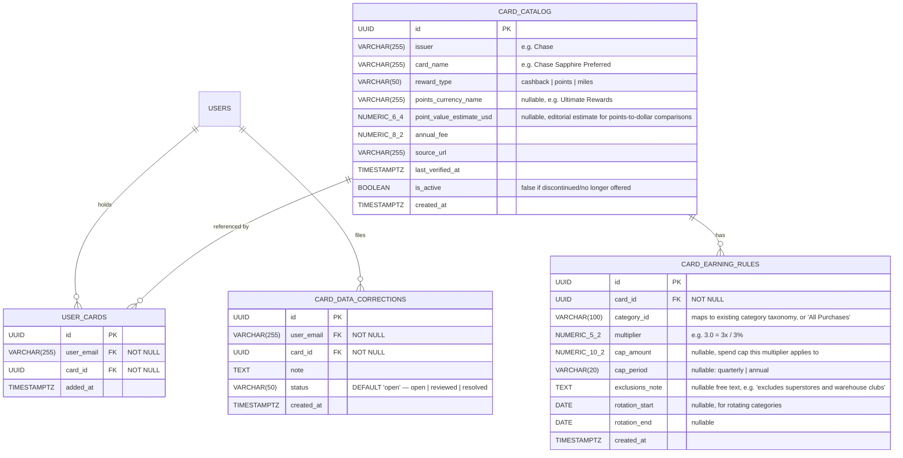

# TrackSpense Card Rewards — Phase 1 ("Card Coach") Product & Technical Spec

> **Document Version:** 0.1.0 (Draft)
> **Status:** Draft for review — not yet committed to `docs/engineering/`
> **Author:** Drafted with Claude, based on product brainstorm + market research, 2026-08-17
> **Depends on:** Resolution of the group Balances panel inversion documented in `TrackSpense_Product_Design_Review.md` §3. This feature reads group-share amounts directly, and the current inversion would silently corrupt the payer/share input used in §8.2. **Do not begin TS-CARD-105 (group-share-aware spend input) until this is closed and re-verified.**

---

## Table of Contents

1. [Problem & Opportunity](#1-problem--opportunity)
2. [Goals & Non-Goals](#2-goals--non-goals)
3. [Competitive Positioning (Summary)](#3-competitive-positioning-summary)
4. [Feature Scope — Phase 1: Card Coach](#4-feature-scope--phase-1-card-coach)
5. [Card Data Sourcing Strategy](#5-card-data-sourcing-strategy)
6. [Data Model](#6-data-model)
7. [Backend API Specification](#7-backend-api-specification)
8. [Calculation Logic](#8-calculation-logic)
9. [UX Integration](#9-ux-integration)
10. [Out of Scope for Phase 1](#10-out-of-scope-for-phase-1)
11. [Open Decisions](#11-open-decisions)
12. [Success Metrics](#12-success-metrics)
13. [Implementation Approach](#13-implementation-approach)
14. [Phase 1 Engineering Tickets](#14-phase-1-engineering-tickets)
15. [Appendix: Sample Data Shapes](#appendix-sample-data-shapes)

---

## 1. Problem & Opportunity

Cardholders routinely earn far less in credit card rewards than their spending pattern would allow, and have no easy way to see the gap. This isn't a redemption problem (using points once earned) — it's an earning problem, which is larger and invisible by default: a user who put groceries on a flat 1% card for a year has no way to see that a 6% grocery card existed and would have paid for itself.

Rajesh's own recurring personal question — "which card should I be using for this?" — is the origin of this feature idea, and the market research confirms it's a broadly shared pain, not an idiosyncratic one:

- Cardholders left billions in earned-but-unclaimed rewards on the table industry-wide in the most recent year with published CFPB data, and a large share of rewards cardholders report sitting on unused cash back, points, or miles they never redeemed.
- The commonly cited optimization lift across the point-of-sale-optimizer category (moving from a flat ~1.5% blended earn rate to active per-category card selection) is roughly 2.5–3.5% effective — real money on typical household card spend, though this figure comes from industry blogs, not peer-reviewed sources, and should be presented to users as an estimate, not a guarantee.

**Where TrackSpense has a structural edge over the existing point-of-sale optimizer apps (CardPointers, MaxRewards, Kudos, Pointer AI, etc.):**

- **Itemized receipt data.** Every other tool in this space guesses reward-category eligibility from a merchant category code (MCC) — which is notoriously unreliable (e.g., Walmart and Target are frequently excluded from "grocery" bonus categories despite selling groceries, and MCC assignment varies by network and even by individual store). TrackSpense already has line-item detail from OCR receipt parsing, which is a materially better signal than MCC guessing for at least the grocery/dining categories where itemization matters most.
- **Group-share awareness.** No competitor models the difference between "I paid $400 for a group dinner" and "my actual share was $100." TrackSpense's combined ledger already carries this distinction, and a rewards engine built on it can correctly attribute the *full* paid amount (not just the personal share) to the card that was swiped — something no other tool in the category can do.
- **No bank-link required for the retrospective phase**, since the underlying spend is already in TrackSpense's own ledger. Every competitor either requires bank credentials (MaxRewards — sync reliability and fraud-lock issues are a well-documented complaint) or requires the user to re-enter transaction context at the point of sale (CardPointers, Kudos).

## 2. Goals & Non-Goals

### Goals (Phase 1)
- Show users, using data they've already entered, how much reward value their current card lineup captured vs. what an optimal lineup would have captured, broken down by category.
- Correctly account for group-expense shares — the amount that hit the card, not just the user's personal portion — in that calculation.
- Do this without any new PII collection: no card numbers, no bank linking, no login-based card sync.
- Ship as an extension of the existing Analysis surface and AI Analyst chat, reusing established UI patterns rather than introducing new navigation.

### Non-Goals (explicitly deferred or excluded)
- **Real-time, point-of-sale "which card right now" recommendations** (location-aware prompts, Apple/Google Wallet integration, browser extension at checkout). This is the mature, crowded part of the market and doesn't leverage TrackSpense's ledger advantage — see §3.
- **Bank/card account linking or transaction sync** (Plaid or direct credential login). Out of scope for all of Phase 1 and 2; would be a significant scope, compliance, and trust departure from TrackSpense's current no-bank-connection positioning.
- **New card acquisition / "which card should I apply for" recommendations with affiliate monetization.** This is a real future opportunity (Phase 3, tentative) but requires a deliberate decision on affiliate revenue vs. no-commission trust positioning, plus Regulation Z advertising-compliance review, before any UI work begins. Not scoped here.
- **Automated bulk scraping of issuer sites on a recurring schedule.** See §5 — legal and reliability concerns rule this out as the v1 data sourcing method.

## 3. Competitive Positioning (Summary)

| Tool | Model | Notable gap vs. TrackSpense |
|:---|:---|:---|
| CardPointers | Manual card entry, MCC-based, ~$72–90/yr | No transaction history, no true-spend view, no group-expense concept |
| MaxRewards | Bank-linked (credential-based), ~$108/yr | Frequent sync breakage/fraud locks; no group-expense concept |
| Kudos | Free, Plaid-linked, affiliate-monetized | Affiliate incentive disclosed but present; no group-expense concept |
| Prospify | Free, Plaid-linked, "true spend" + splitting | Converging on TrackSpense's thesis from the opposite direction (cards → splitting); "which card" recommendation explicitly on their roadmap, not shipped |
| Copilot / Monarch | Personal finance aggregation | No card-reward optimization feature at all |

None combine itemized-receipt-quality categorization with group-share-aware spend. That combination is the actual moat; the point-of-sale "which card right now" mechanic is not.

## 4. Feature Scope — Phase 1: Card Coach

Card Coach is a **retrospective** insight feature: "here's what your current cards earned vs. what they could have earned, based on your own spending history."

### 4.1 User-facing capabilities
1. **Add held cards.** User searches a curated card catalog and taps to add cards they hold. No card numbers, no issuer login. Cards can be removed at any time.
2. **Per-category reward gap.** For each spend category (reusing the existing 7-main/44-sub taxonomy from §13 of the main product spec), show: actual amount spent, estimated rewards earned at the assumed default rate, estimated rewards possible with the best card the user holds (or, secondarily, the best card in the catalog), and the dollar gap.
3. **Dashboard insight card.** A single summary card ("You left an estimated $X in rewards on the table this month") using the existing "What changed" card component and its "Ask about it →" hook into AI chat.
4. **AI chat awareness.** The AI Analyst can answer retrospective questions like *"How much would I have earned with a different card on groceries?"* using the same data, without a dedicated new screen.
5. **Group-share attribution.** Where a group expense was paid by the user, the full paid amount (not the personal "my share" amount) counts toward the category total used in the reward calculation, since that's the amount that hit the card. This is called out explicitly in the UI so it isn't confused with the "My Expenses" personal-spend figure used elsewhere.

### 4.2 Explicitly NOT in Phase 1
- No point-of-sale "use this card now" prompt.
- No new-card acquisition recommendation or affiliate link.
- No live merchant lookup (no "what card at this specific store" — that's Phase 2, chat-based, see §11).
- No cap/rotating-category *consumption tracking* against real-time balances — Phase 1 uses static advertised multipliers and known caps/exclusions only as informational context, not as a "you have $340 of headroom left" tracker (see §8.3).

## 5. Card Data Sourcing Strategy

Per discussion, automated recurring scraping of issuer benefit pages was considered and **rejected as the v1 approach**:

- Major issuers' own terms explicitly prohibit automated data collection from these pages (confirmed directly in American Express's Amex Offers terms, and this is standard boilerplate across issuers, not an Amex-specific quirk).
- Violating these terms is a civil/contractual risk (IP blocks, cease-and-desist, breach-of-contract exposure), not typically a criminal one — but the reputational cost of a C&D against a personal-finance app recommending financial products is disproportionate to the cost saved vs. building a small curated dataset by hand.
- Independent of legal risk, scraped issuer pages are operationally fragile: JS-rendered rate tables, WAF/bot detection, and critical exclusion text (e.g., "excludes superstores and warehouse clubs") buried in footnotes that a scraper can easily miss — producing confidently wrong financial advice, which is worse than no feature.

**Chosen approach for Phase 1: manually curated, LLM-assisted static dataset.**

1. Rajesh (or a Claude Code–assisted pass) visits each issuer's own public rates-and-fees / rewards terms page directly — a one-time, human-directed read, not a recurring automated crawl — for an initial set of ~30–50 cards covering the large majority of likely TrackSpense users (major Chase, Amex, Citi, Capital One, Discover, and Bank of America consumer cards).
2. The page text is fed to the existing chat LLM (OpenAI/Ollama, same provider routing already used by `ChatService`/`CategorizationService`) with a structured-extraction prompt to produce the JSON shape in the [Appendix](#appendix-sample-data-shapes) — categories, multipliers, caps, and known exclusions.
3. Each extracted record is spot-checked by a human before being committed to the `card_catalog` table.
4. Every record carries `source_url` and `last_verified_at`, both surfaced in the UI (see §9.4), so TrackSpense is never asserting more confidence in a number than it has.
5. Refresh cadence: quarterly manual review pass, plus an ad hoc refresh whenever a user files a correction (§5, item 6).
6. **User-reported corrections.** A lightweight "Report incorrect reward info" affordance on any card detail view files a flag for manual review — crowdsources freshness without any bot traffic against issuer infrastructure.
7. **Revisit paid data sources if/when justified.** RewardsCC (~$199/mo once caching is required) and the AwardWallet Credit Card Bonus API (contact-only pricing, notably includes a per-point redemption-value field that would materially simplify points-vs-cashback comparison) remain available if the curated dataset proves to be a scaling bottleneck. Not needed for Phase 1 given the ~30–50 card catalog target.

This keeps the "don't pay for an API" goal intact for v1 while avoiding the legal and reliability problems of a scraper — at the cost of a bounded catalog rather than an exhaustive one. A bounded set of ~30–50 cards that's actually correct is a stronger product than an exhaustive set that's frequently stale or wrong.

## 6. Data Model

New tables, additive to the existing `trackspense` schema — no changes to `expenses`, `expense_items`, or existing analytics tables.



### Design notes
- `CARD_EARNING_RULES` is one-to-many per card so a single card (e.g., Chase Freedom Flex) can carry both a flat "All Purchases" rule and several capped/rotating category rules.
- No table stores anything about a user's actual card *account* — no numbers, no issuer credentials, no balances. `USER_CARDS` is purely "this catalog card ID belongs to this user," matching the "no PII" goal.
- Category totals reused for the gap calculation come entirely from existing `expenses`/`expense_items`/`analysis` data — no new expense-side schema changes.

## 7. Backend API Specification

All new endpoints prefixed `/api/v1`, following existing conventions.

| Method | Path | Auth | Description |
|:---|:---|:---|:---|
| `GET` | `/cards/catalog?q=` | Yes | Search the curated card catalog by issuer/name |
| `GET` | `/cards/catalog/{card_id}` | Yes | Full detail for one catalog card, including earning rules and `source_url`/`last_verified_at` |
| `GET` | `/cards/mine` | Yes | List the current user's held cards |
| `POST` | `/cards/mine` | Yes | Add a held card (`card_id`) |
| `DELETE` | `/cards/mine/{user_card_id}` | Yes | Remove a held card |
| `GET` | `/cards/coach?year=&month=&start_date=&end_date=` | Yes | Card Coach analysis: per-category actual vs. optimal reward estimate for the given period |
| `POST` | `/cards/corrections` | Yes | File a data-correction report (`card_id`, `note`) |

`GET /cards/coach` response shape mirrors the existing `AnalysisResponse` pattern for consistency — see [Appendix](#appendix-sample-data-shapes).

## 8. Calculation Logic

### 8.1 Category totals input
Reuse `AnalysisService`'s existing category-total aggregation for the requested period.

### 8.2 Group-share substitution
For categories that include group-expense line items, replace the "my share" amount used elsewhere in Analysis with the **full amount the current user actually paid** on that expense (i.e., what hit their card), when computing the input to Card Coach. This requires the corrected (non-inverted) balance/payer data from the Groups feature — the reason this feature is sequenced after the group Balances panel fix.

### 8.3 Reward estimate
For each category total:
- **Actual earned** = category total × the held card's multiplier for that category (falling back to its flat "All Purchases" rate if no category-specific rule exists), for whichever held card the expense's `payment_method` suggests, or the user's stated default card if `payment_method` is unset.
- **Optimal earned (within wallet)** = category total × the best multiplier among the user's *held* cards for that category.
- **Optimal earned (catalog-wide)** = category total × the best multiplier across the full catalog, shown as an aspirational "a card like X could have earned $Y more" line — informational only, never a hard sell, and explicitly not tied to any acquisition or affiliate flow in Phase 1.
- Points/miles cards convert to a dollar estimate using `point_value_estimate_usd` where present; if absent, the UI shows the raw point/mile figure without a dollar conversion rather than fabricating a value.
- Cap enforcement in Phase 1 is **advisory text only** (e.g., "this multiplier applies up to $1,500/quarter — you may have exceeded this cap"), not a tracked running balance against real transactions. Real cap-consumption tracking is a candidate for Phase 2+ once the retrospective view is validated.

## 9. UX Integration

No new top-level navigation item. All surfaces reuse existing patterns.

### 9.1 Analysis page — new "Cards" tab
Alongside the existing Overview / Items / Merchants tabs. Two states:
- **Empty state:** card search/picker (matches the pattern of other empty states, e.g. "Create a group to split rent, trips, or shared bills") — "Add the cards you carry to see how they're performing."
- **Populated state:** per-category table (actual vs. optimal-in-wallet vs. optimal-catalog), reusing the drill-down visual language already established by Merchant Insights.

### 9.2 Dashboard — one new insight card
Reuses the existing "What changed" card component exactly: *"You left an estimated $180 in rewards on the table this month → Ask about it."* No new component needed.

### 9.3 AI Analyst — new tool, no new screen
A `get_card_coach_summary` tool available to the existing chat agent, so questions like *"how much would I have earned with a different card on groceries?"* are answered in place, consistent with the existing transparency-footnote pattern ("Looked at: This month · My Expenses").

### 9.4 Data provenance, always visible
Any card detail view or Card Coach breakdown shows a small "Source: [issuer link] · Verified [date]" line and the "Report incorrect info" affordance from §5. This is a hard requirement, not a nice-to-have — the whole feature's credibility rests on not overstating confidence in curated data.

### 9.5 Explicit non-changes
Per the sequencing discussion, this phase does **not** touch the Add Expense flow (currently three inconsistent forms per the design review's P2 #6) or introduce any new nav item. Both are deliberate scope boundaries, not oversights.

## 10. Out of Scope for Phase 1

See §2 Non-Goals for the full list. Restated briefly for ticket-writing clarity:
- No bank/Plaid linking
- No point-of-sale / location-aware prompts
- No browser extension or wallet integration
- No card acquisition recommendations or affiliate links
- No real-time cap-consumption tracking against live balances
- No automated recurring scraping job

## 11. Open Decisions

To be resolved before or during ticket breakdown, not blocking this spec's initial review:

1. **Card catalog v1 size and exact list** — proposed ~30–50 cards; needs a concrete list before TS-CARD-102 (data seeding) can start.
2. **Affiliate model** — explicitly deferred past Phase 1; no acquisition-flow UI exists yet to decide it for, but the decision should be made before Phase 2/3 chat-based "which card should I use for this specific purchase" work begins, since that's where a recommendation could plausibly carry a commercial incentive.
3. **Points valuation source** — who sets `point_value_estimate_usd` and how often it's revisited (this is an editorial judgment call, not a scraped fact).
4. **Phase 2 scope confirmation** — prospective, chat-based "which card should I use for this purchase" (e.g., "I'm booking a flight") as a new agent tool, reusing the same `card_catalog`/`user_cards` tables from this phase. Not detailed in this document; worth a short follow-up spec once Phase 1 ships and card-adoption is validated.

## 12. Success Metrics

- % of active users who add at least one card within the first session of viewing the Cards tab.
- % of users who return to the Cards tab or ask a card-related AI Analyst question in a subsequent session (indicates the insight was actually useful, not just novel).
- Qualitative: does the "money left on the table" figure survive a manual accuracy audit against 5–10 real user card/spend combinations before general rollout?

## 13. Implementation Approach

Following the same five-step Claude Code pattern used for Groups:

1. **Spec commit** — this document, committed to `docs/engineering/` after review.
2. **Orientation pass** — read-only Claude Code investigation of `AnalysisService`, `CategorizationService`, and the Groups balance code (post-fix) to confirm integration points and flag conflicts before writing anything.
3. **Isolate a `CardRewardsEngine`** service (mirroring the `SplitEngine` isolation approach from Groups) so the multiplier/cap/gap math is independently testable and not tangled into `AnalysisService`.
4. **Ticket-by-ticket implementation** behind a `CARD_COACH_ENABLED` feature flag, one ticket per PR, manual diff review before merge — same cadence as Groups/UX redesign tickets.
5. **PR review gates** as with all other in-flight work.

## 14. Phase 1 Engineering Tickets

| Ticket | Title | Summary |
|:---|:---|:---|
| TS-CARD-101 | Card catalog schema | `card_catalog` + `card_earning_rules` tables, migrations, seed script scaffold |
| TS-CARD-102 | Seed initial card dataset | Manually curated + LLM-extracted data for ~30–50 cards per §5; human-reviewed before commit |
| TS-CARD-103 | User card management API | `GET/POST/DELETE /cards/mine`, `GET /cards/catalog` search |
| TS-CARD-104 | `CardRewardsEngine` service | Isolated calculation logic per §8, unit-testable independent of API layer |
| TS-CARD-105 | Group-share-aware spend input | Wire corrected group payer/balance data into the engine's category-total input (depends on Groups balance-panel fix) |
| TS-CARD-106 | `GET /cards/coach` endpoint | Wraps the engine, returns the Card Coach response shape |
| TS-CARD-107 | Analysis "Cards" tab (web) | Empty state + populated state UI per §9.1 |
| TS-CARD-108 | Dashboard insight card | Reuse existing "What changed" component per §9.2 |
| TS-CARD-109 | AI Analyst tool integration | `get_card_coach_summary` chat tool per §9.3 |
| TS-CARD-110 | Data-correction reporting | `POST /cards/corrections` + UI affordance per §5/§9.4 |
| TS-CARD-111 | Mobile parity | Cards tab + insight card on mobile (Analysis screen / Home screen equivalents) |

---

## Appendix: Sample Data Shapes

### `CardCatalogDetail` (Response)
```json
{
  "id": "UUID",
  "issuer": "Chase",
  "card_name": "Chase Sapphire Preferred",
  "reward_type": "points",
  "points_currency_name": "Ultimate Rewards",
  "point_value_estimate_usd": 0.0125,
  "annual_fee": 95.00,
  "earning_rules": [
    {
      "category_id": "All Purchases",
      "multiplier": 1.0,
      "cap_amount": null,
      "cap_period": null,
      "exclusions_note": null
    },
    {
      "category_id": "Food & Drink - Dining out",
      "multiplier": 3.0,
      "cap_amount": null,
      "cap_period": null,
      "exclusions_note": null
    }
  ],
  "source_url": "https://creditcards.chase.com/rewards-credit-cards/sapphire/preferred",
  "last_verified_at": "2026-07-01T00:00:00Z",
  "is_active": true
}
```

### `GET /cards/coach` (Response)
```json
{
  "period": { "year": 2026, "month": 7 },
  "total_estimated_gap": 180.42,
  "by_category": [
    {
      "category": "Food & Drink - Groceries",
      "actual_spend": 612.40,
      "spend_source": "personal_plus_group_paid",
      "actual_earned_estimate": 6.12,
      "held_card_used": "Chase Freedom Unlimited",
      "optimal_in_wallet_card": "Chase Freedom Unlimited",
      "optimal_in_wallet_earned_estimate": 6.12,
      "optimal_catalog_card": "Blue Cash Preferred (Amex)",
      "optimal_catalog_earned_estimate": 36.74,
      "cap_note": "Blue Cash Preferred's 6% grocery rate applies up to $6,000/year; excludes superstores and warehouse clubs — verify at checkout"
    }
  ],
  "filter_info": {
    "year": 2026,
    "month": 7,
    "group_share_included": true
  }
}
```

### `CardDataCorrection` (Request)
```json
{
  "card_id": "UUID",
  "note": "Multiplier for dining looks outdated — issuer site now shows 4x, not 3x."
}
```

---

*This document scopes Phase 1 ("Card Coach") only. Phase 2 (prospective, chat-based "which card should I use for this purchase") and Phase 3 (new-card acquisition recommendations) are intentionally not detailed here and should be spec'd separately once Phase 1 ships and card-adoption is validated.*
