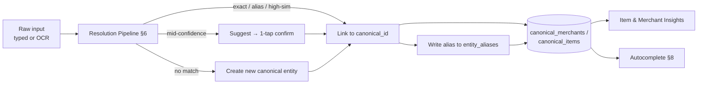

# TrackSpense by Cerebroos — Smart Entity Resolution & Autocomplete: Product & Technical Specification

> **Document Version:** 0.1.0 (Draft)
> **Last Updated:** 2026-07-15
> **Product Name:** TrackSpense
> **Company:** Cerebroos
> **Repository Name:** VaravuSelavuSeyali
> **Feature Codename:** Canonicalize
> **Status:** Proposed — pending review before ticketing

> **Relationship to master spec:** This document extends *TrackSpense — Complete Product & Technical Specification* v1.0.0 (§3.3 AI Receipt Scanning, §3.4 Analytics, §7 Database Design, §8 API, §10 AI/ML Services). It supersedes the ad-hoc `normalized_name` approach described there for anything touching item/merchant identity. Section references prefixed **M§** point to the master spec; unprefixed **§** references are internal to this document.

---

## Table of Contents

1. [Problem Statement & Motivation](#1-problem-statement--motivation)
2. [Goals & Non-Goals](#2-goals--non-goals)
3. [Core Concept: The Canonical Entity Layer](#3-core-concept-the-canonical-entity-layer)
4. [Feature Catalog](#4-feature-catalog)
5. [Database Design](#5-database-design)
6. [Resolution Pipeline (The Matcher)](#6-resolution-pipeline-the-matcher)
7. [Receipt Canonicalization](#7-receipt-canonicalization)
8. [Autocomplete & Typeahead](#8-autocomplete--typeahead)
9. [Merchant & Item Rules Engine](#9-merchant--item-rules-engine)
10. [Backend API Specification](#10-backend-api-specification)
11. [UX Flows](#11-ux-flows)
12. [Analytics Impact](#12-analytics-impact)
13. [Seed Data & Global Dictionary](#13-seed-data--global-dictionary)
14. [Migration Plan](#14-migration-plan)
15. [Phased Delivery Plan](#15-phased-delivery-plan)
16. [Ticket Batch](#16-ticket-batch)
17. [Open Questions & Risks](#17-open-questions--risks)
18. [Appendix A: Worked Examples](#appendix-a-worked-examples)

---

## 1. Problem Statement & Motivation

TrackSpense derives its Item Insights and Merchant Insights (M§3.4) by aggregating on name strings — `expense_items.normalized_name` and `expenses.merchant_name`. Those strings are inconsistent at the source, which quietly corrupts every downstream insight:

- **Manual entry drift.** A user types `cosco`, `Costco`, `COSTCO Wholesale` on three different days. These become three distinct merchants in insights, splitting spend that should aggregate.
- **Receipt naming drift.** The same physical product is printed differently store to store — `GV MLK 2% GAL`, `2% REDUCED FAT MILK`, `MILK 2% 1GA` — and even differently across visits to the same store. Each becomes a separate "item," so price-history and store-comparison views are unreliable.
- **Correction burden.** The only fix available today is manual editing, line by line, on every receipt. Users will not do this, so the data stays dirty.

The current OCR prompt (M§10.1) already instructs the LLM to *"correct any misspelled or partial item names."* This helps per-receipt legibility but does **not** solve consistency: the LLM cleans each receipt in isolation with no memory, so `2% Milk`, `Milk 2%`, and `Reduced Fat Milk` still land as different strings. The missing piece is a **persistent canonical registry** that every cleaned name is *linked to*, so identity is decided once and reused everywhere.

### Why now
Item Insights, Merchant Insights, and Smart Spend Change Insights (M§3.4) are shipped or partial. Their accuracy is capped by name-string aggregation. Fixing the identity layer unlocks the value already built, and is a prerequisite for the autocomplete and receipt-quality features requested for this cycle.

---

## 2. Goals & Non-Goals

### Goals
1. **Consistent identity.** One canonical record per real merchant and per real product; all insights aggregate on canonical IDs, never on raw strings.
2. **Typo tolerance at entry.** `cosco` resolves to Costco during manual entry without the user noticing a problem.
3. **Autocomplete on type.** As the user types a merchant or item, suggest prior/known entities ranked by relevance, typo-tolerant.
4. **Receipt line quality.** Produce clean, human-readable, consistent line-item descriptions from messy bill text — without requiring the user to edit each line.
5. **Zero-to-low correction burden.** High-confidence matches auto-link silently; only ambiguous cases ask for a one-tap confirm; bulk cleanup is lazy and global (a merge fixes all history at once).
6. **Compounding accuracy.** Every confirmation, rename, or merge teaches the system, so prompts fade over time.

### Non-Goals (this cycle)
- Building a global CPG/UPC product master from external data providers. We seed a small internal dictionary only (§13).
- Barcode/UPC scanning of physical products (receipts rarely carry codes; see §7).
- Cross-user data sharing of *user-created* canonical entities (only the curated global dictionary is shared).
- Replacing the existing categorization service (M§10.3); canonical entities *feed* categorization but do not replace it.

---

## 3. Core Concept: The Canonical Entity Layer

The root cause is that TrackSpense collapses three distinct things into a single string. The fix is to separate them:

| Concept | Example | Where it lives |
|:---|:---|:---|
| **Raw as-entered** | `"cosco"`, `"GV MLK 2% GAL"` | `expenses.merchant_name`, `expense_items.item_name` — kept forever, for audit + dedup |
| **Canonical entity** | Costco (merchant #42), 2% Milk / Great Value (item #318) | `canonical_merchants`, `canonical_items` — one master record per real thing |
| **Alias** | `"cosco"` → merchant #42; `"GV MLK 2% GAL"` → item #318 | `entity_aliases` — every raw variant that maps to a canonical entity |

**The load-bearing rule:** *insights aggregate on `canonical_id`, never on a name string.* Autocomplete reads from the same registry. Receipt lines link into it. One source of truth serves all three features.



---

## 4. Feature Catalog

| # | Feature | Summary | Priority |
|:--|:---|:---|:---|
| 4.1 | **Canonical Registry** | Merchant + item master tables and alias store; insights re-keyed to canonical IDs | P0 |
| 4.2 | **Resolution Pipeline** | Cascade matcher (exact → alias → trigram → rescored → new) with confidence tiers | P0 |
| 4.3 | **Merchant Normalization** | Global seed dictionary of common chains + misspellings; user-scoped learned aliases | P0 |
| 4.4 | **Autocomplete / Typeahead** | Typo-tolerant suggestions for merchant and item fields, ranked by recency/frequency | P0 |
| 4.5 | **Receipt Canonicalization** | Extended OCR prompt emits canonical proposals; lines linked via pipeline; review only for ambiguous | P0 |
| 4.6 | **Merge Tool** | Lazy, global merge of two canonical entities; retroactively fixes all history + writes alias | P1 |
| 4.7 | **Rules Engine** | User-defined "always rename X → Y", auto-applied to future, optionally retroactive | P1 |
| 4.8 | **Semantic Matching (pgvector)** | Embedding fallback for the semantic residue trigrams miss (abbreviations, synonyms) | P2 |

---

## 5. Database Design

### 5.1 New Tables

```sql
-- One master record per real merchant.
CREATE TABLE canonical_merchants (
    id              UUID PRIMARY KEY DEFAULT gen_random_uuid(),
    user_email      VARCHAR(255) REFERENCES users(email) ON DELETE CASCADE, -- NULL => global/curated
    canonical_name  VARCHAR(255) NOT NULL,          -- normalized key, e.g. "costco"
    display_name    VARCHAR(255) NOT NULL,          -- pretty, e.g. "Costco Wholesale"
    default_category_id VARCHAR(100),               -- optional hint for categorization
    is_global       BOOLEAN NOT NULL DEFAULT FALSE, -- TRUE for seed dictionary rows
    created_at      TIMESTAMPTZ NOT NULL DEFAULT now(),
    updated_at      TIMESTAMPTZ NOT NULL DEFAULT now()
);

-- One master record per real product (store-agnostic).
CREATE TABLE canonical_items (
    id              UUID PRIMARY KEY DEFAULT gen_random_uuid(),
    user_email      VARCHAR(255) REFERENCES users(email) ON DELETE CASCADE, -- NULL => global
    canonical_name  VARCHAR(255) NOT NULL,          -- normalized key, e.g. "2% milk"
    display_name    VARCHAR(255) NOT NULL,          -- pretty, e.g. "2% Milk"
    brand           VARCHAR(255),                   -- e.g. "Great Value" (nullable)
    default_category_id VARCHAR(100),
    unit_type       VARCHAR(50),                    -- gallon | each | lb | oz | ...
    is_global       BOOLEAN NOT NULL DEFAULT FALSE,
    created_at      TIMESTAMPTZ NOT NULL DEFAULT now(),
    updated_at      TIMESTAMPTZ NOT NULL DEFAULT now()
);

-- Every raw variant that maps to a canonical entity. This is the memory.
CREATE TABLE entity_aliases (
    id              UUID PRIMARY KEY DEFAULT gen_random_uuid(),
    user_email      VARCHAR(255) REFERENCES users(email) ON DELETE CASCADE, -- NULL => global alias
    entity_type     VARCHAR(20) NOT NULL,           -- 'merchant' | 'item'
    entity_id       UUID NOT NULL,                  -- FK (logical) to canonical_* .id
    raw_key         VARCHAR(255) NOT NULL,          -- normalized form of the raw string
    source          VARCHAR(30) NOT NULL,           -- 'seed' | 'user_confirm' | 'auto_high' | 'rule' | 'llm'
    confidence      NUMERIC(4,3),                   -- match score when auto-created
    confirmed       BOOLEAN NOT NULL DEFAULT FALSE, -- TRUE once a human accepted it
    created_at      TIMESTAMPTZ NOT NULL DEFAULT now(),
    UNIQUE (user_email, entity_type, raw_key)
);

-- User-defined normalization rules (§9).
CREATE TABLE entity_rules (
    id              UUID PRIMARY KEY DEFAULT gen_random_uuid(),
    user_email      VARCHAR(255) NOT NULL REFERENCES users(email) ON DELETE CASCADE,
    entity_type     VARCHAR(20) NOT NULL,           -- 'merchant' | 'item'
    match_type      VARCHAR(20) NOT NULL,           -- 'contains' | 'equals' | 'regex'
    match_value     VARCHAR(255) NOT NULL,
    target_entity_id UUID NOT NULL,                 -- canonical entity to assign
    set_category_id VARCHAR(100),                   -- optional
    is_active       BOOLEAN NOT NULL DEFAULT TRUE,
    created_at      TIMESTAMPTZ NOT NULL DEFAULT now()
);
```

### 5.2 Changes to Existing Tables (M§7)

```sql
-- Link expenses to a canonical merchant. Repurposes the existing merchant_id column.
ALTER TABLE expenses
    ALTER COLUMN merchant_id TYPE UUID USING NULL,               -- was VARCHAR; see migration §14
    ADD CONSTRAINT fk_expenses_canon_merchant
        FOREIGN KEY (merchant_id) REFERENCES canonical_merchants(id) ON DELETE SET NULL;
-- expenses.merchant_name is retained as the raw as-entered string.

-- Link receipt lines to a canonical item.
ALTER TABLE expense_items
    ADD COLUMN item_id UUID REFERENCES canonical_items(id) ON DELETE SET NULL,
    ADD COLUMN match_confidence NUMERIC(4,3),        -- score from resolution pipeline
    ADD COLUMN match_status VARCHAR(20) DEFAULT 'unresolved'; -- 'linked'|'suggested'|'new'|'unresolved'
-- expense_items.item_name is retained as the raw bill text.
-- expense_items.normalized_name is DEPRECATED (kept read-only during transition, dropped in Phase 2).
```

### 5.3 Insights Re-keying (M§3.4)

`ITEM_INSIGHTS` and `MERCHANT_INSIGHTS` change their grouping key from a name string to the canonical FK:

```sql
ALTER TABLE item_insights
    ADD COLUMN canonical_item_id UUID REFERENCES canonical_items(id) ON DELETE CASCADE;
ALTER TABLE merchant_insights
    ADD COLUMN canonical_merchant_id UUID REFERENCES canonical_merchants(id) ON DELETE CASCADE;
-- Backfill maps existing normalized_name / merchant_name rows to canonical IDs (§14),
-- then the aggregation job groups by canonical_*_id going forward.
```

### 5.4 Indexes (typo-tolerant search)

```sql
CREATE EXTENSION IF NOT EXISTS pg_trgm;

-- Trigram indexes power fuzzy autocomplete + fuzzy match candidate lookup.
CREATE INDEX idx_canon_merchants_trgm ON canonical_merchants USING gin (canonical_name gin_trgm_ops);
CREATE INDEX idx_canon_items_trgm     ON canonical_items     USING gin (canonical_name gin_trgm_ops);
CREATE INDEX idx_aliases_rawkey_trgm  ON entity_aliases      USING gin (raw_key gin_trgm_ops);

-- Exact/alias lookups.
CREATE INDEX idx_aliases_lookup ON entity_aliases (user_email, entity_type, raw_key);
CREATE INDEX idx_canon_merchants_user ON canonical_merchants (user_email);
CREATE INDEX idx_canon_items_user     ON canonical_items (user_email);
```

---

## 6. Resolution Pipeline (The Matcher)

A single shared function resolves any raw string (typed or OCR-proposed) to a canonical entity. It implements the Named-Entity-Linking pattern (normalize → fuzzy → knowledge base) combined with **confidence-gated matching** borrowed from SKU-mapping practice.

### 6.1 Normalization (preprocessing)
Lowercase; trim; collapse whitespace; strip punctuation; expand a small abbreviation map (`gv`→`great value`, `whlsl`→`wholesale`, `2%`→`2 percent`); singularize trailing plural. Output = `raw_key`.

### 6.2 Cascade (cheapest first, short-circuit on hit)

| Tier | Check | Score | Action |
|:--|:---|:--|:---|
| 1 | **Exact** — `raw_key` equals a canonical `canonical_name` | 1.00 | Link silently |
| 2 | **Known alias** — `raw_key` in `entity_aliases` (user or global) | 1.00 | Link silently |
| 3 | **High trigram** — `similarity(raw_key, canonical_name) ≥ 0.85` | ≥0.85 | Link silently + write alias (`source=auto_high`) |
| 4 | **Mid band** — top-N trigram candidates in `[0.55, 0.85)`, rescored with Jaro-Winkler (merchants) or embedding cosine (items) | 0.55–0.85 | Return as **suggestion**; require 1-tap confirm; on confirm write alias (`source=user_confirm`) |
| 5 | **No match** — best score `< 0.55` | — | Create new canonical entity; link; write alias (`source=llm`/`user`) |

Thresholds are configuration constants (`RESOLVE_HIGH=0.85`, `RESOLVE_LOW=0.55`, `RESOLVE_TOPN=20`) tunable per entity type without code change.

### 6.3 Why this stack
Trigram (`pg_trgm`) matching is indexed, fast, and resolves the large majority of typo/OCR variance in pure SQL — industry reports put it near 99% recall at 99% precision for dedup, with no ML dependency. Jaro-Winkler rescoring adds positional precision on the top-N shortlist (good for short merchant names). Embeddings are reserved for the genuinely *semantic* residue — abbreviations and synonyms where two strings share little surface text but mean the same product — and are introduced only in Phase 2 (§15) to avoid premature cost/latency.

### 6.4 Cost & latency placement
- **Typeahead (per keystroke):** pure Postgres trigram — no LLM, no network round-trip beyond the API.
- **Save-time resolution (manual entry):** Postgres cascade first; LLM only if creating a brand-new entity that needs a clean display name.
- **Receipt:** one LLM pass already occurs (M§10.1); we extend it (§7) so no *additional* LLM call is added to the hot path — linking is DB-side.

---

## 7. Receipt Canonicalization

### 7.1 Extended OCR contract
Keep the single existing LLM pass (M§10.1) but extend the per-line output so the model emits a **canonical proposal**, not just a cleaned string:

```jsonc
// per line item, added fields in bold intent:
{
  "line_no": 3,
  "item_name": "GV MLK 2% GAL",        // raw bill text, preserved verbatim
  "proposed_canonical": "2% Milk",      // clean, store-agnostic
  "proposed_brand": "Great Value",      // nullable
  "proposed_unit": "gallon",
  "quantity": 1, "unit_price": 3.48, "line_total": 3.48,
  "category_name": "Groceries"
}
```

Prompt addition (to M§10.1):
> *For each line item, in addition to the fields above, provide `proposed_canonical` (a clean, brand-agnostic product name a shopper would recognize), `proposed_brand` (or null), and `proposed_unit` (normalized: each, gallon, lb, oz, dozen…). Do not invent a SKU or UPC; if the bill has no product code, leave it blank.*

### 7.2 Linking after parse (no extra LLM call)
For each line, run `proposed_canonical` (fallback: `item_name`) through the Resolution Pipeline (§6):
- **Tier 1–3 hit** → `match_status='linked'`, silent.
- **Tier 4** → `match_status='suggested'`, flagged for review chip.
- **Tier 5** → create canonical item, `match_status='new'`, saved silently.

### 7.3 The "don't edit every line" guarantee
1. **High-confidence lines auto-link silently** — the user sees clean names, does nothing.
2. **Only `suggested` lines** get a subtle review chip (one tap to accept the canonical, or tap to pick another). This is typically 0–2 lines on a 20-line receipt, not all 20.
3. **`new` lines save without friction** and can be cleaned later in bulk via the Merge Tool (§4.6) — cleanup is *lazy and global*, never per-receipt.
4. Grocery receipts rarely carry UPCs; we deliberately **do not** invent codes (industry consensus: leave blank rather than fabricate).

---

## 8. Autocomplete & Typeahead

### 8.1 Behavior
As the user types into a merchant or item field, return ranked suggestions after a 150 ms debounce (min 2 chars). Typo-tolerant: typing `cos` or `cosco` both surface **Costco**.

### 8.2 Ranking
`score = w1·recency + w2·frequency(user) + w3·trigram_similarity + w4·is_global_boost`. Picking a suggestion links the `canonical_id` directly and **bypasses resolution entirely** (guaranteed-clean write). Free-typed entries that are *not* picked go through §6 at save time.

### 8.3 Merchant → item priming
When a merchant is chosen on an expense, optionally pre-suggest that merchant's frequent items and their last-seen price ("Last time at Costco: milk, eggs, bananas"), sourced from `item_price_history` (M§7) joined on canonical IDs.

---

## 9. Merchant & Item Rules Engine

Modeled on the Monarch/Copilot "transaction rules" pattern: user-defined normalization that runs automatically.

- **Definition:** "When merchant name contains `AMZN`, set merchant = Amazon." Stored in `entity_rules` (§5.1).
- **Future application:** rules run on every new manual entry and every parsed receipt line, before the resolution cascade.
- **Retroactive option:** on creating/editing a rule, offer "Apply to N existing matching transactions" (opt-in checkbox), mirroring Monarch's retroactive toggle.
- **Precedence:** explicit rule > confirmed alias > seed alias > fuzzy match.

---

## 10. Backend API Specification

New/changed endpoints (extends M§8). All authenticated.

| Method | Endpoint | Purpose |
|:--|:--|:--|
| `GET` | `/suggest/merchants?q=&limit=` | Typo-tolerant merchant typeahead |
| `GET` | `/suggest/items?q=&merchant_id=&limit=` | Item typeahead, optionally scoped to a merchant |
| `POST` | `/resolve/merchant` | Body `{raw}` → `{status, canonical, candidates[]}` |
| `POST` | `/resolve/item` | Body `{raw, brand?}` → `{status, canonical, candidates[]}` |
| `POST` | `/canonical/merchants` | Create a user canonical merchant |
| `POST` | `/canonical/items` | Create a user canonical item |
| `POST` | `/canonical/merchants/{id}/merge` | Merge source→target; retroactively re-point history + write alias |
| `POST` | `/canonical/items/{id}/merge` | Same for items |
| `POST` | `/aliases/confirm` | Body `{entity_type, entity_id, raw}` → confirm a suggestion, write alias |
| `GET/POST/PATCH/DELETE` | `/rules` | CRUD for the rules engine |
| `POST` | `/ingest/receipt/parse` (changed) | Now returns per-line `match_status`, `canonical`, `candidates[]` (M§8.4) |

**Resolve response shape:**
```jsonc
{
  "status": "linked" | "suggested" | "new",
  "canonical": { "id": "…", "display_name": "Costco Wholesale", "category_id": "shopping" },
  "candidates": [ { "id": "…", "display_name": "Costco Gas", "score": 0.71 } ]  // present when suggested
}
```

---

## 11. UX Flows

### 11.1 Manual expense entry (autocomplete)
1. User types merchant → typeahead dropdown (typo-tolerant).
2. Pick suggestion → canonical linked, item priming appears. **OR** keep free text → on save, §6 resolves; if `suggested`, a small inline "Did you mean Costco?" confirm appears; if `new`, saved silently.

### 11.2 Receipt scan
1. Upload → parse (M§3.3) → confirmation screen shows **cleaned** line names.
2. `suggested` lines carry a review chip; `linked`/`new` lines look normal.
3. User confirms the 0–2 chips (or ignores) → save. No per-line editing required.

### 11.3 Bulk cleanup (Item/Merchant Insights)
1. In Insights, a "Merge" affordance lets the user select two entities that are really the same.
2. Merge re-points all history to the target, writes an alias, and the two never split again. All past insights self-correct.

### 11.4 Rules
Account → Rules tab: create "contains AMZN → Amazon," toggle retroactive apply.

---

## 12. Analytics Impact

Once insights aggregate on canonical IDs (§5.3):
- **Item Insights** price-history and store-comparison become trustworthy (same product across stores collapses to one row with per-store price points).
- **Merchant Insights** lifetime spend/transaction counts stop fragmenting across spelling variants.
- **Smart Spend Change Insights** ("new merchant", "price increase") stop firing false positives caused by a renamed string looking like a new entity.
- The AI Analyst (M§10.2) receives cleaner, deduplicated context, improving answer quality with no prompt change.

---

## 13. Seed Data & Global Dictionary

Ship a curated, read-only global dictionary (`is_global=TRUE`) covering the highest-frequency US chains and their common misspellings/abbreviations, so day-one resolution works with zero user history:

- **Merchants (~200 rows):** Costco (`cosco`, `costco whse`), Walmart (`wal-mart`, `wmt`, `wm supercenter`), Target (`tgt`), Trader Joe's (`trader joes`, `tj`), Amazon (`amzn`, `amazon mktp`), Whole Foods (`wholefds`, `wfm`), Kroger, Safeway, Aldi, CVS, Walgreens, Starbucks (`sbux`), etc.
- **Items:** a small starter set of common grocery staples with brand-agnostic canonical names + typical abbreviations. Grows primarily from user data; the global item list stays intentionally small this cycle (§2 non-goal).

Dictionary is versioned and shippable independently of app releases (data-only migration).

---

## 14. Migration Plan

1. **Additive first.** Create all new tables and columns; add `pg_trgm`. No behavior change yet. (Reversible.)
2. **`expenses.merchant_id` type change.** The existing column is `VARCHAR(255)` and effectively unused as an FK. Migrate by: add new `merchant_id_uuid`, backfill NULL, swap, drop old — rather than an in-place `ALTER TYPE`, to avoid lock/coercion issues. (See §5.2 note.)
3. **Backfill canonical entities.** Batch job groups existing `expenses.merchant_name` and `expense_items.normalized_name` by normalized key, creates canonical rows, links FKs, and writes `source='backfill'` aliases. Fuzzy-cluster near-duplicates at `≥0.9` conservatively (high threshold to avoid bad auto-merges; leave the rest as separate, mergeable later).
4. **Re-key insights.** Recompute `item_insights`/`merchant_insights` grouped on canonical IDs; verify totals reconcile to pre-migration sums (§ verification).
5. **Deprecate `normalized_name`.** Keep read-only for one release; drop in Phase 2.
6. **Feature flag.** Ship behind `ENTITY_RESOLUTION_ENABLED`, consistent with the project's flag convention (e.g., `GROUPS_ENABLED`).

---

## 15. Phased Delivery Plan

| Phase | Scope | Exit criteria |
|:--|:---|:---|
| **P0 — Foundation** | Canonical tables, alias store, `pg_trgm`, resolution pipeline, seed merchant dictionary, typeahead endpoints, insights re-keyed | Typing `cosco` resolves to Costco; insights aggregate on canonical IDs; totals reconcile post-backfill |
| **P1 — Receipt + cleanup** | Extended OCR prompt, per-line linking + review chips, merge tool, rules engine | ≤2 review chips on a typical 20-line receipt; merge fixes history globally; rules auto-apply |
| **P2 — Semantic** | `pgvector` embeddings for item semantic residue; drop deprecated `normalized_name`; expand global dictionary | Embedding fallback measurably lifts item match recall on held-out receipts |

---

## 16. Ticket Batch

> Naming follows the project convention (`TS-<AREA>-<n>`). **ING** = ingestion/receipt, **ANL** = analytics/insights, **ENT** = entity resolution (new area). One PR per ticket, investigate-first → ticket → implement, behind `ENTITY_RESOLUTION_ENABLED`.

**Phase 0**
- **TS-ENT-101** — Create `canonical_merchants`, `canonical_items`, `entity_aliases` tables + `pg_trgm` extension + trigram/lookup indexes (§5).
- **TS-ENT-102** — Normalization preprocessor (lowercase/strip/abbrev-map/singularize) with unit tests (§6.1).
- **TS-ENT-103** — Resolution pipeline cascade (tiers 1–5) with configurable thresholds; unit + property tests (§6.2).
- **TS-ENT-104** — Seed global merchant dictionary (data migration, ~200 rows + aliases) (§13).
- **TS-ENT-105** — `/resolve/merchant`, `/resolve/item`, `/suggest/merchants`, `/suggest/items` endpoints (§10).
- **TS-ENT-106** — `expenses.merchant_id` → UUID FK migration (add/backfill/swap/drop) (§14.2).
- **TS-ANL-201** — Re-key `item_insights`/`merchant_insights` to canonical IDs + backfill + reconciliation report (§5.3, §14).
- **TS-DES-3xx** — Web + mobile autocomplete component wired to `/suggest/*` (typo-tolerant, debounced) (§8).

**Phase 1**
- **TS-ING-201** — Extend OCR prompt + parser schema for `proposed_canonical`/`brand`/`unit`; preserve raw `item_name` (§7.1).
- **TS-ING-202** — Post-parse line linking + `match_status` + review-chip payload in `/ingest/receipt/parse` (§7.2).
- **TS-DES-3xx** — Receipt confirmation review-chip UX (web + mobile) (§11.2).
- **TS-ENT-201** — Merge endpoints + retroactive history re-pointing + alias write (§10, §11.3).
- **TS-ENT-202** — Rules engine tables + CRUD + application order + retroactive apply (§9).

**Phase 2**
- **TS-ENT-301** — `pgvector` embedding index + tier-4 embedding rescoring for items (§6.2, §15).
- **TS-ENT-302** — Drop deprecated `expense_items.normalized_name`; expand global dictionary.

---

## 17. Open Questions & Risks

1. **Global vs. per-user canonical scope.** Proposal: seed dictionary is global (`is_global`), user-created entities are user-scoped. Confirm no cross-user leakage is acceptable for the shared dictionary. *(Decision needed.)*
2. **Auto-merge aggressiveness on backfill.** `≥0.9` is conservative; too low risks wrongly merging "Costco" and "Costco Gas." Recommend erring toward under-merging (users can merge later; un-merging is harder).
3. **LLM proposal trust.** `proposed_canonical` still passes through §6 before creating a new entity, so a bad LLM guess can't silently fragment data — but monitor `new`-rate as a quality metric.
4. **Threshold tuning.** `0.85`/`0.55` are starting points; instrument confirm-accept rate to tune per entity type.
5. **Groups interaction.** Itemized receipt splits are a Groups differentiator; confirm canonical item IDs flow into `expense_item_splits` cleanly (coordinate with the Groups track, but treat as independent per project principle).

---

## Appendix A: Worked Examples

**A.1 Manual entry, typo**
Input `cosco` → normalize `cosco` → Tier 3 trigram vs `costco` (sim ≈ 0.83) → borderline; seed alias `cosco→Costco` exists → **Tier 2 hit**, linked silently. Insight rolls into Costco.

**A.2 Receipt, cross-store item**
Store A prints `GV MLK 2% GAL`; store B prints `2% REDUCED FAT MILK 1GAL`. LLM proposes `2% Milk` for both → Tier 1/3 both link to canonical item #318 → price history shows two store points for the *same* item. No user edits.

**A.3 New item**
`DRAGONFRUIT ORG` → no match ≥0.55 → create canonical `Organic Dragon Fruit`, `match_status='new'`, saved silently → appears in Insights immediately; user may later merge if a variant appears.

**A.4 Rule**
User creates "contains `AMZN` → Amazon." Next import of `AMZN MKTP US*2X9` → rule fires before cascade → linked to Amazon; optional retroactive apply cleans 37 past rows.
